> **Ported from V-Bounce (shipped).** Original: `product_plans.vbounce-archive/archive/epics/EPIC-013_wiki_knowledge_pipeline/EPIC-013_wiki_knowledge_pipeline.md`. Shipped in sprint S-11, carried forward during ClearGate migration 2026-04-24.

# EPIC-013: Wiki Knowledge Pipeline (Karpathy Pattern)

## 1. Problem & Value
> Target Audience: Stakeholders, Business Sponsors

### 1.1 The Problem
Today, when the agent answers a question it reads **full Drive files on-demand every time** — the same 20-page policy doc gets re-processed token-for-token on every query. There is no cross-document synthesis: if two files contradict each other or cover related concepts, the agent discovers this ad-hoc during each conversation. Knowledge doesn't compound — the system is stateless between queries.

### 1.2 The Solution
Implement a **Karpathy-style LLM Wiki pipeline** that processes source documents at ingest time into a persistent, interconnected wiki of pre-compiled markdown pages. When a document enters `teemo_documents` (via Drive, upload, or agent creation — see EPIC-015), the scan-tier model reads it once and produces:
- A **source summary** page (condensed version of the document)
- **Concept pages** (themes, processes, policies extracted from the document)
- **Entity pages** (people, teams, services, tools mentioned)
- **Cross-references** between all pages (new and existing)
- An **auto-generated index** (slug + TLDR per page for fast agent routing)

At query time, the agent reads the lightweight wiki index from its system prompt, picks the relevant pages via `read_wiki_page(slug)`, and synthesizes answers from pre-compiled knowledge. **The agent never reads raw source documents directly** (ADR-027). Knowledge **compounds** — each new document enriches the entire wiki.

### 1.3 Success Metrics (North Star)
- Agent answers queries **without reading source documents** — reads wiki pages via `read_wiki_page(slug)`
- Adding a new document **creates/updates 5-15 wiki pages** automatically
- Wiki index fits in the system prompt context window (slug + TLDR per page, <4K tokens for 15 source documents)
- Cross-document questions ("how does X relate to Y?") answered accurately using pre-built cross-references
- Periodic **lint operation** detects contradictions and stale claims across the wiki

---

## 2. Scope Boundaries
> Target Audience: AI Agents (Critical for preventing hallucinations)

### IN-SCOPE (Build This)
- [ ] `teemo_wiki_pages` table — stores wiki pages per workspace (slug, title, type, content, tldr, source refs, related slugs, confidence)
- [ ] `teemo_wiki_log` table — append-only audit trail of all wiki operations (ingest, query, lint)
- [ ] **Ingest pipeline** (`wiki_service.py`) — processes a document from `teemo_documents` into wiki pages: source summary, concepts, entities, cross-references, index rebuild. Triggered by `sync_status = 'pending'`.
- [ ] **Destructive re-ingest** — when a source document changes (EPIC-015 Drive sync cron sets `sync_status='pending'`), DELETE all wiki pages sourced from that document and re-run the full ingest (no partial update)
- [ ] **Wiki ingest cron** — background task that scans `teemo_documents` for `sync_status = 'pending'`, runs ingest, transitions to `processing` → `synced` (or `error`)
- [ ] **`read_wiki_page(slug)`** agent tool — retrieves a pre-compiled wiki page by slug. This is the agent's **only** path to read knowledge.
- [ ] **Wiki index injection** in agent system prompt — replaces EPIC-015's transitional `## Available Documents` section with wiki page TLDRs for routing (ADR-027: wiki is the knowledge path, no raw document reads)
- [ ] **Lint operation** — scans wiki for contradictions, orphans, stale claims, missing concepts (manual agent tool for v1, cron later)
- [ ] **Ingest hook** on document creation — when a document is added to `teemo_documents` with `sync_status='pending'`, automatically trigger async wiki ingest
- [ ] Page types: `source-summary`, `concept`, `entity`, `synthesis`
- [ ] YAML-like frontmatter per page (type, sources, related, confidence, created/updated dates)
- [ ] Agent may create `synthesis` pages during queries (tool available, not forced — agent decides)

### OUT-OF-SCOPE (Do NOT Build This)
- Vector database or embeddings — this is structured markdown, not RAG
- Frontend wiki explorer/viewer — agent-only interface for v1 (dashboard UI deferred)
- Real-time collaborative editing of wiki pages by humans
- Raw document storage — `teemo_documents` (EPIC-015) is the source layer; wiki doesn't own raw content
- Automatic lint on every query — too expensive; manual only for v1
- Wiki pages for thread conversations — wiki covers document knowledge only
- Wiki page cap — 15 source documents naturally bounds to ~150 pages; no artificial cap needed
- **Drive sync cron** — that's EPIC-015 (document-layer concern). This epic only owns the wiki ingest cron.
- **Document creation/upload** — that's EPIC-015 + EPIC-014. This epic only reads from `teemo_documents`.

---

## 3. Context

### 3.1 User Personas
- **Workspace Admin**: Adds documents (Drive, upload, or asks agent to create), expects the bot to "know" the content
- **Slack User**: Asks cross-document questions ("does our refund policy conflict with the SLA?"), expects synthesized answers
- **Agent (Tee-Mo)**: Needs fast, pre-compiled knowledge to answer without burning tokens on full document reads

### 3.2 User Journey (Happy Path)

```mermaid
flowchart LR
    A["EPIC-015: Document enters teemo_documents\n(Drive / upload / agent-created)"] --> B["sync_status = 'pending'"]
    B --> C[Wiki ingest cron picks up pending doc]
    C --> D[Scan-tier LLM produces wiki pages]
    D --> E[Pages stored in teemo_wiki_pages]
    E --> F["sync_status = 'synced'"]
    F --> G[Wiki index rebuilt with TLDRs]
    G --> H[User @mentions bot in Slack]
    H --> I[Agent reads wiki index from system prompt]
    I --> J[Agent calls read_wiki_page for relevant pages]
    J --> K[Agent synthesizes answer from pre-compiled knowledge]
```


### 3.3 Constraints
| Type | Constraint |
|------|------------|
| **Cost** | Ingest uses scan-tier model (Haiku/4o-mini/Flash) — same BYOK key, cheapest model. Must not be expensive per document. |
| **Token Budget** | Wiki index (all slugs + TLDRs) must fit in <4K tokens to leave room for conversation in system prompt. |
| **Latency** | Ingest is async (background task after document creation). |
| **Scale** | 15 source documents max per workspace (existing cap from EPIC-015). Wiki pages uncapped but expected ~75-150 per workspace at max documents. |
| **BYOK** | All LLM calls during ingest use the workspace's own API key. Zero host cost. |
| **Table Prefix** | All new tables must use `teemo_` prefix (shared Supabase instance). |
| **No raw reads** | Agent reads wiki pages only. No `read_document` or `read_drive_file` tool. ADR-027. |

---

## 4. Technical Context
> Target Audience: AI Agents - READ THIS before decomposing.

### 4.1 Architecture — Two-Layer Design (see EPIC-015 §4.5)

```
                  EPIC-015 (source document layer)        EPIC-013 (this epic — knowledge layer)
┌──────────────────────────────────┐       ┌──────────────────────────────────┐
│  Sources:                        │       │  Agent reads:                    │
│  • Google Drive (cron sync)      │       │  • Wiki index (system prompt)    │
│  • Local upload (EPIC-014)       │──────>│  • read_wiki_page(slug)          │
│  • Agent create_document tool    │ ingest│  • Lint tool                     │
│                                  │       │                                  │
│  teemo_documents                 │       │  teemo_wiki_pages                │
│  (sync_status: pending)          │       │  (TLDRs, concepts, entities)     │
└──────────────────────────────────┘       └──────────────────────────────────┘
```

**Handoff:** This epic reads from `teemo_documents` where `sync_status = 'pending'`. After processing, it sets `sync_status = 'synced'` (or `'error'`). It never writes to `teemo_documents` except for `sync_status` updates.

### 4.2 Affected Areas
| Area | Files/Modules | Change Type |
|------|---------------|-------------|
| Database | `database/migrations/0XX_teemo_wiki_pages.sql` | New table |
| Database | `database/migrations/0XX_teemo_wiki_log.sql` | New table |
| Service | `backend/app/services/wiki_service.py` | New — ingest pipeline, lint, index builder |
| Agent | `backend/app/agents/agent.py` | Modify — add `read_wiki_page` tool, replace transitional `## Available Documents` (EPIC-015) with wiki index TLDRs in system prompt |
| Agent | `backend/app/agents/agent.py:build_agent()` | Modify — fetch wiki index at agent construction, pass to `_build_system_prompt` |
| Config | `backend/app/core/config.py` | Possibly add wiki-related settings (e.g., max pages per workspace) |
| Health | `backend/app/main.py` | Add `teemo_wiki_pages` + `teemo_wiki_log` to `TEEMO_TABLES` health check |
| Cron | `backend/app/services/wiki_ingest_cron.py` | New — background task scanning `teemo_documents` for `sync_status='pending'`, running ingest |
| Startup | `backend/app/main.py` | Register wiki ingest cron on FastAPI `lifespan` startup |

### 4.3 Dependencies
| Type | Dependency | Status |
|------|------------|--------|
| **Requires** | EPIC-015: Documents Table Redesign | Draft — provides `teemo_documents` with `sync_status` column, `content` for ingest, `document_service.py` |
| **Requires** | EPIC-007: AI Agent + Slack Event Loop | Done (S-07) — wiki tools are agent tools, system prompt modification |
| **Requires** | EPIC-004: BYOK Key Management | Done (S-06) — ingest uses scan-tier model via workspace BYOK key |
| **Unlocks** | Future: Dashboard wiki explorer | Deferred — frontend view of wiki pages |

### 4.4 Integration Points
| System | Purpose | Docs |
|--------|---------|------|
| `teemo_documents` (EPIC-015) | Source content for wiki ingest. Read `content` column. Update `sync_status`. | EPIC-015 §4.4 |
| Pydantic AI Agent | `read_wiki_page` tool + wiki index in system prompt | `backend/app/agents/agent.py` |
| Scan-tier LLM | Wiki page generation during ingest (Haiku/4o-mini/Flash per ADR-004) | `_build_pydantic_ai_model()` in `agent.py` |

### 4.5 Data Changes
| Entity | Change | Fields |
|--------|--------|--------|
| `teemo_wiki_pages` | NEW | `id` UUID PK, `workspace_id` FK, `slug` VARCHAR(200) UNIQUE per workspace, `title` VARCHAR(512), `page_type` VARCHAR(32) CHECK IN ('source-summary','concept','entity','synthesis'), `content` TEXT, `tldr` VARCHAR(500), `source_document_ids` UUID[] (references `teemo_documents.id`), `related_slugs` TEXT[], `confidence` VARCHAR(16) CHECK IN ('high','medium','low'), `created_at` TIMESTAMPTZ, `updated_at` TIMESTAMPTZ |
| `teemo_wiki_log` | NEW | `id` UUID PK, `workspace_id` FK, `operation` VARCHAR(32) CHECK IN ('ingest','query','lint','update'), `details` JSONB, `created_at` TIMESTAMPTZ |
| `teemo_documents` | MODIFY (sync_status only) | Wiki ingest cron updates `sync_status` from `'pending'` → `'processing'` → `'synced'` (or `'error'`) |

---

## 5. Decomposition Guidance

### Affected Areas (for codebase research)
- [ ] Database migrations in `database/migrations/` — follow existing pattern (sequential numbering, `teemo_` prefix)
- [ ] Agent factory in `backend/app/agents/agent.py` — tool registration, system prompt builder, `AgentDeps`
- [ ] Service layer in `backend/app/services/` — follow existing `skill_service.py` and `document_service.py` (EPIC-015) patterns
- [ ] Health check in `backend/app/main.py` — `TEEMO_TABLES` list
- [ ] `teemo_documents` table (EPIC-015) — `sync_status` column, `content` column, workspace isolation

### Key Constraints for Story Sizing
- Each story should touch 1-3 files and have one clear goal
- Prefer vertical slices (thin end-to-end) over horizontal layers
- Stories must be independently verifiable

### Suggested Sequencing Hints
1. **Schema first** — `teemo_wiki_pages` + `teemo_wiki_log` tables
2. **Wiki service core** — `wiki_service.py` with ingest pipeline
3. **Agent integration** — `read_wiki_page` tool + wiki index injection into system prompt
4. **Wiki ingest cron** — background task scanning `teemo_documents` for `sync_status='pending'`
5. **Ingest hook** — trigger async wiki ingest immediately when a document is created/updated
6. **Lint operation** — scan wiki for contradictions, orphans, staleness

---

## 6. Risks & Edge Cases
| Risk | Likelihood | Mitigation |
|------|------------|------------|
| **Ingest token cost is high** — processing 15 documents through LLM to generate wiki pages could be expensive for users | Medium | Use scan-tier (cheapest) model. Cap wiki pages per source document (~15 max). Show estimated token cost before ingest. |
| **Wiki pages drift from source** — document changes but wiki isn't updated | Low | EPIC-015's Drive sync cron resets `sync_status='pending'` on change. Wiki ingest cron picks it up. Two crons, clean handoff. |
| **Wiki index exceeds system prompt budget** — too many pages, TLDRs too long | Low | Enforce TLDR max length (500 chars). With 15 source documents × ~10 pages = 150 pages × ~50 tokens each = ~7.5K tokens. May need to summarize the index itself if >4K. |
| **Cross-reference quality degrades** — LLM creates spurious or missed cross-refs | Medium | Lint operation flags orphan pages and pages with no incoming refs. Human can review lint report. |
| **Concurrent ingest race conditions** — two documents ingested simultaneously update the same concept page | Low | Per-workspace advisory lock during ingest. Or sequential ingest queue. |
| **Destructive re-ingest loses cross-refs** | Medium | Re-ingest rebuilds all cross-references for the document's new pages. Orphaned `related_slugs` on OTHER pages are cleaned up during the re-ingest cross-ref pass. |
| **EPIC-015 not landed yet** | Medium | This epic requires `teemo_documents` with `sync_status`. Cannot start until EPIC-015 schema story is complete. |

---

## 7. Acceptance Criteria (Epic-Level)

```gherkin
Feature: Wiki Knowledge Pipeline

  Scenario: Ingest a document into wiki pages
    Given a workspace with a BYOK key and a document in teemo_documents with sync_status "pending"
    When the wiki ingest pipeline runs for that document
    Then a source-summary page is created in teemo_wiki_pages
    And concept pages are created for key themes in the document
    And entity pages are created for named items (people, services, tools)
    And all new pages have cross-references (related_slugs) linking to existing pages
    And the wiki index is rebuilt with updated TLDRs
    And sync_status is updated to "synced" on teemo_documents
    And a log entry is appended to teemo_wiki_log

  Scenario: Agent uses wiki to answer questions
    Given a workspace with wiki pages built from 3 documents
    When a user @mentions the bot with a question answerable from wiki pages
    Then the agent reads the wiki index from its system prompt
    And the agent calls read_wiki_page for the relevant page(s)
    And the agent answers from pre-compiled wiki knowledge
    And the response cites wiki page sources

  Scenario: Wiki ingest cron processes pending documents
    Given a workspace with 2 documents where sync_status is "pending"
    When the wiki ingest cron runs
    Then both documents are ingested into wiki pages
    And sync_status is updated to "synced" for both
    And the wiki index is rebuilt

  Scenario: Destructive re-ingest on document change
    Given a workspace with wiki pages built from a document
    And EPIC-015's Drive sync cron has updated the document content and set sync_status to "pending"
    When the wiki ingest cron runs
    Then it deletes ALL wiki pages where source_document_ids includes that document
    And it re-runs the full ingest pipeline for the changed document
    And new wiki pages are created with updated content
    And cross-references to/from other documents' pages are rebuilt
    And the wiki index is rebuilt with updated TLDRs

  Scenario: Ingest error handling
    Given a document with sync_status "pending"
    When wiki ingest fails (e.g., LLM error, content too short)
    Then sync_status is set to "error"
    And a log entry is appended to teemo_wiki_log with error details
    And the document is skipped on the next cron tick (not retried infinitely)
```

---

## 8. Open Questions
| Question | Options | Impact | Owner | Status |
|----------|---------|--------|-------|--------|
| **Ingest timing** — should wiki build be synchronous or async? | ~~A: Sync~~ **B: Async background task** | Document usable via transitional prompt while wiki builds. | Solo dev | **Decided** 2026-04-12 |
| **Wiki page cap** — should we limit total wiki pages per workspace? | **A: Uncapped** | No artificial limit needed. | Solo dev | **Decided** 2026-04-12 |
| **Lint trigger** — how/when does lint run? | **A: Manual agent tool for v1**. | Start simple, add automation later. | Solo dev | **Decided** 2026-04-12 |
| **ADR needed?** — does this override ADR-005? | **A: New ADR-027** — wiki is the primary knowledge path. | Wiki is primary, raw doc read is fallback. | Solo dev | **Decided** 2026-04-12 (refined 2026-04-13) |
| **Re-ingest strategy** | **Destructive re-ingest**: delete all wiki pages from changed document, re-run full ingest from scratch. | Simpler, no merge logic, guarantees consistency. | Solo dev | **Decided** 2026-04-12 |
| **Prompt tuning quality bar** | **AI judges.** Conversation-tier model evaluates wiki pages against source document. | Removes subjective human judgment from the tuning loop. Repeatable. | Solo dev | **Decided** 2026-04-13 |
| **Concurrent ingest** | **Sequential queue in cron.** Process one doc at a time per workspace. | Cron already iterates sequentially. Simplest approach. | Solo dev | **Decided** 2026-04-13 |

---

## 9. Artifact Links

**Stories (Status Tracking):**
- [ ] STORY-013-01-wiki-tables-read-tool (L2) → Active (Sprint S-11)
- [ ] STORY-013-02-wiki-ingest-pipeline (L3) → Active (Sprint S-11) — includes AI judge tuning loop
- [ ] STORY-013-03-wiki-ingest-cron (L2) → Active (Sprint S-11)
- [ ] STORY-013-04-wiki-lint (L2) → Active (Sprint S-11)

**References:**
- Charter: [Tee-Mo Charter](../../strategy/tee_mo_charter.md) §2.3 (Targeted Knowledge), §5.3 (Knowledge Pipeline)
- Roadmap: [Tee-Mo Roadmap](../../strategy/tee_mo_roadmap.md) §3 ADR-005, ADR-006
- Inspiration: [Karpathy LLM Wiki Gist](https://gist.github.com/karpathy/442a6bf555914893e9891c11519de94f)
- Architecture: EPIC-015 §4.5 (two-layer design — source document layer + knowledge layer)
- Depends on: EPIC-015 (Documents Table Redesign), EPIC-007 (AI Agent, Done), EPIC-004 (BYOK, Done)

---

## Change Log

| Date | Change | By |
|------|--------|-----|
| 2026-04-12 | Epic created. Inspired by Karpathy's LLM Wiki pattern. | Claude (doc-manager) |
| 2026-04-12 | All open questions decided. Key decisions: async ingest, uncapped pages, manual lint for v1, agent-decides synthesis, ADR-027, destructive re-ingest. | Claude (doc-manager) |
| 2026-04-13 | Two-layer architecture alignment with EPIC-015. All references to `teemo_knowledge_index` replaced with `teemo_documents`. | Claude (doc-manager) |
| 2026-04-13 | Pre-sprint refinement. ADR-027 refined: wiki is primary read path, `read_document` (EPIC-015) is fallback. | Claude (doc-manager) |
