> **Ported from V-Bounce.** Original: `product_plans.vbounce-archive/backlog/EPIC-011_slack_ai_apps/EPIC-011_slack_ai_apps_surface.md`. Carried forward during ClearGate migration 2026-04-24.

# EPIC-011: Slack Agents & AI Apps Surface

> **High-level draft.** This epic captures the initiative — not a plan. Decomposition is blocked on a 15-min Phase B spike. Most sections deliberately use TBD until that spike runs.

## 1. Problem & Value

### 1.1 The Problem
Tee-Mo's current Slack interaction model (Charter §5.1) is **channel mentions + DMs** — users `@Tee-Mo` in a channel, or DM the bot. This works on every Slack tier and is the safe default. But it has two UX weaknesses:

1. **No "thinking" feedback.** While the agent is fetching Drive files and calling the LLM, the user sees nothing. Charter ADR-013 explicitly defers streaming to v2 — but that means a 5-15 second silence per query is the norm.
2. **No discoverability.** New users in a workspace don't know what to ask. There's no seeded prompt list, no "Try: 'Show me Q1 OKRs'" hint.

Slack's **Agents & AI Apps** platform feature (released ~2024, mature in 2026) offers a dedicated split-view container, status indicators (`assistant.threads.setStatus`), suggested prompts (`assistant.threads.setSuggestedPrompts`), and streaming reply primitives (`chat.startStream` / `chat.appendStream` / `chat.stopStream`) that fix both weaknesses.

### 1.2 The Solution
Adopt the AI Apps surface as an **additive layer** on top of EPIC-005 Phase B's classical event handlers. The bot continues to answer in channels and DMs as today; in workspaces where the AI Apps surface is available, users also get a richer panel experience with:

- Real-time status ("Searching Drive…", "Reading file 2 of 5…", "Composing answer…")
- Seeded suggested prompts on first open (based on the workspace's indexed file titles)
- Optional streaming replies if ADR-013 is superseded
- A pinned conversational surface that survives across channel switches

### 1.3 Success Metrics (North Star)
- **Demo moment:** A judge opens Tee-Mo's panel in Slack, sees 3 seeded prompts pulled from the workspace's actual Drive files, clicks one, watches the answer stream in <5s with live status updates.
- **Tier coverage:** Confirmed working in at least one Slack workspace tier accessible to hackathon judges.
- **Zero regression:** Classical `app_mention` + `message.im` flows continue to work identically for users on tiers without the AI Apps surface.

---

## 2. Scope Boundaries

### ✅ IN-SCOPE (high-level — refined after Phase B spike)
- [ ] Toggle "Agents & AI Apps" feature in Slack app console + add `assistant:write` scope
- [ ] Re-install bot to dev workspace (one-time disruption)
- [ ] Register `AsyncAssistant` middleware in `backend/app/core/slack.py`
- [ ] Handle `assistant_thread_started` event → call `set_suggested_prompts` with workspace-derived seeds
- [ ] Handle `assistant_thread_context_changed` event → re-route based on the new channel context
- [ ] Handle `message.im` events arriving via the assistant container
- [ ] Implement status updates via `assistant.threads.setStatus` during agent execution (3-5 phases)
- [ ] **(Conditional on ADR-013 supersession)** Stream replies via `chat.appendStream` instead of single `chat.postMessage`
- [ ] Frontend dashboard surface — none. The AI Apps panel is entirely Slack-side. No `/app` changes.

### ❌ OUT-OF-SCOPE
- Replacing `app_mention` channel handlers — must continue to work for tier-restricted workspaces
- Replacing `message.im` DM handlers in non-AI-Apps workspaces
- Building a custom assistant UI on the Tee-Mo dashboard — Slack's panel is the surface
- Image/file uploads in the panel
- Voice input
- Multi-user shared assistant threads (the panel is single-user per design)

---

## 3. Context

### 3.1 User Personas
- **Slack workspace user (paid tier)** — opens the Tee-Mo panel from Slack's top bar, sees seeded prompts, types or clicks, watches a streamed answer with live status.
- **Slack workspace user (free/restricted tier)** — never sees the panel; falls back to `@Tee-Mo` in channels or DMs. Must not regress.

### 3.2 User Journey (Happy Path — TBD detail until Phase B spike)

```mermaid
flowchart LR
    A[User clicks Tee-Mo top-bar icon] --> B[Slack fires assistant_thread_started]
    B --> C[Backend: set_suggested_prompts based on Drive file titles]
    C --> D[User clicks a prompt OR types]
    D --> E[Slack fires message.im in assistant context]
    E --> F[Backend: set_status 'Reading files...']
    F --> G[Agent runs with streaming]
    G --> H[chat.appendStream chunks land in panel live]
    H --> I[chat.stopStream]
```


### 3.3 Constraints
| Type | Constraint |
|------|------------|
| **Plan tier** | **UNKNOWN — load-bearing open question.** Slack docs say "some AI features require a paid plan" but do not name which tier. Must be tested in dev workspace. |
| **SDK** | `slack-bolt==1.28.0` (already pinned) ships `AsyncAssistant` middleware. No dep bump needed. |
| **Manifest** | One-time re-install required to add `assistant:write` scope. Will invalidate Slack's previously verified Event Subscriptions URL — must click Retry post-reinstall. |
| **ADR-013** | Currently forbids streaming. If this epic adopts `chat.appendStream`, ADR-013 must be superseded by a new ADR. |
| **EPIC-007 dependency** | The agent must be working before this epic is testable. |

---

## 4. Technical Context (high level)

### 4.1 Affected Areas (TBD detail until Phase B spike)
| Area | Files/Modules | Change Type |
|------|---------------|-------------|
| Slack manifest | `product_plans/backlog/EPIC-005_slack_integration/slack-app-setup-guide.md` | MODIFY (add scope, document reinstall) |
| Slack client core | `backend/app/core/slack.py` | MODIFY (register AsyncAssistant middleware) |
| Slack event handlers | `backend/app/api/routes/slack_events.py` (or new `slack_assistant.py`) | NEW handlers |
| Agent orchestrator | `backend/app/services/orchestrator.py` (post-EPIC-007) | MODIFY (emit streaming chunks if Path Y) |

### 4.2 Dependencies
| Type | Dependency | Status |
|------|------------|--------|
| **Requires** | EPIC-005 Phase A (OAuth install) | Waiting (S-04) |
| **Requires** | EPIC-005 Phase B (event handlers) | Deferred (after EPIC-007) |
| **Requires** | EPIC-007 (AI Agent) — agent must exist + ideally support streaming | Draft (Release 2) |
| **Requires** | A workspace tier confirmed to render the AI Apps panel | **UNKNOWN — Phase B spike resolves this** |
| **Unlocks** | None — this is a UX enhancement layer, not a prerequisite for any other epic |

### 4.3 Integration Points
| System | Purpose | Docs |
|--------|---------|------|
| Slack `AsyncAssistant` middleware | First-class Bolt-Python support for the panel surface | https://docs.slack.dev/ai/developing-agents/ |
| `assistant.threads.setStatus` | "Searching Drive…" indicator | https://docs.slack.dev/reference/methods/assistant.threads.setStatus/ |
| `assistant.threads.setSuggestedPrompts` | Seeded prompts on first panel open | https://docs.slack.dev/reference/methods/assistant.threads.setSuggestedPrompts/ |
| `chat.startStream` / `appendStream` / `stopStream` | Streaming replies (Path Y only) | https://docs.slack.dev/reference/methods/chat.startStream/ |
| `assistant:write` scope | Required scope for all of the above | https://api.slack.com/scopes/assistant:write |

### 4.4 Data Changes
None expected. The AI Apps surface is purely an interaction layer.

---

## 5. Decomposition Guidance

> **🛑 BLOCKED on Phase B spike outcome.** Decomposition cannot start until Q1 (plan-tier gate) and Q2 (Path X/Y/Z choice) are decided. Once decided, expect **3–6 stories** depending on path:
>
> - **Path Z (additive, expected winner):** ~3 stories — manifest re-toggle + scope, AsyncAssistant middleware + thread_started handler with seeded prompts, set_status during agent execution.
> - **Path Y (rich, streaming):** ~6 stories — Path Z + new ADR superseding ADR-013 + agent orchestrator streaming refactor + chat.startStream/appendStream wiring.
> - **Path X (don't adopt):** epic closed without stories.

---

## 6. Risks & Edge Cases

| # | Risk | Likelihood | Mitigation |
|---|------|------------|------------|
| R1 | **Plan-tier gate blocks adoption** | **HIGH** | 15-min spike at start of Phase B planning. If panel not available, downgrade to P3 or close as Path X. |
| R2 | **Dual-surface routing complexity** | Medium | Use the `assistant_thread_id` field as the discriminator. |
| R3 | **Re-install invalidates Event Subscriptions URL verification** | Medium | Document in deploy runbook: after toggling AI Apps, re-click Retry. |
| R4 | **Streaming refactor cost (Path Y only)** | High (Path Y), zero (Path Z) | Prefer Path Z unless judges specifically value streaming. |
| R5 | **`set_suggested_prompts` requires workspace context at thread start** | Medium | Use the team's `is_default_for_team = true` workspace. |

---

## 7. Acceptance Criteria (Epic-Level — high level)

```gherkin
Feature: Slack Agents & AI Apps Surface (EPIC-011)

  Scenario: Demo moment — judge opens the panel
    Given a Slack workspace on a tier that supports AI Apps
    And Tee-Mo is installed via EPIC-005 Phase A
    And the workspace has a default Tee-Mo Workspace with at least 3 indexed Drive files
    When the user clicks the Tee-Mo agent icon in the Slack top bar
    Then the panel opens showing 3 seeded suggested prompts derived from the indexed file titles
    When the user clicks a prompt
    Then a "Searching files..." status indicator appears
    And the answer is delivered within 10 seconds
    And the status indicator clears

  Scenario: Tier-restricted workspace — graceful fallback
    Given a Slack workspace on a tier that does NOT support AI Apps
    And Tee-Mo is installed
    When the user @mentions the bot in a channel
    Then the existing EPIC-005 Phase B handler runs unchanged
    And no error is logged about missing AI Apps support

  Scenario: Channel-aware panel context (assistant_thread_context_changed)
    Given the user has the Tee-Mo panel open
    When they switch to a different Slack channel that is bound to a different Tee-Mo Workspace
    Then assistant_thread_context_changed fires
    And subsequent panel queries are answered using the new channel's bound Workspace
```

---

## 8. Open Questions

| # | Question | Options | Impact | Status |
|---|----------|---------|--------|--------|
| Q1 | **Which Slack plan tier is required to render the AI Apps panel?** | A: Free, B: Pro, C: Business+, D: Enterprise Grid only, E: Slack AI add-on required | **BLOCKING.** | Open — resolved by Phase B spike |
| Q2 | **Path X (don't adopt), Y (AI Apps primary + streaming), or Z (additive layer)?** | X / Y / Z | Determines story count and ADR-013 supersession | Open — depends on Q1 outcome |
| Q3 | **If Path Y, who supersedes ADR-013?** | A: New ADR-027 in this epic, B: Reopen ADR-013 with override row | A is cleaner | Open |
| Q4 | **Does this epic run before or after EPIC-007 (Agent)?** | A: After (need agent to test), B: Before (build the surface, stub agent) | A is safer | Open — recommend A |
| Q5 | **At `assistant_thread_started`, which Workspace's brain seeds the prompts?** | A: Team's `is_default_for_team` Workspace, B: Most recently bound channel's Workspace, C: User picks | A is consistent with Charter §5.5 | Open — recommend A |

---

## 9. Artifact Links

> Auto-populated after Phase B spike unblocks decomposition.

**Stories:** None yet — blocked on Q1, Q2.

**References:**
- Charter: `product_plans/strategy/tee_mo_charter.md` §5.1 (event loop), §5.5 (channel routing), §6 (constraints)
- Roadmap: `product_plans/strategy/tee_mo_roadmap.md` ADR-013, ADR-021, ADR-023
- Project memory: `~/.claude/projects/.../memory/project_slack_ai_apps_eval.md`
- Slack overview: https://docs.slack.dev/ai

---

## Change Log
| Date | Change | By |
|------|--------|-----|
| 2026-04-12 | High-level draft created during S-04 planning. Status Draft, ambiguity 🔴 — blocked on Phase B spike for Q1 and Q2. No stories drafted, no release assignment, priority P2 (exploratory). | Team Lead |
