# Tee-Mo Architecture

> AI assistant platform for Slack workspaces with multi-provider LLM support via Bring-Your-Own-Key (BYOK).

## Table of Contents

- [System Overview](#system-overview)
- [Tech Stack](#tech-stack)
- [Multi-Tenancy & Scalability](#multi-tenancy--scalability)
- [Bot Configuration](#bot-configuration)
- [Metadata Model](#metadata-model)
- [Authentication & Security](#authentication--security)
- [Slack Integration](#slack-integration)
- [Encryption Pipeline](#encryption-pipeline)
- [Database Schema](#database-schema)
- [Deployment](#deployment)

---

## System Overview

```
┌──────────────────────────────────────────────────────────────────────┐
│                          INTERNET                                    │
└──────────┬──────────────────┬──────────────────┬─────────────────────┘
           │                  │                  │
           ▼                  ▼                  ▼
    ┌─────────────┐   ┌─────────────┐   ┌──────────────┐
    │   Browser   │   │ Slack API   │   │  LLM Provider │
    │  (React SPA)│   │  (Events +  │   │  (Google /    │
    │             │   │   OAuth)    │   │  OpenAI /     │
    │             │   │             │   │  Anthropic)   │
    └──────┬──────┘   └──────┬──────┘   └──────▲───────┘
           │                 │                  │
           │ HTTPS           │ HTTPS            │ HTTPS (BYOK key)
           │ (cookies)       │ (signatures)     │
           ▼                 ▼                  │
    ┌──────────────────────────────────────────────────────┐
    │                  FastAPI (Uvicorn)                    │
    │                                                      │
    │  ┌────────────┐  ┌────────────┐  ┌────────────────┐  │
    │  │ Auth Routes │  │Slack Routes│  │ Workspace/Key  │  │
    │  │ /api/auth/* │  │/api/slack/*│  │  /api/*        │  │
    │  └─────┬──────┘  └─────┬──────┘  └───────┬────────┘  │
    │        │               │                  │           │
    │  ┌─────▼───────────────▼──────────────────▼────────┐  │
    │  │              Core Services                       │  │
    │  │  security.py │ encryption.py │ key_validator.py  │  │
    │  └─────────────────────┬───────────────────────────┘  │
    │                        │                              │
    │  ┌─────────────────────▼───────────────────────────┐  │
    │  │             Supabase Client (PostgREST)          │  │
    │  └─────────────────────┬───────────────────────────┘  │
    └────────────────────────┼──────────────────────────────┘
                             │
                             ▼
                  ┌─────────────────────┐
                  │   Self-Hosted        │
                  │   Supabase           │
                  │   (PostgreSQL)       │
                  │                      │
                  │   teemo_users        │
                  │   teemo_slack_teams  │
                  │   teemo_workspaces   │
                  │   teemo_knowledge_*  │
                  │   teemo_skills       │
                  └─────────────────────┘
```

---

## Tech Stack

| Layer | Technology |
|-------|-----------|
| Frontend | React 19, TypeScript, TanStack Router + Query, Zustand, Tailwind CSS v4 |
| Backend | FastAPI (Python 3.11), Uvicorn |
| Database | Self-hosted Supabase (PostgreSQL) |
| Encryption | AES-256-GCM (`cryptography` library) |
| Auth | PyJWT (HS256), bcrypt |
| Deployment | Docker (multi-stage), Coolify |

---

## Multi-Tenancy & Scalability

### Tenancy Hierarchy

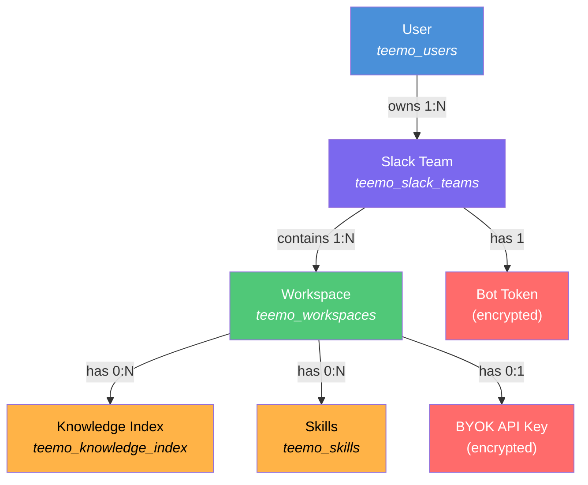

### Scalability Model

```
                    Stateless
                 ┌─────────────┐
  Request ──────►│  FastAPI #1  │──────┐
                 └─────────────┘      │
                 ┌─────────────┐      │     ┌──────────────┐
  Request ──────►│  FastAPI #2  │──────┼────►│   Supabase   │
                 └─────────────┘      │     │  (all state)  │
                 ┌─────────────┐      │     └──────────────┘
  Request ──────►│  FastAPI #N  │──────┘
                 └─────────────┘
```

**Key design decisions:**

- **Zero in-process state** — every request decrypts keys and resolves context from the DB. No caches, no singletons holding bot instances.
- **Horizontal scaling** — add more FastAPI containers behind a load balancer. All state lives in Supabase.
- **Isolation is application-enforced** — RLS is disabled. Every DB query includes `WHERE user_id = :current_user` or `WHERE owner_user_id = :current_user`. Team ownership is verified via `assert_team_owner()` before any workspace mutation.
- **One default workspace per team** — enforced by a PostgreSQL partial unique index on `(slack_team_id) WHERE is_default_for_team = true`.

---

## Bot Configuration

Each bot instance is configured through three layers:

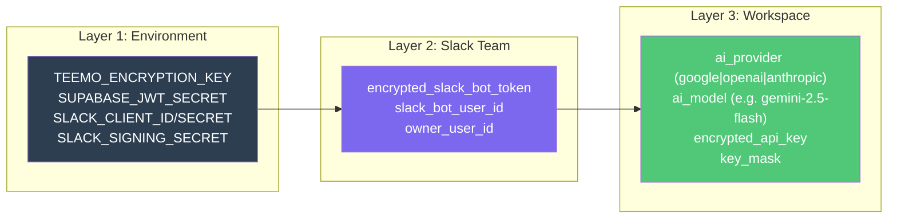

### Provider Defaults

| Provider | Default Model |
|----------|--------------|
| `google` | `gemini-2.5-flash` |
| `openai` | `gpt-4o` |
| `anthropic` | `claude-sonnet-4-6` |

### Key Resolution at Inference Time

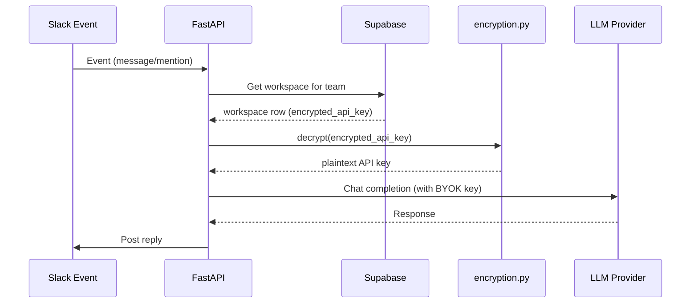

---

## Metadata Model

Metadata serves four distinct purposes across the system:

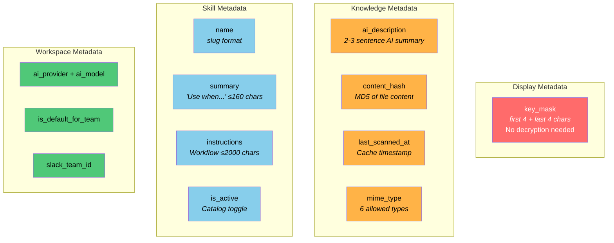

### Knowledge Index — Cache & Diff System

```
  Google Drive File
        │
        ▼
  ┌─────────────┐     content changed?
  │  Scan File   │────────────────────────┐
  │  (MD5 hash)  │                        │
  └──────┬───────┘                    NO  │
         │ YES                            │
         ▼                                ▼
  ┌─────────────┐                  ┌─────────────┐
  │ Re-generate  │                  │  Skip scan   │
  │ AI summary   │                  │  (use cached) │
  │ Update hash  │                  └──────────────┘
  │ Update ts    │
  └──────────────┘
```

The `content_hash` (MD5) enables **incremental re-scanning** — only files whose content actually changed get re-processed. The `ai_description` provides semantic search capability without re-reading the full document.

### Skills — Routing Table

```
  Incoming message
        │
        ▼
  ┌─────────────────┐
  │ Match against    │──── summary: "Use when user asks about..."
  │ active skills    │
  └────────┬────────┘
           │ matched
           ▼
  ┌─────────────────┐
  │ Inject into LLM │──── instructions: workflow steps (≤2000 chars)
  │ context          │
  └─────────────────┘
```

---

## Google Drive Knowledge Pipeline

The knowledge system is **not RAG** — there are no embeddings or vector databases. Files are read on-demand at inference time, with metadata acting as a routing layer so the AI knows *which* file to read.

### End-to-End Flow

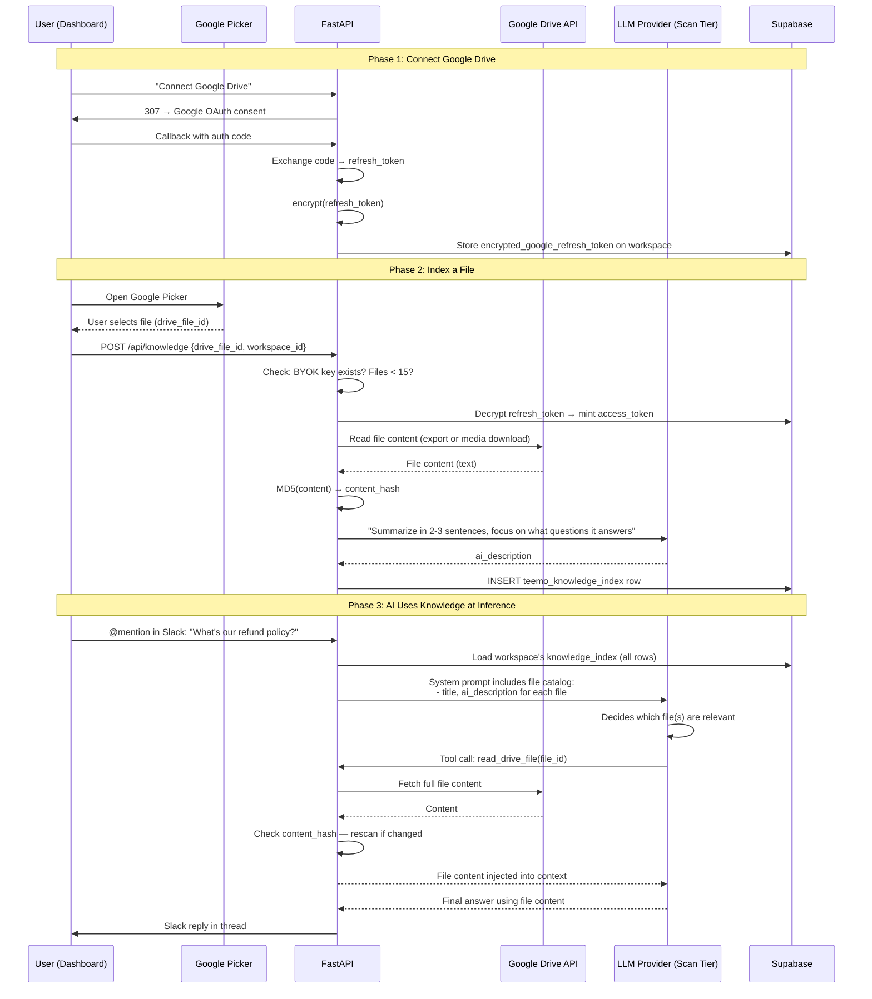

### How the AI Knows Which File to Read

The knowledge index acts as a **semantic routing table** — not a search index, but a catalog the AI reasons over:

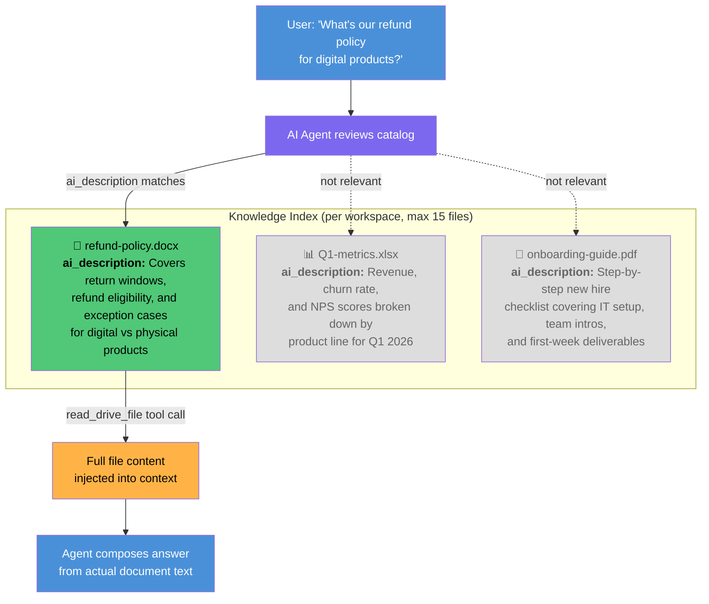

**Key design decisions:**

1. **No vector DB / embeddings** — the AI reads `ai_description` for all 15 files and decides which to fetch. At 15 files max, full-catalog reasoning is trivially fast and more accurate than cosine similarity.
2. **On-demand file reads** — files are fetched from Google Drive at inference time via `read_drive_file` tool. No content is stored locally. Always fresh.
3. **Two-tier LLM usage** — file summarization uses the **scan tier** (cheapest model: `gemini-2.0-flash-lite`, `gpt-4o-mini`, `claude-haiku-4-5`). Conversation uses the **conversation tier** (user-selected model). Both use the same BYOK key.
4. **Content-hash diffing** — at inference time, if the file's MD5 has changed since `last_scanned_at`, the AI re-summarizes before answering. Self-healing metadata.
5. **`drive.file` scope, not `drive.readonly`** — only files the user explicitly picks via Google Picker are accessible. No full-Drive enumeration. Zero security review needed from Google.

### File Type Handling

The `read_drive_file` tool branches by MIME type to extract text:

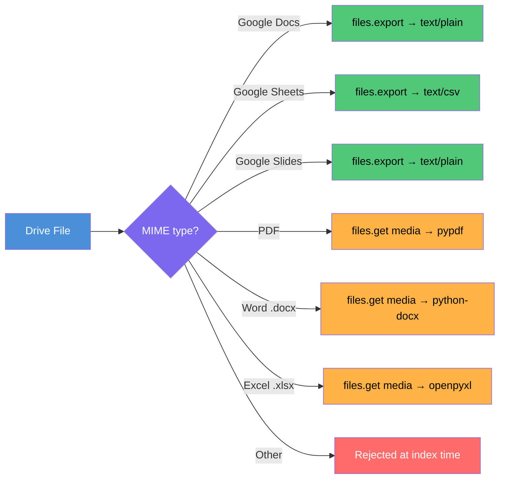

### Google Drive OAuth (per Workspace)

Each workspace has its **own** Google Drive credential — workspaces under the same Slack team never share Drive auth:

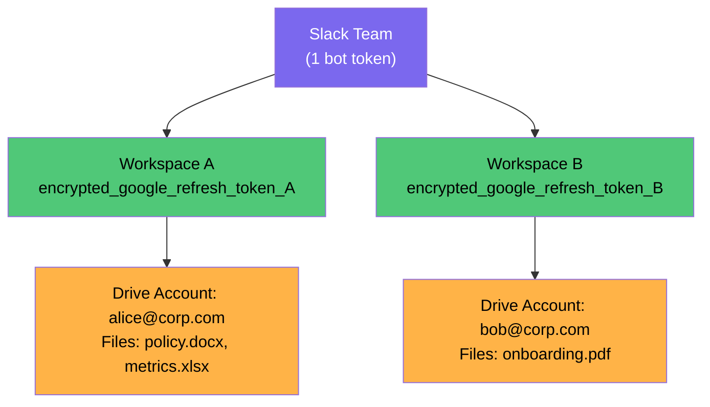

The refresh token flow (ADR-009):
1. User clicks "Connect Drive" → Google OAuth consent (`drive.file` + `userinfo.email` scopes)
2. Backend receives auth code → exchanges for `access_token` + `refresh_token`
3. `refresh_token` encrypted with AES-256-GCM → stored in `teemo_workspaces.encrypted_google_refresh_token`
4. At inference time: decrypt refresh token → exchange for short-lived access token → read file → discard access token

### Guardrails

| Constraint | Enforcement |
|-----------|-------------|
| Max 15 files per workspace | DB trigger (`trg_teemo_knowledge_index_cap`) + backend pre-check |
| BYOK key required before adding files | Backend rejects with 400 if no `encrypted_api_key` |
| Supported MIME types only | DB CHECK constraint on `mime_type` column (6 allowed types) |
| One file indexed once per workspace | UNIQUE constraint on `(workspace_id, drive_file_id)` |
| Refresh token revoked by user | Backend detects `invalid_grant` → prompts reconnect via dashboard |

---

## Authentication & Security

### Token Architecture

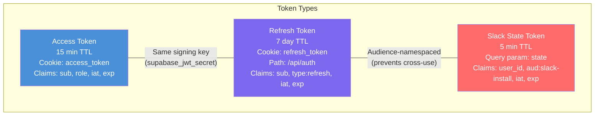

### Auth Flow

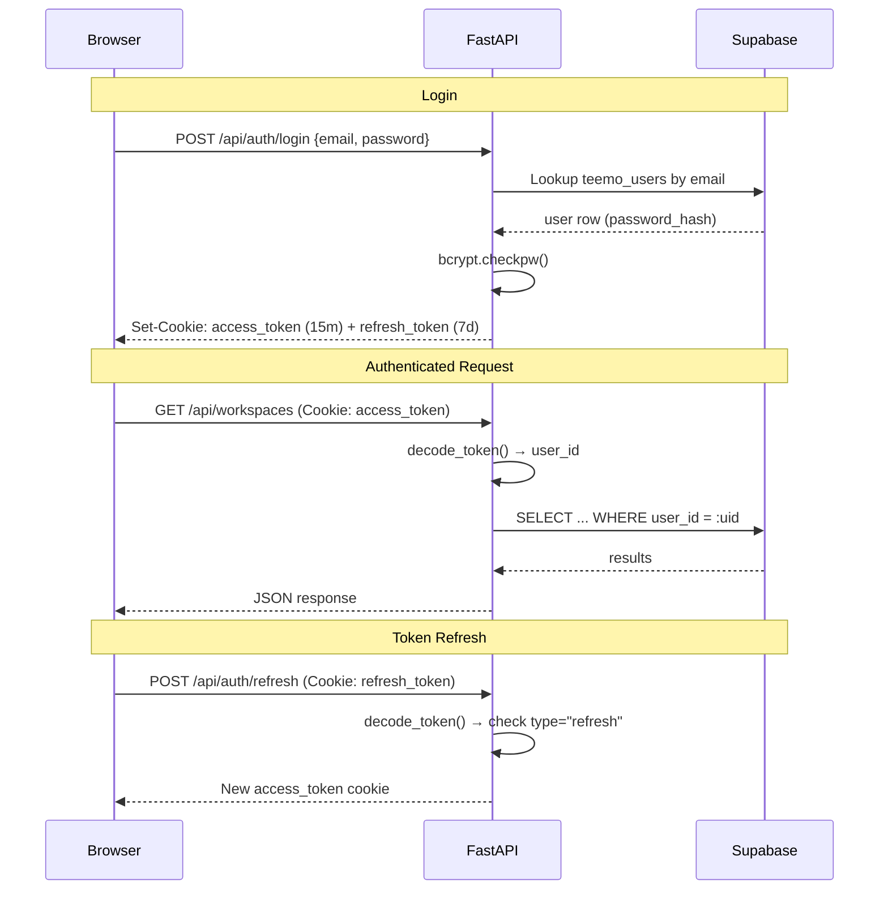

---

## Slack Integration

### OAuth Install Flow

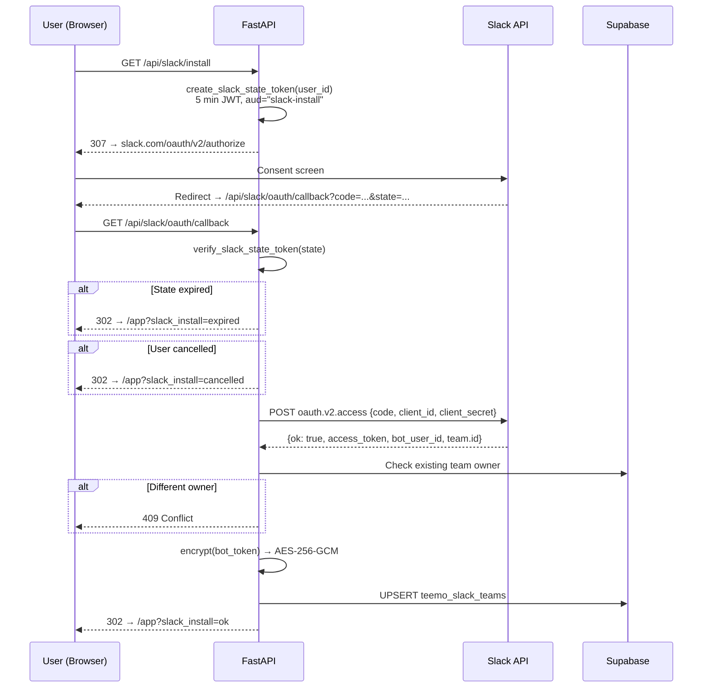

### Event Handling

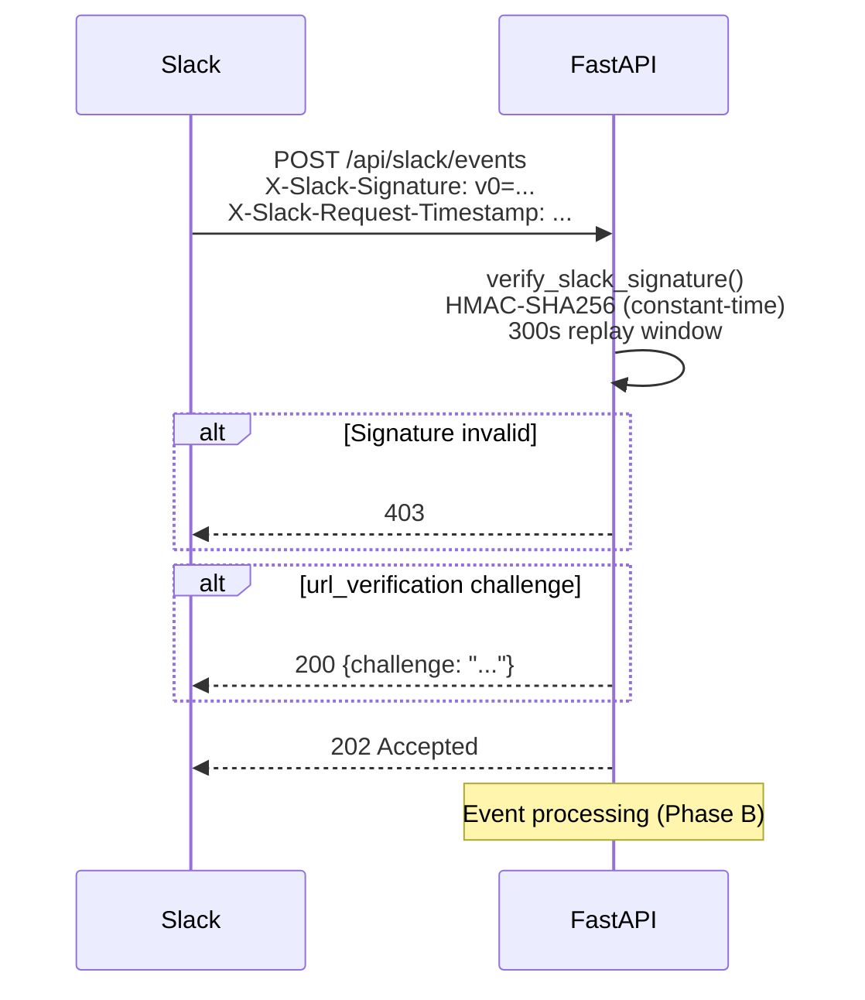

**8 Required Scopes (ADR-021 + ADR-025):**
`app_mentions:read`, `channels:history`, `channels:read`, `chat:write`, `groups:history`, `groups:read`, `im:history`, `users:read`

(`users:read` added 2026-04-27 — needed for sender display-name + tz resolution. Existing installs must re-authorize.)

---

## Encryption Pipeline

All secrets at rest use AES-256-GCM with a single master key (`TEEMO_ENCRYPTION_KEY`).

```
 ENCRYPT                                    DECRYPT
 ═══════                                    ═══════

 plaintext                                  base64url blob
     │                                           │
     ▼                                           ▼
 ┌──────────┐                              ┌──────────┐
 │ Generate  │                              │ base64url│
 │ 12-byte   │                              │ decode   │
 │ nonce     │                              └────┬─────┘
 └─────┬─────┘                                   │
       │                                    ┌────┴─────┐
       ▼                                    │ Split:   │
 ┌──────────┐                               │ nonce[12]│
 │ AES-256- │                               │ ct+tag   │
 │ GCM      │                               └────┬─────┘
 │ encrypt  │                                    │
 └─────┬─────┘                                   ▼
       │                                   ┌──────────┐
       ▼                                   │ AES-256- │
 nonce ║ ciphertext ║ tag                  │ GCM      │
       │                                   │ decrypt  │
       ▼                                   └────┬─────┘
 ┌──────────┐                                   │
 │ base64url│                                   ▼
 │ encode   │                              plaintext
 └─────┬────┘
       │
       ▼
  stored in DB

 Wire format: base64url( nonce[12] || ciphertext || gcm_tag[16] )
 Fresh nonce per call → same plaintext produces different ciphertext
```

**What gets encrypted:**

| Secret | Table | Column |
|--------|-------|--------|
| Slack bot token | `teemo_slack_teams` | `encrypted_slack_bot_token` |
| BYOK API key | `teemo_workspaces` | `encrypted_api_key` |
| Google refresh token | `teemo_workspaces` | `encrypted_google_refresh_token` (planned) |

**Logging safety:** Only `key_fingerprint()` (first 8 hex of SHA-256) is ever logged. Raw keys, ciphertext, and Slack secrets never appear in logs.

---

## Database Schema

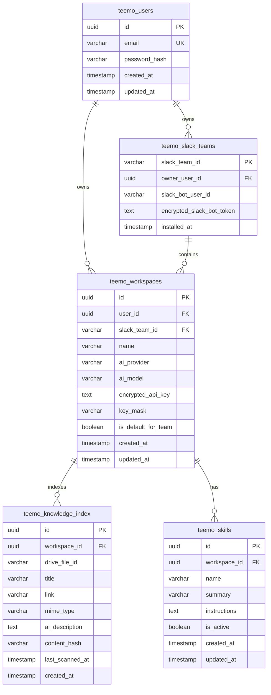

**Constraints:**
- `ai_provider` CHECK: `google`, `openai`, or `anthropic`
- `is_default_for_team`: partial unique index ensures max one default per team
- `teemo_skills.name`: slug regex (`^[a-z0-9]+(-[a-z0-9]+)*$`)
- `teemo_skills.summary`: max 160 chars; `instructions`: max 2000 chars
- `teemo_knowledge_index.mime_type`: 6 allowed MIME types
- All `updated_at` columns use the shared `teemo_set_updated_at()` trigger

---

## Deployment

### Docker Multi-Stage Build

```
 Stage 1: builder-frontend          Stage 2: runtime
 ══════════════════════════          ══════════════════════
 Node 22-alpine                     Python 3.11-slim
     │                                   │
     ├─ npm ci                           ├─ pip install (FastAPI deps)
     ├─ npm run build                    ├─ COPY backend/
     └─ Output: /build/dist/            ├─ COPY --from=stage1 dist/ → static/
                                         └─ CMD: uvicorn app.main:app
                                              --host 0.0.0.0 --port 8000
```

### Request Routing

```
  Incoming Request
       │
       ├── /api/*  ──────────► FastAPI route handlers
       │
       ├── /static/* ────────► Built React assets (JS, CSS, images)
       │
       └── /* (anything else) ► index.html (SPA fallback)
                                  │
                                  └─► TanStack Router (client-side routing)
```

### Development Setup

```
  Terminal 1:                    Terminal 2:
  cd frontend && npm run dev     cd backend && uvicorn app.main:app --reload
       │                              │
       │ :5173                        │ :8000
       │                              │
       └── /api/* proxy ──────────────┘
           (vite.config.ts)
```
