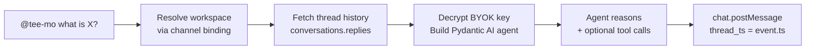

# EPIC-007: AI Agent + Slack Event Loop

## 1. Problem & Value

### 1.1 The Problem

Tee-Mo has a complete foundation (auth, deploy, Slack OAuth install, workspace CRUD, BYOK key management) but the core value proposition — an AI agent that answers questions in Slack — does not exist yet. Users can install the bot and configure a workspace, but @mentioning the bot does nothing. The Slack events endpoint returns 202 and discards every event.

### 1.2 The Solution

Build the Pydantic AI agent framework and wire it into Slack event handlers so that:
1. A user @mentions `@tee-mo` in a bound channel → the bot replies in-thread using the workspace's BYOK key and selected AI model.
2. A user sends a DM to the bot → the bot replies using the team's default workspace.
3. Thread messages become the agent's conversation history, with each speaker identified.
4. The agent can create, load, update, and delete workspace skills through natural conversation.

This epic deliberately ships **without** Google Drive (`read_drive_file`). The agent answers from thread context + skills only. Drive integration (EPIC-006) will plug in `read_drive_file` as an additional tool later.

### 1.3 Success Metrics (North Star)
- User @mentions bot in a Slack channel → bot replies in the same thread within 10 seconds (model latency dependent).
- Thread continuation works: subsequent messages in the thread are treated as conversation history. The agent differentiates who said what.
- User can teach the agent a skill via chat ("create a skill called X that does Y") and the agent uses it in subsequent conversations.
- All three BYOK providers (OpenAI, Anthropic, Google) produce valid responses.
- No BYOK key, encrypted token, or workspace ID is ever logged in plaintext.

---

## 2. Scope Boundaries

### IN-SCOPE (Build This)
- [x] `build_agent()` async factory — Pydantic AI Agent with BYOK key resolution, two-tier model instantiation, system prompt assembly
- [x] `AgentDeps` dataclass (workspace_id, supabase, user_id)
- [x] Model instantiation helpers (`_ensure_model_imports`, `_build_pydantic_ai_model`) — copy+strip from new_app
- [x] System prompt with dynamic `## Available Skills` section (no `## Available Files` until EPIC-006)
- [x] `teemo_skills` table migration + `skill_service.py` (CRUD: list, get, create, update, delete)
- [x] 4 skill tools on the agent: `load_skill`, `create_skill`, `update_skill`, `delete_skill`
- [x] `app_mention` event handler — resolve workspace via `workspace_channels`, fetch thread history, run agent, post reply in-thread
- [x] `message.im` event handler — resolve workspace via `is_default_for_team`, same flow, self-message filter
- [x] Thread history fetching via `conversations.replies` with speaker identification (user display names)
- [x] Unbound-channel nudge reply (no AI inference — just a setup link)
- [x] "No default workspace" nudge reply for DMs
- [x] "No API key configured" error reply
- [x] Rate-limit error handling (`SlackApiError` with `ratelimited` → graceful message)
- [x] Channel binding REST endpoints: `POST /api/workspaces/{id}/channels`, `DELETE /api/workspaces/{id}/channels/{channel_id}`, `GET /api/workspaces/{id}/channels`
- [x] `GET /api/slack/teams/{team_id}/channels` — `conversations.list` proxy for the dashboard channel picker

### OUT-OF-SCOPE (Do NOT Build This)
- `read_drive_file` tool — deferred to EPIC-006
- `scan_file_metadata` service — deferred to EPIC-006
- `## Available Files` section in system prompt — deferred to EPIC-006
- Two-tier model strategy for scan tier — deferred to EPIC-006 (only conversation tier ships here)
- Channel picker modal UI in the frontend — deferred to EPIC-008 (Workspace Setup Wizard)
- Frontend channel chip rendering on workspace cards — deferred to EPIC-008
- Event deduplication via stored event_id — V1 accepts the small risk of rare Slack retries producing duplicate replies; add dedup when it becomes a real problem
- Context pruning / token counting — deferred to EPIC-009 (Error Handling)
- Streaming responses via `chat.update` — Charter ADR-013 says `chat.postMessage` only (no streaming)
- Skills REST API or dashboard UI — Charter §1.2 says skills are chat-only CRUD

---

## 3. Context

### 3.1 User Personas
- **Slack User (Channel)**: Team member who @mentions `@tee-mo` in a bound channel to ask a question. Expects an in-thread reply.
- **Slack User (DM)**: User who messages the bot directly. Expects the bot to use the team's default workspace config.
- **Workspace Admin**: The user who configured the BYOK key and workspace. Teaches the bot skills via Slack chat.

### 3.2 User Journey (Happy Path)


### 3.3 Constraints
| Type | Constraint |
|------|------------|
| **Security** | BYOK keys decrypted in-memory only, never logged. Bot tokens from `teemo_slack_teams` decrypted per-request. |
| **Tech Stack** | Pydantic AI 1.79 with `[openai,anthropic,google]` extras (ADR-003). Provider string format: `provider:model-id`. |
| **Performance** | No streaming (ADR-013). Full response posted via `chat.postMessage`. Slack expects 200/202 within 3 seconds — agent runs async after acknowledging. |
| **Scope** | Skills are chat-only CRUD (ADR-023). No REST endpoints, no dashboard UI for skills. |
| **Copy Source** | `Documents/Dev/new_app` — orchestrator.py, skill_service.py. Copy-then-optimize per ADR-012. |

---

## 4. Technical Context

### 4.1 Affected Areas
| Area | Files/Modules | Change Type |
|------|---------------|-------------|
| Agent factory | `backend/app/agents/agent.py` | **New** — `build_agent()`, `AgentDeps`, model helpers |
| Agent init | `backend/app/agents/__init__.py` | **New** |
| Skill service | `backend/app/services/skill_service.py` | **New** — CRUD for `teemo_skills` |
| Skill tools | (registered inside agent.py) | **New** — `load_skill`, `create_skill`, `update_skill`, `delete_skill` |
| Slack event handler | `backend/app/api/routes/slack_events.py` | **Modify** — replace 202 passthrough with real `app_mention` + `message.im` dispatch |
| Slack thread history | `backend/app/services/slack_thread.py` | **New** — `fetch_thread_history()` with speaker labels |
| Channel binding routes | `backend/app/api/routes/channels.py` | **New** — REST CRUD for workspace-channel bindings |
| Channel list proxy | `backend/app/api/routes/slack_teams.py` (or extend existing) | **New** — `GET /api/slack/teams/{team_id}/channels` |
| Migration | `database/migrations/009_teemo_skills.sql` | **New** — `teemo_skills` table |
| Config | `backend/app/core/config.py` | **Modify** — no new env vars needed (BYOK + Slack secrets already exist) |
| Main app | `backend/app/main.py` | **Modify** — mount `channels_router`, update `TEEMO_TABLES` |

### 4.2 Dependencies
| Type | Dependency | Status |
|------|------------|--------|
| **Requires** | EPIC-002: Auth (JWT + user model) | Done (S-02) |
| **Requires** | EPIC-003 Slice A: Schema (`teemo_slack_teams`, `teemo_workspace_channels`) | Done (S-03) |
| **Requires** | EPIC-003 Slice B: Workspace CRUD (workspace routes + models) | Done (S-05) |
| **Requires** | EPIC-004: BYOK Key Management (`encryption.py`, `provider_resolver.py`, `keys.py`) | Done (S-06) |
| **Requires** | EPIC-005 Phase A: Slack OAuth Install (`teemo_slack_teams` rows with encrypted bot tokens) | Done (S-04) |
| **Unlocks** | EPIC-006: Google Drive — plugs `read_drive_file` tool into the agent |
| **Unlocks** | EPIC-008: Workspace Setup Wizard — channel picker UI consumes channel binding endpoints |

### 4.3 Integration Points
| System | Purpose | Docs |
|--------|---------|------|
| Pydantic AI 1.79 | Agent instantiation, tool registration, multi-provider model support | https://ai.pydantic.dev/ |
| Slack Web API | `conversations.replies` (thread history), `chat.postMessage` (reply), `conversations.list` (channel list), `users.info` (display names) | https://api.slack.com/methods |
| Slack Events API | `app_mention`, `message.im` event delivery | https://api.slack.com/events |
| Supabase | `teemo_skills` CRUD, `teemo_workspace_channels` queries, `teemo_workspaces` + `teemo_slack_teams` lookups | — |

### 4.4 Data Changes
| Entity | Change | Fields |
|--------|--------|--------|
| `teemo_skills` | **NEW** | `id` (UUID PK), `workspace_id` (FK → teemo_workspaces ON DELETE CASCADE), `name` (slug, 1-60 chars), `summary` (1-160 chars), `instructions` (1-2000 chars), `is_active` (bool, default true), `created_at`, `updated_at`. UNIQUE constraint on `(workspace_id, name)`. Name regex: `^[a-z0-9]+(-[a-z0-9]+)*$` (enforced in service layer, not DB). |

### 4.5 Copy Source Reference
| Target | Copy Source (new_app) | What to Strip |
|--------|----------------------|---------------|
| `build_agent()` factory | `orchestrator.py::build_orchestrator()` | `chy_agent_definitions` DB lookup, `chy_workspace_agent_config` DB lookup, `internet_search` param, persona injection, team roster injection, response formatting rules, blueprint catalog injection. Keep: `AgentDeps`, `_ensure_model_imports()`, `_build_pydantic_ai_model()`, BYOK resolution call, `Agent()` construction, skill catalog injection. |
| `skill_service.py` | `services/skill_service.py` | `related_tools` param + validation, `is_system` field, `seed_system_skills()`, `SYSTEM_SKILLS` constant, `TOOL_CATALOG` validation. Keep: `list_skills()`, `get_skill()`, `create_skill()`, `update_skill()`, `delete_skill()`, name format validation. |
| 4 skill tools | `orchestrator.py` tool defs | `related_tools` parameter from write tools. Keep: `load_skill`, `create_skill`, `update_skill`, `delete_skill` signatures (simplified). |

---

## 5. Decomposition Guidance

### Affected Areas (for codebase research)
- [x] Agent framework: `backend/app/agents/` (new directory)
- [x] Slack events: `backend/app/api/routes/slack_events.py` (modify — currently 202 passthrough)
- [x] Slack core: `backend/app/core/slack.py` (read — AsyncApp singleton, verify_slack_signature)
- [x] BYOK resolution: `backend/app/services/provider_resolver.py` + `backend/app/core/keys.py` + `backend/app/core/encryption.py` (read — already done in S-06)
- [x] Workspace model: `backend/app/models/workspace.py` + `backend/app/api/routes/workspaces.py` (read — workspace queries)
- [x] Slack teams model: `backend/app/models/slack.py` + `backend/app/api/routes/slack_oauth.py` (read — team/bot_user_id lookups)
- [x] Skills: new `backend/app/services/skill_service.py` + migration

### Key Constraints for Story Sizing
- Each story should touch 1-3 files and have one clear goal
- Agent factory is the foundation — everything depends on it
- Slack event handlers need the agent factory + thread history service
- Channel binding REST is independent of the agent (pure CRUD)
- Skills service is independent of Slack (pure CRUD + tool registration)

### Suggested Sequencing
1. **Skills table migration + skill_service.py** — foundation for skill tools, no dependencies on agent
2. **Agent factory (`build_agent`) + model helpers + system prompt** — core agent, depends on BYOK resolution (done) and skill_service (step 1)
3. **Thread history service** — `fetch_thread_history()` with speaker labels, independent of agent
4. **Channel binding REST** — CRUD endpoints for `workspace_channels`, independent of agent
5. **Slack event handlers** — wires everything together: resolve workspace, fetch thread, build agent, post reply. Depends on steps 2+3+4.
6. **Manual E2E verification** — test all three providers in a real Slack workspace

---

## 6. Risks & Edge Cases
| Risk | Likelihood | Mitigation |
|------|------------|------------|
| Pydantic AI 1.79 model string format differs from what we expect | Low | Charter §3.2 pins `pydantic-ai[openai,anthropic,google]==1.79.0`. Copy the exact `_build_pydantic_ai_model` pattern from new_app which is proven. |
| Slack events endpoint must return 200/202 within 3 seconds or Slack retries | High | Acknowledge the event immediately with 200, then process the agent call in a background task (`asyncio.create_task`). Post the reply via `chat.postMessage` when done. |
| Bot replies to its own messages in DMs (infinite loop) | High | Self-message filter: early-exit when `event.get("bot_id")` is set OR `event.get("user") == slack_team.slack_bot_user_id`. Both checked before any processing. |
| Slack retry sends duplicate events (3x retry within 30 seconds) | Medium | Accept the risk for V1. Duplicate replies are annoying but not destructive. Add event_id dedup store if it becomes a problem. |
| BYOK key is invalid or expired at inference time | Medium | Catch Pydantic AI provider exceptions. Post a user-friendly error to the thread: "Your API key was rejected by {provider}. Check your key in the dashboard." |
| Thread history is very long (many messages) | Low | V1 sends full thread history. EPIC-009 adds context pruning. For now, extremely long threads may hit provider token limits — the provider will return an error which we surface to the user. |
| `conversations.replies` rate limited | Low | Catch `SlackApiError(ratelimited)`. Post graceful message: "Tee-Mo is busy — please try again in a moment." No retry loop. |
| Workspace has no BYOK key configured | Medium | Agent factory raises `ValueError`. Event handler catches it and posts: "No API key configured. Add your provider key in the Tee-Mo dashboard." with a link. |
| Channel not bound to any workspace | Expected | Post unbound-channel nudge in-thread: "I'm not set up in this channel yet. Bind it to a workspace in the dashboard: {link}." No AI inference. |

---

## 7. Acceptance Criteria (Epic-Level)

```gherkin
Feature: AI Agent responds to Slack mentions and DMs

  Scenario: Channel @mention — happy path
    Given a Slack channel is bound to a workspace with a valid BYOK key
    When a user @mentions @tee-mo with "what is the capital of France?"
    Then the bot posts a reply in the same thread
    And the reply contains a correct answer
    And the reply is attributed to the bot (not another user)

  Scenario: Thread continuation with speaker identification
    Given a thread with prior messages from Alice and Bob
    When Charlie @mentions @tee-mo asking "summarize what Alice said"
    Then the agent's reply references Alice's messages specifically
    And the agent distinguishes Alice from Bob and Charlie

  Scenario: DM — happy path
    Given a team has a default workspace with a valid BYOK key
    When a user sends a DM to the bot saying "hello"
    Then the bot replies in-thread in the DM
    And the self-message filter prevents the bot from replying to itself

  Scenario: Unbound channel
    Given a channel with no workspace binding
    When a user @mentions @tee-mo
    Then the bot posts a nudge message in-thread with a dashboard link
    And no AI inference occurs

  Scenario: No BYOK key
    Given a bound channel whose workspace has no BYOK key
    When a user @mentions @tee-mo
    Then the bot posts an error message: "No API key configured"
    And no LLM call is made

  Scenario: Skill creation via chat
    Given a workspace with a valid BYOK key
    When a user says "@tee-mo create a skill called daily-standup that formats standup notes"
    Then the agent creates the skill in teemo_skills
    And the skill appears in the Available Skills section of subsequent prompts

  Scenario: Rate limit
    Given the Slack API returns ratelimited
    When the bot tries to post a reply
    Then the bot posts a graceful fallback message (if possible)
    And no crash or unhandled exception occurs
```

---

## 8. Open Questions
| Question | Options | Impact | Owner | Status |
|----------|---------|--------|-------|--------|
| Should we use `asyncio.create_task` or a proper task queue for background agent processing? | A: `asyncio.create_task` (simple, in-process), B: Celery/ARQ (durable, separate worker) | Affects reliability of long-running agent calls. V1: option A is sufficient — single-container deploy, no task queue infra. | sandrinio | **Decided — A** |
| How to format thread history for the agent? | A: `"User (Alice): message\nAssistant: reply\n..."`, B: Pydantic AI message objects | Affects agent quality. A is simpler and provider-agnostic. B uses Pydantic AI's native `ModelMessage` types for better multi-turn. | sandrinio | **Decided — B** |
| Should channel binding endpoints require workspace ownership or just auth? | A: Any authenticated user, B: Only workspace owner | Affects security model. B is safer — only the person who created the workspace can bind channels. | sandrinio | **Decided — B** |

---

## 9. Artifact Links

**Stories (Status Tracking):**
- [ ] STORY-007-01-skill-service -> Active (Sprint S-07)
- [ ] STORY-007-02-agent-factory -> Active (Sprint S-07)
- [ ] STORY-007-03-thread-history -> Active (Sprint S-07)
- [ ] STORY-007-04-channel-binding-rest -> Active (Sprint S-07)
- [ ] STORY-007-05-slack-dispatch -> Active (Sprint S-07)
- [ ] STORY-007-06-manual-e2e -> Active (Sprint S-07)

**References:**
- Charter: [Tee-Mo Charter §3.3, §3.4, §5.1](../../strategy/tee_mo_charter.md)
- Roadmap: [Roadmap §3 ADR-003, ADR-004, ADR-021, ADR-024, ADR-025](../../strategy/tee_mo_roadmap.md)
- Copy Source: `Documents/Dev/new_app/backend/app/agents/orchestrator.py`
- Copy Source: `Documents/Dev/new_app/backend/app/services/skill_service.py`
- Existing: `backend/app/core/encryption.py` (AES-256-GCM — done S-04)
- Existing: `backend/app/services/provider_resolver.py` (BYOK resolution — done S-06)
- Existing: `backend/app/core/slack.py` (AsyncApp singleton — done S-04)
- Existing: `backend/app/api/routes/slack_events.py` (202 skeleton — done S-04)

---

## Change Log
| Date | Change | By |
|------|--------|-----|
| 2026-04-12 | Initial draft. Combines Charter EPIC-007 (AI Agent) scope with EPIC-005 Phase B Slack event handling to create a working end-to-end bot without Google Drive. Resequenced ahead of EPIC-006 per user decision. | Claude (doc-manager) |
| 2026-04-12 | All open questions decided. Thread history format: Pydantic AI ModelMessage objects (Option B). Channel binding ownership: workspace owner only. Background processing: asyncio.create_task. EPIC-006 file processing approach decided: Option A (process at index time) + cached_content column in teemo_knowledge_index for fast concurrent reads at query time. | Claude (doc-manager) |
