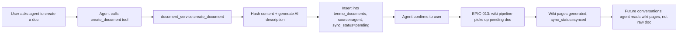

# EPIC-015: Documents Table Redesign + Agent Document Creation

## 1. Problem & Value
> Target Audience: Stakeholders, Business Sponsors

### 1.1 The Problem
Two problems converging:

1. **Agent can't create knowledge.** Tee-Mo can read Drive files but cannot persist its own output. Meeting notes, summaries, synthesized insights — they disappear with the Slack thread. The agent has no write path back into the knowledge base.

2. **`teemo_knowledge_index` is being bent out of shape.** The table was designed for Drive file indexing. EPIC-014 (local upload) was already planning to bolt on nullable `drive_file_id`, a `source` column, and relaxed MIME constraints. Agent-created documents would add more patches. With zero clients and zero data, this is the right time to redesign the table properly rather than accumulate tech debt before launch.

### 1.2 The Solution
Replace `teemo_knowledge_index` with a proper **`teemo_documents`** table (following the `chy_documents` pattern from new_app) and add agent document creation tools.

The new table:
- Supports all three sources natively: `google_drive`, `upload`, `agent`
- Has a `sync_status` state machine (`pending → processing → synced → error`) that drives EPIC-013 wiki pipeline processing
- Drops Drive-specific assumptions (no more `drive_file_id` as the identity column)
- Uses UUID `id` as the universal document identifier across all sources

The agent gets **write tools only**:
- `create_document(title, content)` — persists markdown into the workspace knowledge base
- `update_document(document_id, content)` — modifies agent-created documents only
- `delete_document(document_id)` — removes agent-created documents only

The agent's **primary read path** is the wiki layer (EPIC-013) via `read_wiki_page(slug)`. This epic provides a `read_document` **fallback tool** for cases where wiki pages are insufficient (exact quotes, spreadsheet row data, documents pending wiki ingest). The wiki is the preferred path; raw document read is the escape hatch.

```
                  EPIC-015 (this epic)                    EPIC-013 (wiki pipeline)
┌──────────────────────────────────┐       ┌──────────────────────────────────┐
│  Sources:                        │       │  Agent reads (primary):           │
│  • Google Drive (cron sync)      │       │  • Wiki index (system prompt)    │
│  • Local upload (EPIC-014)       │──────>│  • read_wiki_page(slug)          │
│  • Agent create_document tool    │ ingest│  • Lint tool                     │
│                                  │       │                                  │
│  teemo_documents                 │       │  teemo_wiki_pages                │
│  (sync_status: pending)          │       │  (TLDRs, concepts, entities)     │
│                                  │       │                                  │
│  Agent reads (fallback):         │       │                                  │
│  • read_document(id) — raw       │       │                                  │
│    content from teemo_documents  │       │                                  │
└──────────────────────────────────┘       └──────────────────────────────────┘
```

A new **`document_service.py`** service layer (following new_app's pattern) provides clean CRUD that both API routes and agent tools call — no duplicated logic.

### 1.3 Success Metrics (North Star)
- Agent can create, update, and delete markdown documents via tools in Slack
- Created documents enter the wiki pipeline (EPIC-013) identically to Drive and uploaded files — `sync_status='pending'` triggers wiki ingest
- All existing Drive functionality works against the new `teemo_documents` table with zero behavioral regression
- `document_service.py` is the single CRUD entry point for all document operations (routes + agent tools)
- `read_document` fallback tool reads raw content from `teemo_documents` for cases where wiki pages are insufficient. Primary read path is wiki (EPIC-013).

---

## 2. Scope Boundaries
> Target Audience: AI Agents (Critical for preventing hallucinations)

### IN-SCOPE (Build This)
- [ ] **`teemo_documents` table** — replaces `teemo_knowledge_index`. New schema with `source` enum, `sync_status` state machine, `content_hash` (SHA-256), nullable `external_id` (Drive file ID), `original_filename`, `content` (replaces `cached_content`), `ai_description`, `doc_type`, `metadata` JSONB. Unified 15-doc cap via DB trigger.
- [ ] **Drop `teemo_knowledge_index`** — no data to migrate. Clean replacement.
- [ ] **`document_service.py`** — service layer with: `create_document()`, `read_document_content()`, `update_document()`, `delete_document()`, `list_documents()`. Both API routes and agent tools call this service. Handles hash computation, AI description generation, sync_status transitions.
- [ ] **Refactor knowledge routes** — `backend/app/api/routes/knowledge.py` updated to use `teemo_documents` + `document_service.py`. Existing endpoints preserved: index from Drive (POST), list (GET), delete (DELETE), reindex (POST). New endpoint: `POST /api/workspaces/{id}/documents` for agent/upload creation.
- [ ] **Refactor existing agent code** — all references to `teemo_knowledge_index` in `agent.py` updated to `teemo_documents`. Rename `read_drive_file` to `read_document` — reads `content` from `teemo_documents` by UUID (works for all sources: Drive, upload, agent). System prompt guidance: "Prefer wiki pages for answering questions. Use `read_document` only when you need exact quotes, specific data points, or the wiki doesn't cover the topic yet." Replace `## Available Files` with `## Available Documents` listing titles + `ai_description` (transitional until EPIC-013 wiki index replaces it).
- [ ] **Agent document CRUD tools:**
  - `create_document(title, content)` — creates with `source='agent'`, `doc_type='markdown'`, `sync_status='pending'`. Returns document ID + confirmation.
  - `update_document(document_id, content)` — only `source='agent'` docs are mutable. Re-hashes, re-generates AI description, sets `sync_status='pending'` for wiki re-ingest.
  - `delete_document(document_id)` — only `source='agent'` docs. Cascades to wiki pages (EPIC-013).
  - `read_document(document_id)` — fallback read tool. Returns `content` from `teemo_documents`. Works for all sources. Workspace isolation enforced.
- [ ] **`sync_status` state machine** — `pending → processing → synced → error`. Documents start as `pending` on create/update. EPIC-013 wiki pipeline transitions to `processing` then `synced`. Until EPIC-013 lands, `sync_status` stays `pending` with no ill effects — documents are still usable via the transitional system prompt section.
- [ ] **Cron: Drive change detection** — 10-minute background task checks all `source='google_drive'` documents for content-hash changes via `files.get(fields=md5Checksum)`. On hash mismatch: re-fetch content, update `content`, recompute `content_hash`, set `sync_status='pending'` for wiki re-ingest. This is the cron that EPIC-013 §2 referenced — it lives here because it's a document-layer concern (syncing source content), not a wiki concern.
- [ ] **Reindex** — only re-fetches `source='google_drive'` documents. Skips `upload` and `agent`.
- [ ] **Health check** — replace `teemo_knowledge_index` with `teemo_documents` in `TEEMO_TABLES`.
- [ ] **Frontend** — update workspace detail page to read from `teemo_documents`. Source badges: Drive / Upload / Agent.
- [ ] **Update EPIC-014** — local upload stories now target `teemo_documents` instead of patching `teemo_knowledge_index`.

### OUT-OF-SCOPE (Do NOT Build This)
- **Wiki ingest pipeline** — that's EPIC-013. This epic provides the `sync_status` handoff; EPIC-013 consumes it.
- **`read_wiki_page` tool** — that's EPIC-013.
- **Wiki index in system prompt** — that's EPIC-013. This epic provides a transitional `## Available Documents` section until EPIC-013 lands.
- Frontend document editor or viewer — agent-only creation for v1
- Frontend "Create Document" button — future enhancement
- Agent creating documents in formats other than markdown
- Agent editing Drive or uploaded files — those sources are read-only to the agent
- Version history or diff tracking
- Vector embeddings or RAG (Charter §2.3 — no vector DB)

---

## 3. Context

### 3.1 User Personas
- **Slack User**: Asks the agent to "write that up" or "save this as a doc" — expects it to persist for future conversations
- **Workspace Admin**: Manages all documents (Drive, uploaded, agent-created) from the dashboard
- **Agent (Tee-Mo)**: Can persist synthesized knowledge. Knowledge compounds across conversations via the wiki pipeline.

### 3.2 User Journey (Happy Path)


### 3.3 Constraints
| Type | Constraint |
|------|------------|
| **Document Cap** | 15 documents per workspace, all sources combined (ADR-007). No sub-cap per source — simplest approach, no data to justify complexity. |
| **Content Size** | 100KB max content per document (aligned with new_app). Existing 50K char truncation preserved for Drive exports. |
| **BYOK** | AI description generation uses workspace BYOK key (scan-tier model). |
| **Workspace Isolation** | Documents scoped to workspace. Agent can only CRUD docs in its own workspace. |
| **Table Prefix** | `teemo_documents` (shared Supabase instance). |
| **Agent writes only** | Agent can create/update/delete `source='agent'` docs. Agent **reads** via wiki layer (EPIC-013), not raw documents. |
| **Auto-create** | Agent creates documents only when explicitly asked by the user. System prompt guides this. |

---

## 4. Technical Context
> Target Audience: AI Agents - READ THIS before decomposing.

### 4.1 Affected Areas
| Area | Files/Modules | Change Type |
|------|---------------|-------------|
| Migration | `database/migrations/0XX_teemo_documents.sql` | New — create `teemo_documents`, drop `teemo_knowledge_index` |
| Service | `backend/app/services/document_service.py` | New — CRUD operations, hash, AI description, sync_status transitions |
| Service | `backend/app/services/drive_service.py` | Modify — update table references from `teemo_knowledge_index` → `teemo_documents`, extraction logic stays |
| Service | `backend/app/services/scan_service.py` | No change — `generate_ai_description` interface stays the same |
| Routes | `backend/app/api/routes/knowledge.py` | Modify — use `teemo_documents` + `document_service`, add `POST .../documents` |
| Models | `backend/app/models/knowledge.py` | Modify — add `CreateDocumentRequest`, `DocumentResponse` with source field |
| Agent | `backend/app/agents/agent.py` | Modify — remove `read_drive_file` tool, remove raw file catalog from system prompt, add `create_document` + `update_document` + `delete_document` tools, add transitional `## Available Documents` section (replaced by wiki index when EPIC-013 lands) |
| Cron | `backend/app/services/drive_sync_cron.py` | New — 10-minute background task checking Drive files for content-hash changes |
| Startup | `backend/app/main.py` | Modify — replace `teemo_knowledge_index` with `teemo_documents` in `TEEMO_TABLES`, register cron on lifespan |
| Frontend | `frontend/src/routes/app.teams.$teamId.$workspaceId.tsx` | Modify — update API response shape, add source badges |
| Frontend | `frontend/src/hooks/useKnowledge.ts` | Modify — update types and API calls |

### 4.2 Dependencies
| Type | Dependency | Status |
|------|------------|--------|
| **Requires** | EPIC-004: BYOK Key Management | Done (S-06) — scan-tier uses workspace BYOK key |
| **Requires** | EPIC-007: AI Agent + Slack Event Loop | Done (S-07) — agent tool registration |
| **Absorbs** | EPIC-014: Local Upload | Ready — upload stories retarget `teemo_documents` instead of patching `teemo_knowledge_index` |
| **Feeds** | EPIC-013: Wiki Knowledge Pipeline | Draft — wiki pipeline reads `teemo_documents` where `sync_status='pending'`, processes into wiki pages. EPIC-013 owns the agent read path. |

### 4.3 Integration Points
| System | Purpose | Docs |
|--------|---------|------|
| Pydantic AI Agent | `create_document`, `update_document`, `delete_document` write tools | `backend/app/agents/agent.py` |
| Scan-tier LLM | AI description generation | `backend/app/services/scan_service.py` |
| Google Drive API | Source content for `google_drive` documents (existing extraction) + cron hash check | `backend/app/services/drive_service.py` |
| Wiki Pipeline (EPIC-013) | Reads `teemo_documents` where `sync_status='pending'`, processes into wiki pages, updates `sync_status='synced'` | Future `wiki_service.py` |
| new_app reference | `chy_documents` table pattern, `document_service.py` CRUD pattern, agent tool pattern | `/Users/ssuladze/Documents/Dev/new_app/` |

### 4.4 Data Changes

**New table: `teemo_documents`**

```sql
CREATE TABLE teemo_documents (
    id                  UUID PRIMARY KEY DEFAULT gen_random_uuid(),
    workspace_id        UUID NOT NULL REFERENCES teemo_workspaces(id) ON DELETE CASCADE,
    title               VARCHAR(512) NOT NULL,
    content             TEXT,                          -- extracted/authored text content
    ai_description      TEXT,                          -- 2-3 sentence AI summary (scan-tier)
    doc_type            VARCHAR(32) NOT NULL,          -- pdf, docx, xlsx, markdown, text, google_doc, google_sheet, google_slides
    source              VARCHAR(20) NOT NULL,          -- google_drive, upload, agent
    sync_status         VARCHAR(16) NOT NULL DEFAULT 'pending',  -- pending, processing, synced, error
    external_id         VARCHAR(128),                  -- Google Drive file ID (NULL for upload/agent)
    external_link       TEXT,                          -- webViewLink from Drive (NULL for upload/agent)
    original_filename   VARCHAR(512),                  -- original filename for uploads
    content_hash        VARCHAR(64),                   -- SHA-256 hex of content
    file_size           INTEGER,                       -- original file size in bytes (NULL for agent)
    metadata            JSONB DEFAULT '{}',            -- extensible: page_count, extraction_engine, etc.
    last_synced_at      TIMESTAMPTZ,                   -- last time content was synced from external source
    created_at          TIMESTAMPTZ NOT NULL DEFAULT NOW(),
    updated_at          TIMESTAMPTZ NOT NULL DEFAULT NOW(),

    CONSTRAINT chk_teemo_documents_source CHECK (source IN ('google_drive', 'upload', 'agent')),
    CONSTRAINT chk_teemo_documents_sync_status CHECK (sync_status IN ('pending', 'processing', 'synced', 'error')),
    CONSTRAINT chk_teemo_documents_doc_type CHECK (doc_type IN (
        'pdf', 'docx', 'xlsx', 'text', 'markdown',
        'google_doc', 'google_sheet', 'google_slides'
    ))
);

-- Indexes
CREATE INDEX idx_teemo_documents_workspace ON teemo_documents (workspace_id);
CREATE INDEX idx_teemo_documents_sync_status ON teemo_documents (sync_status) WHERE sync_status != 'synced';

-- Drive files: unique on (workspace_id, external_id) where external_id is not null
CREATE UNIQUE INDEX uq_teemo_documents_drive ON teemo_documents (workspace_id, external_id)
    WHERE external_id IS NOT NULL;

-- Uploads: unique on (workspace_id, original_filename) where source = 'upload'
CREATE UNIQUE INDEX uq_teemo_documents_upload ON teemo_documents (workspace_id, original_filename)
    WHERE source = 'upload';

-- 15-document cap trigger (same logic as current, new table name)
CREATE OR REPLACE FUNCTION trg_teemo_documents_cap_fn() RETURNS TRIGGER AS $$
BEGIN
    IF (SELECT COUNT(*) FROM teemo_documents WHERE workspace_id = NEW.workspace_id) >= 15 THEN
        RAISE EXCEPTION 'Maximum 15 documents per workspace';
    END IF;
    RETURN NEW;
END;
$$ LANGUAGE plpgsql;

CREATE TRIGGER trg_teemo_documents_cap
    BEFORE INSERT ON teemo_documents
    FOR EACH ROW EXECUTE FUNCTION trg_teemo_documents_cap_fn();

-- Drop old table (no data to migrate)
DROP TABLE IF EXISTS teemo_knowledge_index CASCADE;
```

**Dropped table: `teemo_knowledge_index`** — replaced entirely by `teemo_documents`.

**Column mapping (old → new):**

| `teemo_knowledge_index` | `teemo_documents` | Notes |
|-------------------------|-------------------|-------|
| `id` | `id` | Same UUID PK |
| `workspace_id` | `workspace_id` | Same FK |
| `drive_file_id` | `external_id` | Nullable, only for Drive source |
| `title` | `title` | Same |
| `link` | `external_link` | Nullable, only for Drive source |
| `mime_type` | `doc_type` | Renamed + simplified values (no MIME strings) |
| `ai_description` | `ai_description` | Same |
| `content_hash` | `content_hash` | Upgraded from MD5 to SHA-256 |
| `cached_content` | `content` | Renamed — it's THE content, not a cache |
| `last_scanned_at` | `last_synced_at` | Renamed for generality |
| `created_at` | `created_at` | Same |
| (none) | `source` | NEW — google_drive / upload / agent |
| (none) | `sync_status` | NEW — pending / processing / synced / error |
| (none) | `original_filename` | NEW — for uploads |
| (none) | `file_size` | NEW — original file size |
| (none) | `metadata` | NEW — JSONB extensibility |
| (none) | `updated_at` | NEW — tracks content updates |

### 4.5 Architecture Alignment — Karpathy Wiki (EPIC-013)

This epic and EPIC-013 form a two-layer architecture:

| Layer | Epic | Table | Agent interaction | Responsibility |
|-------|------|-------|-------------------|----------------|
| **Source document layer** | EPIC-015 (this) | `teemo_documents` | Write only (`create_document`, `update_document`, `delete_document`) | Where documents come from. Storage, sync, extraction, AI description. |
| **Knowledge layer** | EPIC-013 | `teemo_wiki_pages` | Read only (`read_wiki_page`, wiki index in system prompt) | Where the agent reads. Wiki pages, cross-references, TLDRs, lint. |

**Handoff mechanism:** `sync_status` on `teemo_documents`.
- EPIC-015 writes a document → `sync_status = 'pending'`
- EPIC-013 wiki pipeline picks it up → `sync_status = 'processing'`
- Wiki pages generated → `sync_status = 'synced'`
- On failure → `sync_status = 'error'`

**Cron ownership:**
- **Drive content sync cron** (this epic) — checks Drive for file changes, updates `content` + `content_hash`, resets `sync_status='pending'`. This is a document-layer concern.
- **Wiki ingest cron** (EPIC-013) — scans for `sync_status='pending'` documents, generates wiki pages. This is a knowledge-layer concern.

**Transitional state** (before EPIC-013 lands):
- Agent system prompt includes `## Available Documents` with document titles + `ai_description` for basic routing
- No `read_wiki_page` tool yet — agent has no deep-read tool for documents (acceptable because the current `read_drive_file` pattern is being replaced, and the wiki layer is the proper replacement)
- Once EPIC-013 lands, the transitional section is replaced by wiki TLDRs and the `read_wiki_page` tool

---

## 5. Decomposition Guidance

### Affected Areas (for codebase research)
- [ ] `backend/app/api/routes/knowledge.py` — all endpoints query `teemo_knowledge_index`, need `teemo_documents`
- [ ] `backend/app/agents/agent.py` — `read_drive_file` tool, `_build_system_prompt()`, tool list, `AgentDeps`
- [ ] `backend/app/services/drive_service.py` — `fetch_file_content`, `compute_content_hash`, table references
- [ ] `backend/app/services/scan_service.py` — `generate_ai_description`
- [ ] `backend/app/models/knowledge.py` — Pydantic models
- [ ] `backend/app/main.py` — `TEEMO_TABLES` list, lifespan for cron registration
- [ ] `frontend/src/routes/app.teams.$teamId.$workspaceId.tsx` — knowledge list UI
- [ ] `frontend/src/hooks/useKnowledge.ts` — API hooks
- [ ] `frontend/src/lib/api.ts` — API functions
- [ ] `database/migrations/` — follow existing sequential numbering
- [ ] new_app reference: `backend/app/services/document_service.py`, `backend/app/agents/orchestrator.py`, `database/migrations/006_documents.sql`

### Key Constraints for Story Sizing
- Each story should touch 1-3 files and have one clear goal
- Prefer vertical slices (thin end-to-end) over horizontal layers
- Stories must be independently verifiable
- The schema migration + table rename is foundational — must land first

### Suggested Sequencing Hints
1. **Schema + service layer** — `teemo_documents` migration + `document_service.py` with core CRUD. Drop `teemo_knowledge_index`.
2. **Route refactor** — Update knowledge routes to use `teemo_documents` + `document_service`. All existing Drive endpoints work.
3. **Agent refactor** — Remove `read_drive_file` tool, update system prompt to transitional `## Available Documents`, update all table references.
4. **Agent create/update/delete tools** — New write tools calling `document_service`. Vertical slice: agent can create a doc and see it in the transitional system prompt.
5. **Drive sync cron** — 10-minute background task checking `source='google_drive'` docs for hash changes, resetting `sync_status='pending'`.
6. **Frontend update** — Update workspace detail page for new API shape + source badges.

---

## 6. Risks & Edge Cases
| Risk | Likelihood | Mitigation |
|------|------------|------------|
| **Table rename breaks existing code** — many files reference `teemo_knowledge_index` | High (expected) | This IS the work. Systematic find-and-replace across routes, services, agent, tests. No data to migrate — purely code changes. |
| **Transitional gap** — after removing `read_drive_file` and before EPIC-013 lands, agent can see documents (titles + descriptions) but can't deep-read them | Medium | Acceptable tradeoff. The transitional `## Available Documents` section gives the agent enough context for most queries. For deep reads, users should ask the agent to create a summary doc (using `create_document`). Full read capability returns with EPIC-013's `read_wiki_page`. |
| **Agent floods knowledge base** | Medium | 15-doc cap applies to all sources equally. Agent gets a clear error at cap. System prompt instructs agent to create docs only when explicitly asked. |
| **Drive functionality regression** | Medium | All existing Drive tests must pass against `teemo_documents`. Column mapping is mechanical. Run full test suite after refactor. |
| **sync_status stays pending forever** | Low | Until EPIC-013 lands, documents stay `pending` — no ill effects. The field is forward-compatible. |
| **Cron Drive API quota** — 10-min cron checking 15 files × N workspaces | Low | Use lightweight `files.get(fields=md5Checksum)` — 1 API call per file, no content download. Google Drive API allows 12,000 queries/100s. |
| **EPIC-013 coupling** | Low | The only coupling is `sync_status` column and `teemo_documents` table name. EPIC-013 reads from this table; it doesn't modify the schema. |

---

## 7. Acceptance Criteria (Epic-Level)

```gherkin
Feature: Documents Table Redesign + Agent Document Creation

  Scenario: Existing Drive functionality works on new table
    Given a workspace with Drive connected and BYOK key configured
    When the user adds a file via Google Picker
    Then a row is inserted into teemo_documents with source "google_drive"
    And external_id contains the Drive file ID
    And ai_description is generated
    And content contains the extracted text
    And sync_status is "pending"
    And the file appears in the knowledge list on the dashboard

  Scenario: Agent creates a markdown document
    Given a workspace with BYOK key configured and fewer than 15 documents
    When the agent calls create_document with title "Meeting Notes" and markdown content
    Then a row is inserted into teemo_documents with source "agent" and doc_type "markdown"
    And ai_description is generated via scan-tier model
    And content_hash is computed (SHA-256)
    And sync_status is "pending"
    And the agent returns confirmation with the document ID

  Scenario: Agent-created doc appears in transitional system prompt
    Given a workspace where the agent previously created a document
    When the agent starts a new conversation
    Then the document's title and ai_description appear in ## Available Documents

  Scenario: Agent updates its own document
    Given a workspace with an agent-created document
    When the agent calls update_document with new content
    Then content is updated, content_hash recomputed, ai_description re-generated
    And sync_status resets to "pending" for wiki re-ingest
    And updated_at is refreshed

  Scenario: Agent cannot update Drive or uploaded files
    Given a workspace with a Drive-sourced document
    When the agent calls update_document with that document's ID
    Then the tool returns "Only agent-created documents can be updated"

  Scenario: Agent deletes its own document
    Given a workspace with an agent-created document
    When the agent calls delete_document with that document's ID
    Then the document is removed from teemo_documents
    And it no longer appears in the transitional system prompt or dashboard

  Scenario: Agent cannot delete Drive or uploaded files
    Given a workspace with a Drive-sourced document
    When the agent calls delete_document with that document's ID
    Then the tool returns "Only agent-created documents can be deleted via this tool"

  Scenario: Agent has NO read_document tool
    Given the agent tool list after this epic
    Then there is no read_document or read_drive_file tool
    And the agent can only read documents via EPIC-013's read_wiki_page tool (when available)

  Scenario: 15-document cap spans all sources
    Given a workspace with 15 total documents (any mix of Drive, upload, agent)
    When the agent calls create_document
    Then the tool returns "Maximum 15 documents per workspace"

  Scenario: Reindex skips non-Drive documents
    Given a workspace with 3 Drive files, 1 uploaded file, and 1 agent-created document
    When the user triggers reindex
    Then only the 3 Drive files are re-fetched from Google Drive
    And the uploaded and agent-created documents are untouched

  Scenario: Drive sync cron detects content change
    Given a workspace with a Drive file whose content has changed
    When the 10-minute cron job runs
    Then it detects the hash mismatch via files.get(fields=md5Checksum)
    And re-fetches the file content
    And updates content, content_hash, and ai_description in teemo_documents
    And sets sync_status to "pending" for wiki re-ingest

  Scenario: Drive sync cron skips unchanged files
    Given a workspace with 5 Drive files, all unchanged
    When the 10-minute cron job runs
    Then no documents are modified and no LLM calls are made

  Scenario: Dashboard shows source badges
    Given a workspace with documents from all three sources
    When the user views the knowledge list
    Then each document shows a source badge: "Drive", "Upload", or "Agent"

  Scenario: document_service is the single CRUD entry point
    Given the codebase after this epic
    Then all document create/read/update/delete operations route through document_service.py
    And neither knowledge routes nor agent tools contain direct Supabase queries for document CRUD

  Scenario: sync_status is ready for EPIC-013
    Given a newly created document (any source)
    Then its sync_status is "pending"
    And EPIC-013's wiki pipeline can query for pending documents to ingest
```

---

## 8. Open Questions
| Question | Options | Impact | Owner | Status |
|----------|---------|--------|-------|--------|
| **Sub-cap for agent docs?** | **A: No sub-cap** — all sources share the full 15-doc pool. | Simplest. No data to justify complexity. Revisit if agents start flooding. | Solo dev | **Decided** — Option A |
| **Should agent auto-create docs?** | **A: Only when user explicitly asks.** | System prompt guides: "Only create documents when the user asks you to." Safer for v1. | Solo dev | **Decided** — Option A |
| **EPIC-014 ordering** | **Moot** — this epic absorbs the schema work. EPIC-014 upload stories target `teemo_documents` directly. | EPIC-014 no longer needs its own migration. | Solo dev | **Decided** — absorbed |
| **Transitional read gap** | **Keep `read_document` as fallback.** Renamed from `read_drive_file`, reads `content` from `teemo_documents` by UUID. Agent prefers wiki pages but can fall back to raw docs for exact quotes, specific data, or pending-ingest docs. | No gap. Agent always has a read path. Wiki is primary, raw doc is fallback. | Solo dev | **Decided** — keep fallback |
| **Cron ownership** | **Drive sync cron lives in EPIC-015** (document layer). Wiki ingest cron lives in EPIC-013 (knowledge layer). | Clean separation of concerns. Two crons, two responsibilities. | Solo dev | **Decided** |
| **Tiny document ingest threshold** | **B: Skip wiki ingest for docs <100 chars.** Store content as-is, no wiki page generation. `sync_status` stays `synced` (nothing to process). | Avoids wasting LLM calls on trivial docs. Agent reads them via `read_document` fallback. | Solo dev | **Decided** — Option B |
| **Concurrent wiki ingest** | **B: Sequential queue in cron.** Cron processes one document at a time per workspace. No advisory locks needed. | Simpler than Postgres advisory locks. Cron already iterates sequentially. | Solo dev | **Decided** — Option B |

---

## 9. Artifact Links
> Auto-populated as Epic is decomposed.

**Stories (Status Tracking):**
- [ ] STORY-015-01-schema-document-service (L2) → Active (Sprint S-11)
- [ ] STORY-015-02-route-refactor (L2) → Active (Sprint S-11)
- [ ] STORY-015-03-agent-refactor-and-tools (L2) → Active (Sprint S-11) — merged from 015-03 + 015-04
- [ ] STORY-015-05-drive-sync-cron (L2) → Active (Sprint S-11)
- [ ] STORY-015-06-frontend-update (L1) → Active (Sprint S-11)

**References:**
- Charter: [Tee-Mo Charter](../../strategy/tee_mo_charter.md) §2.7 (Chat-First Extensibility)
- Roadmap: [Tee-Mo Roadmap](../../strategy/tee_mo_roadmap.md) §3 ADR-005, ADR-006, ADR-007
- Reference impl: `/Users/ssuladze/Documents/Dev/new_app/` — `chy_documents` table, `document_service.py`, agent tool CRUD pattern
- Absorbs: EPIC-014 schema migration (upload stories retarget `teemo_documents`)
- Feeds: EPIC-013 (Wiki Pipeline — consumes `sync_status` from `teemo_documents`, owns the agent read path)
- Depends on: EPIC-004 (BYOK, Done), EPIC-007 (Agent, Done)

---

## Change Log

| Date | Change | By |
|------|--------|-----|
| 2026-04-13 | Epic created. Agent document creation tools + API. 3 open questions. | Claude (doc-manager) |
| 2026-04-13 | Major rewrite. Scope expanded to full table redesign: `teemo_knowledge_index` → `teemo_documents` (following new_app `chy_documents` pattern). Added `document_service.py`, `sync_status`, `delete_document` tool, SHA-256 hashing, JSONB metadata, `doc_type` enum. All 3 open questions decided. EPIC-014 schema absorbed. | Claude (doc-manager) |
| 2026-04-13 | **Architecture alignment with Karpathy Wiki (EPIC-013).** Removed direct `read_drive_file` — agent reads via wiki layer primarily (ADR-027). Added §4.5 architecture diagram showing two-layer split. Moved Drive sync cron into this epic (document-layer concern). Added transitional `## Available Documents` system prompt section for pre-EPIC-013 state. 2 open questions decided (transitional gap, cron ownership). Updated EPIC-013 cross-references throughout. | Claude (doc-manager) |
| 2026-04-13 | **Pre-sprint refinement.** Restored `read_document` as fallback tool (renamed from `read_drive_file`, reads from `teemo_documents.content` by UUID). Wiki is primary read path, raw doc read is escape hatch for exact quotes/specific data/pending ingest. Resolved 2 more open questions: skip wiki ingest for docs <100 chars, sequential cron queue (no advisory locks). | Claude (doc-manager) |
