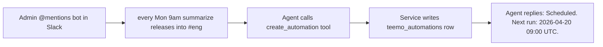

# EPIC-018: Scheduled Automations

## 1. Problem & Value

### 1.1 The Problem

Tee-Mo's agent today is strictly reactive — a user has to @mention the bot (or DM it) for the agent to do anything. There's no way to say "every Monday at 09:00, summarize last week's releases into #general" or "tomorrow at 5pm, remind me to close the quarterly report." Users must open Slack and re-issue the same prompt every time they want a recurring task, and one-off scheduled work has no home at all.

### 1.2 The Solution

Add **scheduled automations**: a user (via the dashboard UI or via an agent tool call from Slack chat) defines a prompt plus a schedule (recurring or one-time), and a background scheduler spawns the agent at the scheduled time, runs the prompt with full access to the workspace's tools/knowledge, and delivers the result to the bound Slack channel.

Both surfaces (UI and agent tools) write through the **same service layer** and the **same REST API**, so behavior is identical regardless of who created the automation. A **dry-run** action executes the prompt exactly like a real run but returns the output to the user's screen instead of posting to Slack. Every run (scheduled or dry) is captured in an execution history so users can audit what the agent said and when.

Reference implementation: `chy_automations` in `Documents/Dev/new_app` (see §4 for the copy-then-strip plan).

### 1.3 Success Metrics (North Star)
- A workspace owner can create a recurring automation from the dashboard in < 60s.
- A workspace owner can create the same automation from a Slack chat message by describing it to the bot.
- Dashboard lists all automations per workspace with next-run time, last-run status, and toggles.
- Dashboard "Dry Run" button executes the prompt and renders the generated output on screen without posting to Slack and without writing delivered_content to history (run is still logged).
- Execution history shows ≥ last 50 runs per automation with status, timing, tokens used, and error (if any).
- No automation can leak across workspaces (workspace_id filter enforced in service + RLS).
- Scheduled runs fire within ±60s of `next_run_at` under normal load.

---

## 2. Scope Boundaries

### ✅ IN-SCOPE (Build This)
- [ ] `teemo_automations` table + `teemo_automation_executions` table (migrations)
- [ ] SQL helpers: `calculate_next_run_time(schedule JSONB, from_time)` + `get_due_automations()` RPC
- [ ] `automation_service.py` — CRUD + schedule validation + history pruning (cap 50 rows/automation)
- [ ] REST endpoints: `POST/GET/PATCH/DELETE /api/workspaces/:id/automations`, `GET /api/workspaces/:id/automations/:id/history`, `POST /api/workspaces/:id/automations/test-run`
- [ ] `automation_executor.py` — runs a single automation end-to-end: builds the agent, runs the prompt, writes execution row, delivers to Slack, advances `next_run_at`, deactivates one-time automations
- [ ] `automation_cron.py` — asyncio background loop (60s tick) following the existing `wiki_ingest_cron` / `drive_sync_cron` pattern, registered in `main.py` lifespan
- [ ] `skip_if_active` guard — if a prior execution is still `running`, skip this tick and advance `next_run_at`
- [ ] 4 agent tools (wired into the existing conversation-tier agent): `create_automation`, `list_automations`, `update_automation`, `delete_automation`
- [ ] System prompt: `## Scheduled Automations` section describing the tools and when to use them (keyword-triggered, same pattern as Skills catalog)
- [ ] Frontend: `AutomationsSection` inline in `WorkspaceCard` (below KeySection / MCP section) — list, badges, enable/disable toggle, delete, history drawer, dry-run button
- [ ] Frontend: `AddAutomationModal` — name, prompt (textarea), schedule builder (once/daily/weekdays/weekly/monthly + time + timezone), **multi-select target channel picker** (checkbox list of already-bound channels — user must select ≥ 1)
- [ ] Frontend: `AutomationHistoryDrawer` — execution list with status badge, timestamps, expandable generated output, error detail
- [ ] Frontend: `useAutomations.ts` — TanStack Query hooks for CRUD + history + dry-run
- [ ] Dry-run UX: modal opens showing loading → rendered output (markdown). No Slack post. No delivered_content write. Execution row is written with `was_dry_run=true` flag
- [ ] Timezone support: per-automation IANA tz name, persisted on the row; UI defaults to user browser tz
- [ ] One-time automations auto-deactivate (`is_active=false`) after the single run completes

### ❌ OUT-OF-SCOPE (Do NOT Build This)
- **Data source binding** — unlike new_app, the user does NOT attach documents/saved-queries/github filters to an automation. The agent already has workspace knowledge tools (`read_drive_file`, wiki retrieval) and the prompt itself must mention what it needs.
- **Non-Slack delivery adapters** (email, telegram, document-output) — Tee-Mo delivers to Slack only. Within Slack, an automation MAY target one-or-more of the workspace's already-bound channels (multi-fanout), but no other delivery medium.
- **`delivery_method` discriminator** — only Slack-channel delivery is supported; no mode enum needed.
- **Default-channel fallback** — there is no implicit default. The user (or agent on the user's behalf) must always explicitly pick at least one bound channel from `teemo_workspace_channels` for the workspace.
- **Mention resolution in prompts** (`@[Doc]`, `::blueprint`) — new_app's prompt-enrichment step is not copied. Plain prompts only.
- **ARQ / Redis worker** — reuse Tee-Mo's existing in-process asyncio cron pattern; do not introduce a new dependency.
- **Multi-tenant distributed scheduler / leader election** — single-process cron is acceptable for the hackathon scale (one backend instance).
- **Cron expression syntax** (`0 9 * * MON`) — structured JSONB schedule only (daily / weekdays / weekly / monthly / once).
- **Retries on failure** — a failed run is recorded as `status='failed'` with an error; the schedule keeps advancing. No auto-retry.
- **Usage/cost dashboards for automation tokens** — `tokens_used` is recorded on the row but no aggregate UI is built here.
- **Agent tool for `test_run` (dry-run)** — dry-run is a UI-only affordance. The agent does not expose a "preview" tool (keeps the agent surface small; users who want to dry-run use the dashboard).
- **Per-workspace concurrency limits / quotas** — a future concern.

---

## 3. Context

### 3.1 User Personas
- **Workspace Admin (Dashboard)**: Wants precise control — schedule builder, timezone picker, dry-run preview, history browsing.
- **Workspace Admin (Slack)**: Wants to say "@tee-mo every weekday at 9am post a summary of new drive files into #standup" and have it just work.
- **Slack User (Recipient)**: Doesn't create automations — just sees the agent's scheduled posts land in the bound channel as regular bot messages.

### 3.2 User Journey (Happy Path)

```mermaid
flowchart LR
    A[Admin opens WorkspaceCard] --> B[Clicks New Automation]
    B --> C[Modal: name, prompt, schedule, channel]
    C --> D[Dry Run → preview on screen]
    D --> E[Save → row written, next_run_at computed]
    E --> F[Cron ticks at next_run_at]
    F --> G[Executor spawns agent + runs prompt]
    G --> H[chat.postMessage to bound channel]
    H --> I[History row written: success, tokens, duration]
```




### 3.3 Constraints
| Type | Constraint |
|------|------------|
| **Security** | Workspace isolation: all CRUD and cron queries filtered by `workspace_id`. Only workspace owners may mutate; members+ may read. RLS matches the pattern used for `teemo_workspaces` and MCP. |
| **Tech Stack** | Reuse existing Pydantic AI agent factory (EPIC-007). Reuse Slack Bolt AsyncApp for `chat.postMessage`. Reuse asyncio-cron pattern (`wiki_ingest_cron`). No new runtime dependencies (no ARQ, no Redis). |
| **Performance** | Cron tick fires every 60s. Per-run execution budget bounded by agent BYOK model latency. `skip_if_active` prevents overlapping runs of the same automation. History pruning caps at 50 rows per automation. |
| **Scheduling Accuracy** | `next_run_at` accuracy ±60s. Timezone-aware via IANA tz names stored on row and used when computing `next_run_at`. |
| **UI Pattern** | Inline in `WorkspaceCard`, same layout/style as `KeySection` (BYOK) and the MCP section from EPIC-012 — cards + badges + modal + drawer. |
| **BYOK Hard Gate** | Workspace has exactly one BYOK key (the user-provided one) — scheduled runs use that key. If missing/invalid at run time, write `status='failed'` history row with a human-readable error; do not crash the cron. No personal-key fallback. |
| **Delivery Fanout** | An automation may post the same generated content to 1..N bound Slack channels. No per-channel content customization in v1. A channel being inaccessible (bot kicked, 404) counts as a per-channel failure recorded in history but does not fail the whole run as long as ≥1 channel succeeds. |

---

## 4. Technical Context

### 4.1 Affected Areas
| Area | Files/Modules | Change Type |
|------|---------------|-------------|
| Migration | `database/migrations/0XX_teemo_automations.sql` | **New** — `teemo_automations` + `teemo_automation_executions` + `calculate_next_run_time()` + `get_due_automations()` |
| Service | `backend/app/services/automation_service.py` | **New** — CRUD, schedule validation, history query + pruning |
| Executor | `backend/app/services/automation_executor.py` | **New** — end-to-end run (build agent → run prompt → deliver → write history → advance schedule) |
| Cron loop | `backend/app/services/automation_cron.py` | **New** — 60s asyncio loop, mirrors `wiki_ingest_cron.py` structure |
| Lifespan | `backend/app/main.py` | **Modify** — register third cron task alongside drive_sync + wiki_ingest |
| REST | `backend/app/api/routes/automations.py` | **New** — 7 endpoints |
| Main app | `backend/app/main.py` | **Modify** — mount automations router; add tables to `TEEMO_TABLES` health aggregate |
| Agent tools | `backend/app/agents/agent.py` | **Modify** — register 4 automation tools; add `## Scheduled Automations` system-prompt section |
| Slack delivery | `backend/app/services/slack_dispatch.py` (or new `automation_delivery.py`) | **New or Modify** — helper that takes `(workspace_id, channel_id, content)` and posts to Slack using the workspace's encrypted bot token. Must not assume a thread context (automation posts are top-level channel messages). |
| Frontend types | `frontend/src/types/automation.ts` | **New** |
| Frontend hooks | `frontend/src/hooks/useAutomations.ts` | **New** — TanStack Query hooks (list, create, update, delete, history, testRun) |
| Frontend UI | `frontend/src/components/dashboard/WorkspaceCard.tsx` | **Modify** — add `AutomationsSection` below existing sections |
| Frontend UI | `frontend/src/components/dashboard/AutomationsSection.tsx` | **New** — card list, toggle, delete, open-history, open-dry-run |
| Frontend UI | `frontend/src/components/dashboard/AddAutomationModal.tsx` | **New** — schedule builder + channel picker |
| Frontend UI | `frontend/src/components/dashboard/AutomationHistoryDrawer.tsx` | **New** |
| Frontend UI | `frontend/src/components/dashboard/DryRunModal.tsx` | **New** — shows loading → rendered markdown output |
| API client | `frontend/src/lib/api.ts` | **Modify** — add automation wrappers |

### 4.2 Dependencies
| Type | Dependency | Status |
|------|------------|--------|
| **Requires** | EPIC-007: agent factory (`build_agent`) + BYOK key resolver | In progress / partial |
| **Requires** | EPIC-005 Phase B: Slack dispatch + bound-channel CRUD (`teemo_workspace_channels`) | Needed — an automation can only target a bound channel |
| **Requires** | EPIC-004: `core.encryption` (to read encrypted Slack bot token for posting) | Done (S-06) |
| **Requires** | Existing asyncio cron pattern from `wiki_ingest_cron.py` / `drive_sync_cron.py` | Done (S-10/S-11) |
| **Requires** | Supabase Python client supports RPC calls (for `get_due_automations`) | Done — already used elsewhere |
| **Unlocks** | Future: "Smart Digests" epic (preconfigured automation templates) | Deferred |

### 4.3 Integration Points
| System | Purpose | Docs |
|--------|---------|------|
| Slack Web API (`chat.postMessage`) | Deliver scheduled agent output to bound channel as a top-level message | https://api.slack.com/methods/chat.postMessage |
| Pydantic AI agent (EPIC-007) | Run the prompt with full workspace tool/knowledge context at scheduled time | Internal |
| Supabase RPC | `get_due_automations()` SQL function returning due rows | Internal |
| Browser Intl API | Default timezone selection in the frontend schedule builder | MDN |

### 4.4 Data Changes
| Entity | Change | Fields |
|--------|--------|--------|
| `teemo_automations` | **NEW** | `id` (UUID PK), `workspace_id` (FK → teemo_workspaces, ON DELETE CASCADE), `name` (TEXT, unique per workspace), `description` (TEXT nullable), `prompt` (TEXT NOT NULL), `slack_channel_ids` (TEXT[] NOT NULL — array of `teemo_workspace_channels.slack_channel_id` values; CHECK `array_length(slack_channel_ids, 1) >= 1`; each element verified at service layer to belong to this workspace), `schedule` (JSONB NOT NULL — structure below), `schedule_type` (TEXT CHECK IN ('recurring','once') DEFAULT 'recurring'), `timezone` (TEXT DEFAULT 'UTC' — IANA), `is_active` (BOOLEAN DEFAULT TRUE), `owner_user_id` (UUID FK → teemo_users), `last_run_at` (TIMESTAMPTZ), `next_run_at` (TIMESTAMPTZ), `created_at`, `updated_at`. Indexes: `(is_active, next_run_at) WHERE is_active`, `(workspace_id)`. Unique `(workspace_id, name)`. |
| `teemo_automation_executions` | **NEW** | `id` (UUID PK), `automation_id` (FK → teemo_automations ON DELETE CASCADE), `status` (TEXT CHECK IN ('pending','running','success','partial','failed') DEFAULT 'pending'), `was_dry_run` (BOOLEAN DEFAULT FALSE), `started_at` (TIMESTAMPTZ DEFAULT now()), `completed_at` (TIMESTAMPTZ), `generated_content` (TEXT), `delivery_results` (JSONB — per-channel `[{channel_id, ok, error, ts}]`; NULL for dry-runs), `error` (TEXT — top-level error such as BYOK missing or agent crash), `tokens_used` (INT), `execution_time_ms` (INT). Index: `(automation_id, started_at DESC)`. Status rules: `success` = all channels delivered; `partial` = ≥1 succeeded and ≥1 failed; `failed` = generation failed OR all channel deliveries failed. |
| `TEEMO_TABLES` in `/api/health` | **Modify** | Add `teemo_automations` + `teemo_automation_executions` to aggregate count |

**Schedule JSONB shape** (copied from new_app, validated in `automation_service.py`):
```json
// recurring
{"occurrence": "daily",    "when": "09:00"}
{"occurrence": "weekdays", "when": "09:00"}
{"occurrence": "weekly",   "when": "09:00", "days": [1, 3, 5]}  // 0=Sun … 6=Sat
{"occurrence": "monthly",  "when": "09:00", "day_of_month": 1}
// one-time
{"occurrence": "once",     "at": "2026-04-20T17:00:00"}         // interpreted in row.timezone, stored UTC in next_run_at
```

---

## 5. Decomposition Guidance

### Affected Areas (for codebase research — MUST read before drafting stories)
- [ ] `backend/app/services/wiki_ingest_cron.py` + `drive_sync_cron.py` — cron loop shape to replicate
- [ ] `backend/app/main.py` lifespan — where to register the third cron task
- [ ] `backend/app/agents/agent.py` — how tools are registered + how system prompt is assembled (for `## Scheduled Automations` section)
- [ ] `backend/app/api/routes/channels.py` + `teemo_workspace_channels` schema — channel FK shape and owner-only mutation pattern
- [ ] `backend/app/services/slack_dispatch.py` — how we currently post to Slack with the workspace's encrypted bot token (for automation delivery)
- [ ] `backend/app/services/keys.py` / BYOK resolver — how to fetch the workspace BYOK key at cron time
- [ ] `frontend/src/components/dashboard/WorkspaceCard.tsx` + KeySection — layout / section pattern to match
- [ ] `Documents/Dev/new_app/backend/app/services/automation_executor.py` + `automation_service.py` + `workers/cron.py` — copy-then-strip source
- [ ] `Documents/Dev/new_app/database/migrations/025_automations.sql` + `034_fix_once_schedule_timezone.sql` — migration + SQL helper source

### Key Constraints for Story Sizing
- Each story touches 1-3 files with one verifiable outcome.
- Prefer vertical slices: e.g., "schema + service CRUD" is one story, not "schema" + "service".
- Executor + cron loop is one story (they're useless alone).
- Agent tools + system prompt section is one story.
- Frontend is ~2 stories: list/section + modal/history/dry-run.

### Suggested Sequencing Hints
1. **STORY-018-01 — Migrations + Service Layer**: tables, SQL helpers, `automation_service.py` CRUD + validation + history pruning. Foundation for everything else.
2. **STORY-018-02 — REST Endpoints**: all 7 endpoints (CRUD + history + test-run). Depends on 018-01.
3. **STORY-018-03 — Executor + Cron Loop**: `automation_executor.py` + `automation_cron.py` + lifespan registration + Slack delivery helper. Depends on 018-01. Parallel-safe with 018-02.
4. **STORY-018-04 — Agent Tools + System Prompt**: 4 tools + `## Scheduled Automations` prompt section + skill card seed (if skills catalog exists). Depends on 018-01. Parallel-safe with 018-02 / 018-03.
5. **STORY-018-05 — Dashboard UI (List + Toggle + Delete + History)**: `AutomationsSection` + `useAutomations.ts` + history drawer. Depends on 018-02.
6. **STORY-018-06 — Dashboard UI (Create Modal + Schedule Builder + Dry Run)**: `AddAutomationModal` + `DryRunModal`. Depends on 018-02 and 018-05.

---

## 6. Risks & Edge Cases

| Risk | Likelihood | Mitigation |
|------|------------|------------|
| Overlapping runs of the same automation if one execution takes > 60s | Medium | `skip_if_active` guard: before starting, check for an in-flight `running` execution; if found, advance `next_run_at` and skip this tick. |
| Cron fires while backend is restarting → missed run | Medium | `get_due_automations()` returns any row where `next_run_at <= now()`, so late runs catch up on the next tick. Acceptable drift. |
| Workspace BYOK key missing or invalid at scheduled time | High | Write `status='failed'` execution row with clear error ("BYOK key not configured"). Do not crash cron. Surface in history drawer. |
| Slack bot token revoked between creation and run | Medium | Catch `SlackApiError`, write `status='failed'` with error detail. Leave automation active; user can re-install bot and runs resume. |
| User selects a channel the bot was kicked from / is_member=false | Medium | Executor posts to each channel independently and records per-channel result in `delivery_results`. If a single channel fails with `not_in_channel`, status becomes `partial` (assuming ≥1 other channel succeeded) or `failed` (if all failed). UI history drawer surfaces each failing channel with "Bot is not a member of #X. Invite @tee-mo." |
| User selects channels and later unbinds one of them from the workspace | Medium | Executor validates each channel_id against `teemo_workspace_channels` at run time; if a channel is no longer bound, record a per-channel failure "Channel no longer bound to this workspace — remove it from the automation" and continue with remaining channels. |
| One-time schedule in the past (user sets 'at' to 2020-01-01) | Low | Service validates `at > now()` at create time; reject with 422. |
| DST transition breaks `next_run_at` for recurring schedules | Medium | Compute `next_run_at` from `timezone` using `zoneinfo` (Python stdlib) at each advance — DST shifts absorb naturally. |
| Dry-run on a long prompt blocks the HTTP request beyond reverse-proxy timeout | Medium | Set reasonable per-run timeout (≤ 30s) in test-run endpoint; return a structured timeout error. Consider async job + polling if we ever see real timeouts (out of scope for v1). |
| Agent tool allows one user to schedule an automation that posts to a channel they shouldn't have access to | High | Inside `create_automation` tool, verify the target channel is already bound to the same workspace; reject otherwise. Same check in REST. |
| Execution history grows unbounded | Low | `prune_execution_history(automation_id)` keeps only the latest 50 rows per automation; called after every write in the executor. |
| Agent infinite-loop / cost blow-up in a scheduled run | Medium | Agent already has per-run iteration limits from Pydantic AI; cron path doesn't change that. Record `tokens_used` so cost is visible. |
| Two backend instances running in parallel both pick up the same due automation | Medium | Single-instance deploy on Coolify — acceptable. If we ever scale horizontally, add `SELECT … FOR UPDATE SKIP LOCKED` in `get_due_automations()`. Out of scope for v1. |

---

## 7. Acceptance Criteria (Epic-Level)

```gherkin
Feature: Scheduled Automations

  # --- Dashboard ---

  Scenario: Create a recurring automation via dashboard (multi-channel)
    Given admin is on WorkspaceCard for workspace "Marketing"
    And the workspace has 3 bound channels: #general, #updates, #standup
    When they open "New Automation" modal
    And enter name "Weekly digest", prompt "summarize last week's docs", daily at 09:00 UTC
    And check #general AND #updates in the channel picker
    And click Save
    Then a row is written to teemo_automations with schedule_type='recurring' and slack_channel_ids=['C_general','C_updates']
    And next_run_at equals the next 09:00 UTC instant
    And the card appears in the Automations section with an "Active" badge and shows both channel chips

  Scenario: Save is blocked when no channels are selected
    Given admin is filling the New Automation modal
    When they leave the channel picker empty and click Save
    Then the modal shows a validation error "Select at least one channel"
    And no row is written

  Scenario: Dry run a prompt from the dashboard
    Given a draft automation in the Add modal
    When admin clicks "Dry Run"
    Then the backend executes the prompt via the full agent
    And the output renders as markdown on the screen
    And no Slack message is posted
    And an execution row is written with was_dry_run=true and delivered_content=NULL

  Scenario: Toggle automation off
    Given an active automation
    When admin flips the enable toggle off
    Then is_active is set to false
    And the cron no longer picks it up on the next tick

  Scenario: View execution history
    Given an automation with 10 prior runs
    When admin opens the history drawer
    Then the last 10 runs are listed newest-first
    And each row shows status badge, started_at, duration, tokens
    And expanding a row reveals generated_content and error (if any)

  # --- Slack (Agent-driven) ---

  Scenario: Create an automation from Slack chat with explicit channels
    Given admin DMs "@tee-mo every weekday at 9am summarize new drive files into #standup and #eng-news"
    And both #standup and #eng-news are already bound to this workspace
    When the agent calls the create_automation tool with slack_channel_ids=['C_standup','C_engnews']
    Then a teemo_automations row is written for this workspace
    And the agent replies with the next run time in the workspace timezone and lists the target channels

  Scenario: Agent asks when no channel is named
    Given admin DMs "@tee-mo every weekday at 9am summarize new drive files"
    When the agent prepares to call create_automation
    Then it first replies asking which bound channel(s) to post into
    And it does NOT default to any channel
    And no automation row is written until the user answers

  Scenario: List automations from Slack chat
    Given the workspace has 3 automations
    When user asks "what automations do I have?"
    Then the agent calls list_automations
    And replies with a formatted list (name, schedule summary, next run, status)

  Scenario: Delete automation from Slack chat
    When user says "@tee-mo remove the weekly digest automation"
    Then the agent calls delete_automation with name="Weekly digest"
    And the row is hard-deleted (history cascades)

  # --- Scheduler / Executor ---

  Scenario: Scheduled run fans out to all target channels
    Given an active automation due at 09:00 UTC with slack_channel_ids=['C1','C2']
    When the 60s cron tick runs at 09:00:30 UTC
    Then the executor builds the agent with this workspace's BYOK key
    And runs the prompt once to produce generated_content
    And posts generated_content to C1 and to C2 via chat.postMessage
    And writes an execution row with status='success' and delivery_results containing both channels as ok=true
    And advances next_run_at to the next matching instant

  Scenario: Partial delivery — bot kicked from one of two channels
    Given an active automation with slack_channel_ids=['C1','C2']
    And the bot is no longer a member of C2
    When the cron fires
    Then C1 receives the message successfully
    And the execution row has status='partial' with delivery_results showing C1 ok=true and C2 ok=false with error 'not_in_channel'
    And next_run_at still advances

  Scenario: One-time automation auto-deactivates
    Given an automation with schedule_type='once' and at='2026-04-20T17:00:00'
    When the cron fires at 17:00 UTC on 2026-04-20
    Then the execution runs and is delivered
    And is_active is set to false
    And next_run_at is NULL

  Scenario: Overlapping run is skipped
    Given automation A has an execution still in status='running' from the previous tick
    When the next cron tick finds A due again
    Then a new execution is NOT started
    And next_run_at is advanced to the next scheduled instant
    And no history row is written for the skipped tick

  # --- Error paths ---

  Scenario: Missing BYOK key at run time
    Given an automation whose workspace has no BYOK key
    When the cron fires
    Then an execution row is written with status='failed' and a human-readable error
    And the cron does not crash
    And next_run_at still advances

  Scenario: All target channels fail
    Given an automation whose only two target channels both have the bot kicked
    When the cron fires
    Then generated_content is still produced (and visible in history)
    And delivery_results records both channels as ok=false
    And status is 'failed'

  # --- Security ---

  Scenario: Cross-workspace automation creation is blocked
    Given a non-owner user
    When they POST to /api/workspaces/{other_id}/automations
    Then the request is rejected with 403

  Scenario: Agent tool cannot schedule into a channel outside this workspace
    Given workspace A has channel #A-only
    When an agent call in workspace B invokes create_automation including #A-only's channel_id
    Then the service rejects the write (channel not bound to workspace B)
    And the tool returns an error and no row is created
```

---

## 8. Open Questions

| Question | Options | Impact | Owner | Status |
|----------|---------|--------|-------|--------|
| Are scheduled agent runs billed against the workspace BYOK key, or do we need a personal-key fallback? | A: Workspace BYOK only. B: Fall back to owner's personal key. | Cost attribution + error UX | sandrinio | **Decided 2026-04-14 — A** (single-key project — there is only one BYOK per workspace provided by the user; no fallback concept exists) |
| Should the agent's `create_automation` tool require explicit channel(s), or default to a bound channel when omitted? | A: Always require ≥1 explicit channel. B: Default to team's default channel. | UX friction vs. surprise | sandrinio | **Decided 2026-04-14 — A** (require explicit; multi-select allowed from already-bound channels. Agent must ask when missing.) |
| Delivery fanout — can a single automation target multiple bound channels? | A: Exactly one channel. B: One-or-more channels. | Data model + executor loop | sandrinio | **Decided 2026-04-14 — B** (array field `slack_channel_ids`, per-channel `delivery_results` in history; see §4.4 + §6 partial-failure rule) |
| System-prompt impact of `## Scheduled Automations` section | A: Always on. B: Keyword-gated (only inject when workspace has ≥1 automation or user message matches scheduling keywords). | Per-turn token cost | sandrinio | **Decided 2026-04-14 — B** (keyword-gated, matches Skills catalog pattern) |
| Dry-run timeout | A: 15s. B: 30s. C: 60s. | Prevents frontend hanging on long prompts | sandrinio | **Proposed B (30s)** — non-blocking |
| "New Automation" trigger placement | A: Button in `AutomationsSection` header. B: Global workspace-card fab. | Visual density | sandrinio | **Proposed A** — non-blocking |
| Separate pause state vs. `is_active` alone | A: Single `is_active`. B: Add `paused_until`. | "Pause for 2 weeks" use case | sandrinio | **Proposed A (YAGNI)** — non-blocking |
| Agent tool awaits DB write or fire-and-forget? | A: Await. B: Fire-and-forget. | Reliability of agent's reply | sandrinio | **Proposed A** — non-blocking |
| History retention | A: 50 hardcoded. B: Env-configurable. | Ops flexibility | sandrinio | **Proposed A** — non-blocking |
| "Run now" button in v1 | A: Defer. B: Include (trivial given executor). | Scope vs. completeness | sandrinio | **Proposed A — defer** — non-blocking |

---

## 9. Artifact Links

**Stories (Status Tracking):**
- [x] STORY-018-01 — Automations Schema + Service Layer → **Spec complete** (`STORY-018-01-service-layer.md`)
- [x] STORY-018-02 — Automations REST Endpoints → **Spec complete** (`STORY-018-02-rest-endpoints.md`)
- [x] STORY-018-03 — Automation Executor + Cron Loop → **Spec complete** (`STORY-018-03-executor-cron.md`)
- [x] STORY-018-04 — Agent Tools + System Prompt Integration → **Spec complete** (`STORY-018-04-agent-tools.md`)
- [x] STORY-018-05 — Dashboard UI: Automations Section + History → **Spec complete** (`STORY-018-05-ui-list-history.md`)
- [x] STORY-018-06 — Dashboard UI: Add Modal + Schedule Builder + Dry Run → **Spec complete** (`STORY-018-06-ui-modals.md`)

**References:**
- Reference impl: `Documents/Dev/new_app/backend/app/services/automation_executor.py`
- Reference impl: `Documents/Dev/new_app/backend/app/services/automation_service.py`
- Reference impl: `Documents/Dev/new_app/backend/app/api/routes/automations.py`
- Reference impl: `Documents/Dev/new_app/backend/app/workers/cron.py` (port logic — drop ARQ)
- Reference impl: `Documents/Dev/new_app/backend/app/agents/orchestrator.py` (automation tools)
- Reference migration: `Documents/Dev/new_app/database/migrations/025_automations.sql`
- Reference migration: `Documents/Dev/new_app/database/migrations/034_fix_once_schedule_timezone.sql`
- Reference frontend: `Documents/Dev/new_app/frontend/src/components/settings/AutomationsTab.tsx`
- Reference frontend: `Documents/Dev/new_app/frontend/src/hooks/useAutomations.ts`
- Tee-Mo cron pattern: `backend/app/services/wiki_ingest_cron.py`, `backend/app/services/drive_sync_cron.py`
- Tee-Mo Slack dispatch: `backend/app/services/slack_dispatch.py`
- Related epic: EPIC-012 MCP Server Integration (shares the "UI + agent-tool dual surface" pattern)
- Related epic: EPIC-007 AI Agent + Skills (agent factory + system prompt composition)

---

## Change Log
| Date | Change | By |
|------|--------|-----|
| 2026-04-14 | Initial draft. Reference implementation: new_app `chy_automations`. Port reshaped to: (a) drop data-source binding (agent has workspace access already), (b) drop multi-adapter delivery (Slack-only via bound channel), (c) drop ARQ/Redis (reuse existing asyncio cron pattern), (d) dry-run is UI-only (not an agent tool). 6 stories proposed. | sandrinio + Claude |
| 2026-04-14 | Blocking questions resolved. Multi-channel fanout: `slack_channel_ids TEXT[]` with per-channel `delivery_results` JSONB on executions; status adds `'partial'`. Workspace BYOK only — no personal-key fallback (single-key project). System prompt keyword-gated. §2, §3.3, §4.4, §6, §7, §8 updated accordingly. Ambiguity locked to 🟢 Low — Ready for Stories. | sandrinio + Claude |
