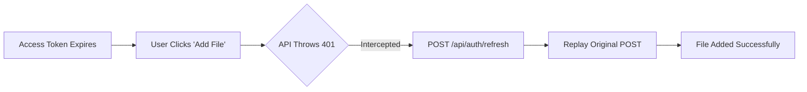

# EPIC-022: Frontend Token Management

## 1. Problem & Value
> Target Audience: Stakeholders, Business Sponsors

### 1.1 The Problem
Currently, the Tee-Mo frontend HTTP wrappers (`api.ts`) do not automatically intercept `401 Unauthorized` responses. The `access_token` lives for 15 minutes. When it expires, all subsequent API fetches fail silently with network errors, effectively "logging out" active users abruptly, regardless of whether they have a valid 7-day `refresh_token`.

### 1.2 The Solution
Implement an intelligent retry wrapper in `frontend/src/lib/api.ts` that catches 401s, momentarily pauses pending API calls using a Promise lock, hits the `/api/auth/refresh` endpoint to renew the `access_token`, and transparently replays the original requests.

### 1.3 Success Metrics (North Star)
- 0% of active sessions forcibly terminated before the 7-day refresh token expires.
- Concurrent failing API queries generate exactly 1 network request to `/refresh`.

---

## 2. Scope Boundaries
> Target Audience: AI Agents (Critical for preventing hallucinations)

### ✅ IN-SCOPE (Build This)
- [x] Create a `fetchWithAuth` wrapper in `api.ts`.
- [x] Implement a concurrent refresh promise lock.
- [x] Catch 401 errors, invoke the refresh endpoint, and retry logic.
- [x] Throw explicit errors/force logout if the refresh request itself fails (i.e. refresh_token expired).

### ❌ OUT-OF-SCOPE (Do NOT Build This)
- Backend authorization or cookie lifespan modifications (already covered in EPIC-002).
- Axios migration (Tee-Mo uses native `fetch`).

---

## 3. Context

### 3.1 User Personas
- **Dashboard User**: Expects to remain logged in while modifying Slack connections, Workspace Knowledge bases, or bindings over a long session.

### 3.2 User Journey (Happy Path)


### 3.3 Constraints
| Type | Constraint |
|------|------------|
| **Performance** | Refresh lock must not block non-401 queries globally, only those retrying. |
| **UX** | Re-authentication must be 100% invisible to the user component layer. |

---

## 4. Technical Context
> Target Audience: AI Agents - READ THIS before decomposing.

### 4.1 Affected Areas
| Area | Files/Modules | Change Type |
|------|---------------|-------------|
| API | `frontend/src/lib/api.ts` | Modify |

### 4.2 Dependencies
| Type | Dependency | Status |
|------|------------|--------|
| **Requires** | EPIC-002: Backend Auth Routes | Done |

### 4.3 Integration Points
N/A (Internal Token Exchange)

### 4.4 Data Changes
N/A (Cookies are stateful on the browser)

---

## 5. Decomposition Guidance

This is a focused, single-story epic designed to patch a critical infrastructure hole.
- **Story-01**: Centralize `fetch` logic inside `api.ts` so `apiGet`, `apiPost`, `apiPatch`, `deleteWorkspace`, `unbindChannel` and `removeKnowledgeFile` all route through a custom `fetchWithAuth(url, options)` function that provides the refresh lock and retry envelope.

---

## 6. Risks & Edge Cases
| Risk | Likelihood | Mitigation |
|------|------------|------------|
| Infinite Loop via `/refresh` returning 401 | Medium | The retry block MUST explicit verify `!url.includes('/api/auth/refresh')` before attempting to refresh again. |
| Race Conditions for multiple queries | High | Use a singleton `refreshPromise` block at the module level in `api.ts`. |

---

## 7. Acceptance Criteria (Epic-Level)

```gherkin
Feature: Frontend Token Management

  Scenario: Complete Happy Path
    Given the user has an expired access_token but a valid refresh_token
    When the user makes an authenticated request (e.g. GET /me)
    Then the client intercepts the 401 rejection
    And successfully calls POST /api/auth/refresh
    And replays the request, successfully surfacing the data to the UI with no flashing components.

  Scenario: Key Error Case
    Given the user's refresh_token has also expired
    When the user makes a request and the background refresh returns 401
    Then the client rejects the promise
    And the auth store correctly forces a transition to the Login route.
```

---

## 8. Open Questions
| Question | Options | Impact | Owner | Status |
|----------|---------|--------|-------|--------|
| Should `api.ts` import the `authStore` to trigger explicit logout upon final 401? | A: Yes (circular import risk bypassed by lazy loading), B: No (let TanStack catch boundaries handle it). | Eject UX | Human | Decided (A) |

---

## 9. Artifact Links

**Stories (Status Tracking):**
> Keep track of where stories live contextually.
- [x] STORY-022-01-api-refresh-interceptor -> Done
