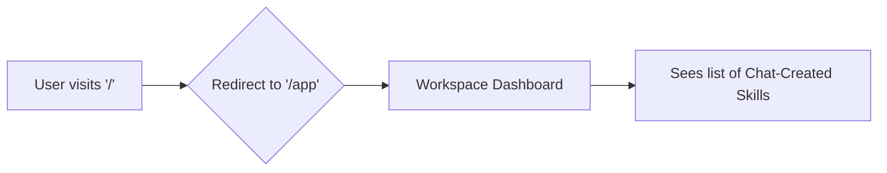

# EPIC-023: UX Production Readiness

## 1. Problem & Value
> Target Audience: Stakeholders, Business Sponsors

### 1.1 The Problem
Following a comprehensive UX Audit, two critical friction points were identified for the production release:
1. **Skill Amnesia**: Agent skills are created via Slack chat, but are completely invisible on the dashboard. Users have no way to see what the bot has been trained to do.
2. **Vestigial Landing Page**: The root path (`/`) displays a diagnostic system status page from Sprint 1, which provides no value to end-users and creates an unnecessary hop to get to the application.

### 1.2 The Solution
1. Introduce a read-only "Active Skills" widget on the Workspace Detail page.
2. Rip out the diagnostic landing page and replace it with a direct redirect to `/app` (which automatically routes unauthenticated users to `/login`).

### 1.3 Success Metrics (North Star)
- Users can view a list of active skills mapped to a knowledge base from the dashboard.
- Zero clicks required to reach the login/app page from the root domain.

---

## 2. Scope Boundaries
> Target Audience: AI Agents

### ✅ IN-SCOPE (Build This)
- [x] Fetch skills via a new TanStack Query hook (`useSkillsQuery`).
- [x] Render a "SkillList" component in `/app/teams/$teamId/$workspaceId`.
- [x] Refactor `frontend/src/routes/index.tsx` to perform an immediate redirect to `/app`.

### ❌ OUT-OF-SCOPE (Do NOT Build This)
- UI for *editing* or *creating* skills (Skills remain chat-driven only).
- Complete uninstallation of the `/api/health` backend endpoint (keep it for DevOps/monitoring).

---

## 3. Context

### 3.1 User Personas
- **Dashboard User**: Needs transparency into the bot's learned behaviors.
- **Returning User**: Needs fast, zero-friction access to the app.

### 3.2 User Journey (Happy Path)


### 3.3 Constraints
| Type | Constraint |
|------|------------|
| **UX** | Skills list must explicitly clarify that creation happens in Slack, to avoid confusing users looking for an "Add Skill" button. |

---

## 4. Technical Context
> Target Audience: AI Agents

### 4.1 Affected Areas
| Area | Files/Modules | Change Type |
|------|---------------|-------------|
| UI | `frontend/src/routes/index.tsx` | Modify / Strip |
| UI | `frontend/src/routes/app.teams.$teamId.$workspaceId.tsx` | Modify |
| API | `frontend/src/lib/api.ts` | Add |

### 4.2 Dependencies
| Type | Dependency | Status |
|------|------------|--------|
| **Requires** | Backend `GET /api/workspaces/{id}/skills` Endpoint | Done in Sprint 1 |

---

## 5. Decomposition Guidance

- **Story 1: Vestigial Routing:** Replace `index.tsx` contents with `<Navigate to="/app" />`.
- **Story 2: Skill Dashboard Widget:** Add API wrappers, tanstack hooks, and a read-only list UI to the Workspace page.

---

## 6. Risks & Edge Cases
| Risk | Likelihood | Mitigation |
|------|------------|------------|
| Missing Backend API | Low | Fetch the `/skills` endpoint, if standard contract differs, gracefully handle 404 or missing endpoints by hiding the card. |

---

## 7. Acceptance Criteria (Epic-Level)

```gherkin
Feature: UX Production Readiness

  Scenario: Root Redirect
    Given a user navigates to the root domain
    When the app loads
    Then they are instantly redirected to `/app` (or `/login` via auth guard).

  Scenario: Skill Visibility
    Given the user is on a Workspace detail page
    When the page renders
    Then an 'Active Skills' card displays a list of the agent's learned behaviors with their names and descriptions.
```

---

## 8. Artifact Links

**Stories (Status Tracking):**
- [x] STORY-023-01-skills-list-ui -> Done
- [x] STORY-023-02-remove-landing-page -> Done
