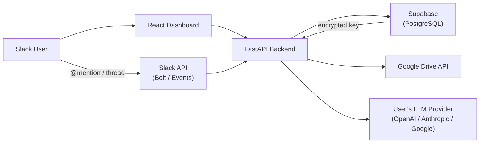

# Project Charter: Tee-Mo

## 1. Project Identity

> **Context:** Hackathon project. Deadline: **2026-04-18** (8 days). Cadence: **2 sprints/day = 16 sprints total**, each ~4 hours. Scope decisions must prioritize a working demo over completeness. Cut scope before cutting quality on the core loop.

### 1.1 What It Is
Tee-Mo is a context-aware AI agent embedded directly in Slack that answers queries using thread history as conversational context. The system uses a BYOK (Bring Your Own Key) model — users supply their own API key for OpenAI, Anthropic, or Google — so the host incurs zero LLM inference costs. Users can attach up to 15 Google Drive documents as a knowledge base; the agent reads them on-demand in real-time rather than indexing them into a vector store. Users can also teach Tee-Mo custom **skills** — named workflow bundles the agent creates, loads, and invokes through natural conversation in Slack. Users manage their workspace via a minimalistic, modern React dashboard.

### 1.2 What It Is NOT
- Not a vector-database RAG pipeline — document retrieval is real-time, targeted, and limited to 15 explicitly selected files.
- Does not manage or bill users for LLM usage — each user pays their own AI provider directly.
- Does not provide document editing — the agent has read-only access to Google Drive files.
- Does not use Supabase Auth — authentication is custom email/password JWT handled by the FastAPI backend.
- Does not verify email addresses at registration — email format is accepted as-is; no confirmation email sent.
- Does not support Google OAuth or any third-party SSO — email + password only.
- Does not expose a skills management UI on the dashboard — skill CRUD happens **entirely through chat** with the agent in Slack. The dashboard never renders a skills list or editor.
- Does not seed default/system skills — workspaces start with zero skills; users (and the agent) create them organically through conversation.

### 1.3 Success Definition
- Host operates at zero LLM inference cost: 100% of API charges go to the end-user's own key.
- Users can query workspace knowledge without leaving Slack.
- Any of the three supported providers (OpenAI, Anthropic, Google) is usable interchangeably without code changes.
- A workspace can add, update, and remove Drive knowledge files with no developer involvement.
- API keys are never exposed in plaintext to the frontend or in logs.

---

## 2. Design Principles

1. **Zero Host Cost**: All LLM inference costs are borne by the end-user via BYOK. The backend never calls an AI provider with its own key.
2. **Provider Agnosticism**: Pydantic AI instantiates models dynamically from stored provider/model metadata. No provider-specific logic may leak into application-level code.
3. **Targeted Knowledge over Bulk Indexing**: The agent reads Drive files on-demand at inference time. No preprocessing, embedding, or vector storage is ever performed.
4. **Security First**: API keys are encrypted at rest with AES-256-GCM and decrypted only in-memory during a single request. Plaintext keys are never returned to the frontend or written to logs.
5. **Thread-Aware Context**: Every Slack reply is informed by the full thread history fetched at event time. Stateless storage — no separate conversation history table required.
6. **Minimalistic Modern UI**: The workspace setup dashboard is clean, uncluttered, and visually modern. No decorative complexity — every element on screen serves a function. Tailwind CSS utility-first approach, no heavy component libraries. **See `tee_mo_design_guide.md` for the full design system** — Asana-inspired warm minimalism with coral brand accent, slate neutrals, Inter typography, Lucide icons, and Radix primitives.
7. **Chat-First Extensibility**: Tee-Mo learns new behaviors through conversation, not configuration. Skills — named instruction bundles that shape how the agent responds — are created, updated, and removed by the agent itself during natural Slack chat. No skill editor, no admin panel. The agent is the interface.

---

## 3. Architecture Overview

### 3.1 System Context

### 3.2 Technical Foundation

#### Frontend
| Package | Version | Install | Notes |
|---------|---------|---------|-------|
| `react` + `react-dom` | **19.2.5** | `npm i react react-dom` | Latest stable. New compiler, Actions, `use()` hook. |
| `tailwindcss` | **4.2.x** | `npm i tailwindcss` | CSS-first config (no `tailwind.config.js` needed in v4). P3 wide-gamut colors, container queries, 3D transforms built-in. |
| `vite` | **8.0.8** | `npm create vite@latest` | Build tool. Scaffold with `--template react-ts`. |
| `@tanstack/react-router` | **1.168.12** | `npm i @tanstack/react-router` | 100% type-safe routing. File-based routes. Replaces React Router. |
| `@tanstack/react-query` | **5.97.0** | `npm i @tanstack/react-query` | Server state management. Used for API data fetching + caching. |
| `zustand` | **5.0.12** | `npm i zustand` | Client state (auth store). Minimal boilerplate. |
| `@supabase/supabase-js` | **2.x latest** | `npm i @supabase/supabase-js` | Realtime channels if needed. |

#### Backend
| Package | Version | Install | Notes |
|---------|---------|---------|-------|
| `fastapi[standard]` | **0.135.3** | `pip install "fastapi[standard]"` | Includes uvicorn, pydantic v2, python-multipart. |
| `pydantic-ai[openai,anthropic,google]` | **1.79.0** | `pip install "pydantic-ai[openai,anthropic,google]"` | Agent instantiation: `Agent('anthropic:claude-sonnet-4-6')`. Model string format: `provider:model-id`. |
| `supabase` | **2.28.3** | `pip install supabase` | Python client. v3 pre-release available — stay on 2.x (stable). |
| `cryptography` | **46.0.7** | `pip install cryptography` | AES-256-GCM via `AESGCM`. Copy `encryption.py` from new_app. |
| `PyJWT` | **2.12.1** | `pip install PyJWT` | JWT signing/verification. Requires secret ≥ 32 bytes in production. |
| `bcrypt` | **5.0.0** | `pip install bcrypt` | **Breaking in 5.0:** passwords > 72 bytes now raise `ValueError` instead of silent truncation. |
| `slack-bolt` | **1.28.0** | `pip install slack_bolt` | Use `AsyncApp` + `AsyncSlackRequestHandler` for FastAPI. Two event subscriptions: `app_mention` (channels) + `message.im` (DMs). NO `message.channels`. Self-message filter required on `message.im`. |
| `google-api-python-client` | **2.194.0** | `pip install google-api-python-client` | Drive API calls (`files.get`, `files.export`). |
| `google-auth` | **2.49.2** | `pip install google-auth google-auth-httplib2` | Offline Refresh Token credential flow. Exchange refresh token for short-lived access token per request. |
| `pypdf` | latest stable | `pip install pypdf` | PDF text extraction for `read_drive_file`. |
| `python-docx` | latest stable | `pip install python-docx` | Word (.docx) text extraction for `read_drive_file`. |
| `openpyxl` | latest stable | `pip install openpyxl` | Excel (.xlsx) text extraction for `read_drive_file`. |

### 3.3 Copy Sources (from `Documents/Dev/new_app`)
These modules are direct structural copies — strip unused features after copying:

| Module | Source File(s) | What to Strip |
|--------|----------------|---------------|
| **Auth** | `backend/app/api/routes/auth.py`, `backend/app/core/security.py` | Google OAuth endpoints, invite-only gate, license/user-cap checks, `link_pending_invites` RPC, `SetupGate`, `setup.tsx` wizard |
| **BYOK** | `backend/app/api/routes/keys.py`, `backend/app/models/key.py`, `backend/app/core/keys.py`, `backend/app/core/encryption.py` | Instance key fallback (`chy_instance_provider_keys`), key scope/multi-key management — keep single-key-per-provider per workspace |
| **Orchestrator** | `backend/app/agents/orchestrator.py`, `backend/app/services/provider_resolver.py` | All tools except `read_drive_file` (new) + the 4 skill tools (`load_skill`, `create_skill`, `update_skill`, `delete_skill`). Strip DB tools, blueprint tools, channel/automation tools, web search, RAG search, `save_workspace_persona`. Keep `OrchestratorDeps` dataclass pattern and `build_orchestrator` factory. |
| **Skills** | `backend/app/services/skill_service.py` (new_app), skill tools in `orchestrator.py`, migration `038_agent_skills.sql` | Strip `related_tools` field, `is_system` field, `seed_system_skills()` function, TOOL_CATALOG validation. Strip the entire `chy_skill_cards` system (do NOT port `020_skill_cards.sql` or `skill_card_service.py`). Keep CRUD functions, L1 catalog injection pattern, and the 4 tool signatures (simplified — no `related_tools` parameter). |

**Copy rule (from new_app FLASHCARDS.md):** Copy-then-optimize, not copy-paste. Remove dead code, strip unused features, adapt to this stack before wiring up.

### 3.4 Model Selection — Two-Tier Strategy

Tee-Mo uses **two model tiers per provider**. The user's BYOK key is the same for both; only the model ID changes.

| Provider | Conversation Tier (user-selectable) | Scan Tier (fixed, small/fast/cheap) |
|----------|-------------------------------------|-------------------------------------|
| **Google** | Gemini 2.5 Pro / Flash (user choice) | `gemini-2.5-flash` |
| **Anthropic** | Claude Sonnet 4.6 / Opus 4.6 (user choice) | `claude-haiku-4-5` |
| **OpenAI** | GPT-5 / GPT-4o (user choice) | `gpt-4o-mini` |

**Rules:**
- **Conversation tier** is used in §5.1 (Slack event loop). User selects the model during workspace setup.
- **Scan tier** is used in §5.2 (file indexing) and §5.1 step 9b (content re-summarization). Hardcoded per provider, not user-selectable — always the smallest/fastest model the provider offers. Rationale: summaries are cheap, high-volume, and don't need frontier reasoning.
- Both tiers use the **same BYOK key** — the backend just passes a different `model_id` to Pydantic AI.
- Exact model IDs verified at implementation time against provider catalogs; always prefer the latest stable small-tier model.

---

## 4. Core Entities

> ⚠️ **Terminology:** Slack calls its top-level team a "workspace". Tee-Mo reuses the word "Workspace" for a **knowledge silo** (Drive files + BYOK key + skills). To avoid collision, this charter uses **SlackTeam** for the Slack-side install and **Workspace** for the Tee-Mo knowledge silo. One SlackTeam can host many Workspaces.

**Relationship shape:** `1 User : N SlackTeams : N Workspaces : N channel bindings`. A channel is bound to at most one Workspace; a Workspace can be bound to many channels. Exactly one Workspace per SlackTeam is marked `is_default_for_team` — it serves DMs (and only DMs; unbound channels never fall back, see §5.5).

| Entity | Purpose | Key Fields |
|--------|---------|------------|
| **User** | Account holder. Can own multiple SlackTeams and multiple Workspaces within each. | id, email, password_hash |
| **SlackTeam** | One Slack app install per Slack team. The user installs the bot once per team; all Workspaces underneath share this install and its encrypted bot token. | slack_team_id (PK), owner_user_id, slack_bot_user_id, encrypted_slack_bot_token, installed_at |
| **Workspace** | A Tee-Mo knowledge silo: one brain = Drive files + BYOK key + skills + Drive auth. Belongs to exactly one SlackTeam. Many Workspaces per SlackTeam is supported. | id, user_id, slack_team_id (FK → SlackTeam), name, ai_provider, ai_model, encrypted_api_key, encrypted_google_refresh_token, is_default_for_team (bool) |
| **WorkspaceChannel** | Binding between a Slack channel and exactly one Workspace. Created via the dashboard channel picker (§5.5). A channel has at most one binding. | slack_channel_id (PK), workspace_id (FK), slack_team_id, bound_at |
| **KnowledgeIndex** | A single registered Google Drive file | id, workspace_id, drive_file_id, title, link, mime_type, ai_description (AI-generated summary), content_hash (MD5 of last read content), last_scanned_at |
| **Skill** | A workspace-scoped named instruction bundle the agent can load and invoke. Created/updated/deleted exclusively through agent chat. | id, workspace_id, name (slug, 1-60 chars), summary (1-160 chars, "Use when..." format), instructions (1-2000 chars, full workflow text), is_active, created_at, updated_at |

**DB constraints:**
- `slack_teams`: primary key on `slack_team_id`.
- `workspaces`: `FOREIGN KEY (slack_team_id) REFERENCES slack_teams`, `UNIQUE(slack_team_id, name)`, **partial unique index** `CREATE UNIQUE INDEX one_default_per_team ON workspaces (slack_team_id) WHERE is_default_for_team` (enforces at most one default per team).
- `workspace_channels`: primary key on `slack_channel_id` (a channel is owned by at most one workspace globally), `FOREIGN KEY (workspace_id) REFERENCES workspaces ON DELETE CASCADE`. The denormalized `slack_team_id` must equal the parent workspace's `slack_team_id` (enforced in service layer).

---

## 5. Key Workflows

> **Note for Epic authors:** Each workflow below is tagged with `[COPY:...]` and `[NEW]` markers.
> `[COPY: file]` = adapt this logic from the given file in `Documents/Dev/new_app`. Strip unused features before wiring up.
> `[NEW]` = no copy source exists; build from scratch.
> Full copy-source details are in §3.3 and §10.

### 5.1 AI Event Loop (Slack → Response)
**Triggers (two):**
1. `app_mention` — fires when someone @mentions `@tee-mo` in a public/private channel.
2. `message.im` — fires on every message in a direct-message conversation with the bot. No @mention needed.

**Reply rule:** Both triggers post their response in-thread via `thread_ts`. Tee-Mo never posts top-level messages — even in DMs, replies are threaded for consistency.

**Self-message filter:** `message.im` fires on the bot's own replies too, which would cause infinite loops. The handler MUST early-exit when `event.get("bot_id")` is set OR `event.get("user") == slack_team.slack_bot_user_id` (stored on the `slack_teams` row keyed by `event.team`).

1. User triggers Tee-Mo via either @mention in a channel OR a message in a DM with the bot.
2. Slack delivers the `app_mention` or `message.im` event to the FastAPI webhook. `[NEW — Slack Bolt AsyncApp handlers, 2 listeners]`
3. Backend resolves the **Workspace** (knowledge silo) for this event. The lookup differs by trigger:
   - **`app_mention`**: `SELECT w.* FROM workspace_channels wc JOIN workspaces w ON w.id = wc.workspace_id WHERE wc.slack_channel_id = $1`. If no row → the bot posts the unbound-channel reply in-thread (see §5.5) and stops. **Channels NEVER fall back to the team's default workspace.**
   - **`message.im`**: `SELECT * FROM workspaces WHERE slack_team_id = $1 AND is_default_for_team = true`. If no row → the bot replies with a setup nudge and stops.
   The resolved Workspace row provides `ai_provider`, `ai_model`, `encrypted_api_key`, `encrypted_google_refresh_token`, and the indexed files + skills used below. The `encrypted_slack_bot_token` used to post the reply comes from the parent `slack_teams` row, not the workspace.
4. Backend decrypts the API key in-memory. `[COPY: backend/app/core/encryption.py → decrypt()]`
5. Backend fetches the thread history using `conversations.replies(channel, thread_ts)`. `[NEW — Slack Web API]`
   — If the trigger is top-level (no existing thread), `thread_ts = event["ts"]` starts a new thread.
   — Applies uniformly to channels and DMs.
6. Pydantic AI instantiates the selected model with the decrypted key. `[COPY: backend/app/agents/orchestrator.py → _build_pydantic_ai_model(), _ensure_model_imports()]`
7. Agent receives a single prompt composed of: system prompt (with file metadata list + skill catalog) + thread history + user message.
   The system prompt has two dynamic sections:
   - `## Available Files` — numbered list of all indexed files: `[id] "Title" — ai_description` (self-updating via content hash check).
   - `## Available Skills` — list of all active workspace skills: `- name: summary` (omitted if no skills exist).
   The agent uses file title+ai_description to pick files and skill summaries to pick skills. Content of neither is preloaded.
8. Agent reasons over the user message. Tools available:
   - `read_drive_file(drive_file_id)` — fetch a Drive file's content. `[NEW]`
   - `load_skill(skill_name)` — fetch full instructions for a skill listed in the catalog. `[COPY: new_app skill tool — simplified]`
   - `create_skill(name, summary, instructions)` — add a new workspace skill (no `related_tools` param). `[COPY: new_app — simplified]`
   - `update_skill(skill_name, summary?, instructions?)` — partial update. `[COPY: new_app — simplified]`
   - `delete_skill(skill_name)` — remove a skill. `[COPY: new_app — simplified, no is_system check]`
   Agent may call any tool multiple times per turn (Pydantic AI handles sequential tool calls natively). If nothing is relevant, it answers from thread context alone.
9. `read_drive_file` executes three steps: `[NEW]`
   a. Fetch full file content via Google Drive API + MIME-type extraction.
   b. Compute MD5 hash of content. If hash differs from `knowledge_index.content_hash`, make a summarization LLM call and update `ai_description`, `content_hash`, `last_scanned_at` in the DB.
   c. Return file content to the agent.
10. Agent composes the final answer incorporating file content and posts it to the thread via `chat.postMessage(thread_ts=...)`. `[NEW]`

### 5.2 File Indexing Flow (Dashboard → Knowledge Base)
**Hard Prerequisite:** A valid BYOK key for the workspace's selected provider must exist before ANY file can be added. The dashboard's "Add File" button is disabled until BYOK is configured. The backend rejects indexing requests with 400 if no key is present.

1. User opens the React dashboard, selects a workspace, and authenticates with JWT. `[COPY: frontend auth components]`
2. Dashboard checks workspace has BYOK configured. If not → "Add File" is disabled with tooltip "Configure your AI provider first". `[NEW]`
3. User opens the Google Drive File Picker — requires Google Drive already connected (see §5.3). `[NEW — Google Picker API]`
4. User selects a file. Backend checks MIME type is supported. Unsupported types rejected immediately with a clear error. `[NEW]`
5. Backend re-validates BYOK key exists + workspace has fewer than 15 files.
6. Backend reads the full file content via Drive API. `[NEW]`
7. Backend makes a summarization call using the workspace's BYOK key + the provider's **small-model tier** (see §3.4): *"Summarize this document in 2-3 sentences, focusing on what questions it can answer."* `[NEW]`
8. Backend stores `[drive_file_id, title, link, mime_type, ai_description, content_hash, last_scanned_at]` in `knowledge_index`. User never writes a description. `[NEW]`
9. Dashboard shows the AI-generated description to the user (read-only, with a "Rescan" button). `[NEW]`

### 5.3 Setup Flow (First-Time Onboarding)

Setup has **two phases**: a one-time **Slack team install** and a repeatable **Workspace (knowledge silo) creation**. A user doing first-time setup runs both phases back-to-back. Adding a second knowledge silo under the same SlackTeam re-runs only Phase B.

**Phase A — Slack Team Install (once per Slack team)**
1. User registers with email + password (max 72 chars, no verification). `[COPY: backend/app/api/routes/auth.py → POST /api/auth/register — strip invite gate, license cap, link_pending_invites]`
2. JWT pair issued: access token (15min, httpOnly) + refresh token (7d, httpOnly, path `/api/auth`). `[COPY: backend/app/core/security.py → create_access_token(), create_refresh_token(), _set_auth_cookies()]`
3. Dashboard shows an empty "Slack Teams" list with an **"Install Slack"** button. User clicks it → Slack OAuth v2 consent → redirect to backend callback. `[NEW — Slack OAuth flow]`
4. Backend extracts `team.id`, `authed_user.id` (the bot user), and `bot_token` from the OAuth response. Writes (or upserts on re-install) a `slack_teams` row with the team ID, bot user ID, and AES-256-GCM-encrypted bot token. Redirects back to the dashboard. `[NEW]`

**Phase B — Workspace Creation (repeatable per knowledge silo)**
5. Dashboard now shows the installed SlackTeam card with a **"New Workspace"** button. User clicks it, names the Workspace (e.g., "Marketing Knowledge"). Backend creates a `workspaces` row linked to that `slack_team_id`. If this is the first workspace under that team, it is automatically set to `is_default_for_team = true`. `[NEW]`
6. User clicks **"Connect Google Drive"** → Google OAuth consent (scopes: `drive.readonly`). Backend encrypts and stores the offline `refresh_token` against **this** workspace's `encrypted_google_refresh_token`. Each Workspace has its own Drive credential — Workspaces under the same SlackTeam never share Drive auth. `[NEW — Google OAuth offline flow]`
7. User selects AI provider + model and inputs their BYOK API key. Each Workspace has its own BYOK key. `[COPY: frontend key components + backend/app/api/routes/keys.py]`
8. Backend validates the key with a lightweight provider API call, encrypts and stores it. `[COPY: backend/app/api/routes/keys.py → POST /api/keys/validate + encrypt()]`
9. User adds Drive files via the Google Picker (§5.2) — up to 15 per Workspace. Each file triggers a scan-tier summarization call.
10. User binds Slack channels to this Workspace via the dashboard channel picker (§5.5). The `default-for-team` workspace handles DMs + is the recommended home for general-purpose channels. Additional Workspaces under the same team exist specifically to hold isolated data for specific channels.

### 5.4 Skill Creation Flow (Chat-Only)
Skills are created, updated, and deleted entirely through Slack chat with the agent — never through the dashboard.

**Creation example:**
1. User @mentions Tee-Mo: *"Tee-Mo, whenever someone asks about Q1 budgets, always check the Q1 Budget file first and compare to the previous quarter."*
2. Agent recognizes the intent and drafts a skill definition inline: name (slug), summary (one sentence "Use when..."), instructions (full workflow).
3. Agent optionally confirms with the user in-thread: *"I'll save this as `budget-comparison`. Ready?"*
4. On user confirmation, agent calls `create_skill(name, summary, instructions)`. `[NEW — simplified tool]`
5. Backend inserts into `skills` table. Returns success.
6. Agent replies: *"Saved. I'll use this next time you ask about budgets."*
7. On the next turn in any thread, `build_agent` queries active skills and the new skill appears in the `## Available Skills` section of the system prompt automatically.

**Invocation example:**
1. User asks a question that matches a skill summary: *"What's our Q1 budget status?"*
2. Agent sees `budget-comparison` in the `## Available Skills` catalog.
3. Agent calls `load_skill("budget-comparison")` → receives full instructions.
4. Agent follows the instructions (e.g., reads specific Drive files, formats output in a specific way).
5. Agent posts the final answer in-thread.

**Update/delete examples:**
- *"Update the budget-comparison skill to also check the Q2 file"* → agent calls `update_skill("budget-comparison", instructions=...)`.
- *"Forget the budget-comparison skill"* → agent calls `delete_skill("budget-comparison")`.

**Discovery:** Users can ask *"What skills do I have?"* — the agent answers from its own system prompt context (it already sees the full catalog every turn), so no listing tool is needed.

### 5.5 Channel Binding Flow (Dashboard-Led)

Binding a Slack channel to a Tee-Mo Workspace is **dashboard-led only**. The bot never sends proactive messages — it does not subscribe to `member_joined_channel` and does not auto-join channels. It only ever speaks when summoned.

**Intent vs. permission:** Two independent things must both be true before the bot can answer in a channel:
1. **Intent** — a `workspace_channels` row exists (set in the dashboard).
2. **Permission** — the bot is a member of the channel (set in Slack via `/invite @tee-mo`).

They can happen in either order. The dashboard surfaces both as a combined status.

**Binding from the dashboard:**
1. User opens a Workspace card → clicks **"+ Add channel"**.
2. Dashboard calls `GET /api/slack/channels?team=<slack_team_id>` → backend loads the team's decrypted bot token and calls `conversations.list` (types: `public_channel`, `private_channel`). `[NEW — needs channels:read + groups:read scopes]`
3. User picks `#channel-name`. Backend writes a `workspace_channels` row: `(slack_channel_id, workspace_id, slack_team_id, bound_at=now())`. If `slack_channel_id` is already bound to any workspace → backend returns 409 with `{"error": "channel_already_bound", "current_workspace": "..."}`. The user must unbind first. `[NEW]`
4. Dashboard renders a chip for the new channel with status **⚠ Pending /invite** and copy-to-clipboard snippet: *"Run `/invite @tee-mo` in #channel-name to activate."*
5. User runs `/invite @tee-mo` in Slack. The bot becomes a member of the channel. (Tee-Mo never auto-joins; the explicit Slack command is required so the user's consent to grant bot access stays with Slack, not with us.)
6. On next dashboard render, the chip status is refreshed by calling `conversations.info(channel).is_member` for each binding. Bindings where `is_member=true` render as **✅ Active** (green). Bindings where `is_member=false` continue to show **⚠ Pending /invite**.

**Unbinding:**
- Clicking the `x` on a chip deletes the `workspace_channels` row. It does **not** kick the bot out of the channel — leaving Slack is a Slack-side action. The bot simply stops answering in that channel (any subsequent `@mention` hits the unbound-channel fallback below). The user can re-bind the same channel to any workspace later.

**Unbound-channel reply (`app_mention` fallback):**
- When `app_mention` fires in a channel with **no** `workspace_channels` row, the event handler posts one reply in-thread:
  > *"I'm not bound to a workspace in <#C12345> yet. An owner can bind me here → https://dash.tee-mo/bind?team=T67890&channel=C12345"*
- The reply uses the team's bot token for `chat.postMessage`; no workspace context is loaded. The link carries `team` and `channel` query params so the dashboard can pre-fill the picker.
- **Channels never fall back to the default workspace.** Explicit binding is required.

**Default workspace and DMs:**
- Exactly one Workspace per SlackTeam has `is_default_for_team = true`. The first Workspace created under a team is auto-marked default. The user can transfer the default flag to another Workspace via a **"Make default"** toggle on each Workspace card. The partial unique index `one_default_per_team` enforces mutual exclusion.
- The default Workspace card shows a visible badge: **📨 DMs route here** (plus unbound-channel nudges are posted with the team's bot token, independent of any Workspace).
- `message.im` (DM) events always resolve to `is_default_for_team = true`. There is no DM channel binding mechanism. If the user deletes their only Workspace, DMs reply with a setup nudge.

**No Slack-led setup path in v1.** The bot does not listen for `member_joined_channel`. If a user invites the bot to a channel before binding it in the dashboard, the bot stays silent until it is `@mentioned`, at which point it posts the unbound-channel reply above.

---

## 6. Constraints & Edge Cases
| Constraint | Mitigation |
|------------|------------|
| Bot scope is `app_mention` + `message.im` | `message.channels` is NOT subscribed. In channels, bot is invisible until @mentioned. In DMs, every message is a trigger. Replies always go into the originating thread via `thread_ts`. |
| `message.im` infinite loop risk | `message.im` fires on the bot's own replies. Handler MUST early-exit when `event.bot_id` is set OR the sender matches the bot's user ID. Without this filter, every bot reply would trigger another reply forever. |
| 15-file hard cap per workspace | Enforced by backend count check before INSERT into `knowledge_index` |
| Google Drive read access requires persistent credential | Offline Refresh Token stored encrypted per workspace. Backend exchanges it for a short-lived access token at inference time. No file sharing required from the user. |
| User API key must be valid before storage | Lightweight validation call (model list) at key submission time |
| Slack event deduplication | Slack replays events on failed delivery; backend must check `event_id` for duplicates before processing |
| Agent picks the wrong file | Retrieval signal is AI-generated and self-correcting. Residual risk: initial summary may miss nuance. Mitigation: system prompt instructs agent to use `read_drive_file` when the file is *plausibly* relevant, not only certain. Dashboard shows a "Rescan" button to force re-summarization. |
| Agent reads a file unnecessarily | Wastes tokens from the user's BYOK key. Mitigation: system prompt instructs agent to only call `read_drive_file` when the file is clearly relevant. |
| File indexing requires BYOK key (hard gate) | No file can be added without a valid BYOK key for the workspace. Dashboard disables "Add File" button with tooltip; backend returns 400 on `POST /api/knowledge` if no key exists. Enforced in both frontend and backend. |
| Two-tier model usage | Conversation uses user-selected model; scanning always uses the provider's smallest model (`gemini-2.5-flash` / `claude-haiku-4-5` / `gpt-4o-mini`). Same BYOK key, different `model_id` passed to Pydantic AI. See §3.4. |
| Skills are chat-only (no dashboard UI) | No REST endpoints for skill CRUD. No React components for skill management. Agent tools are the only interface. Dashboard does not render a Skills tab or list. |
| No seeded/system skills | Workspaces start with zero skills. `is_system` column is NOT included in the schema. No `seed_skills()` hook on workspace creation. Users/agent create all skills organically. |
| Skill name uniqueness | Enforced by `UNIQUE(workspace_id, name)` constraint. Agent must handle `name already exists` errors from `create_skill` and self-correct by picking a different name or calling `update_skill` instead. |
| Skill catalog bloat | If a workspace accumulates many skills, the system prompt grows with each turn. Mitigation: soft guidance in the `skill-authoring` system prompt instructs the agent to keep skills focused and reusable. No hard cap in v1. |
| `related_tools` stripped | Unlike new_app, Tee-Mo skills have no `related_tools` column. Tee-Mo only has one user-facing tool (`read_drive_file`); listing it on every skill would be noise. Stripped from schema, service, and tool signatures. |
| File content changes between scans | `read_drive_file` computes MD5 on each read. If hash changed → re-summarize and update `ai_description`. If unchanged → skip LLM call, return content. |
| Large Drive files may increase latency | `read_drive_file` is invoked only when the agent judges it necessary; no pre-fetch |
| LLM provider rate limits are user-side | Backend catches provider errors and posts a user-friendly error message into the Slack thread |
| No email verification means no account recovery path | Out of scope for v1 — password reset is a future concern |
| `slack_bot_token` encrypted at rest | AES-256-GCM, same as BYOK keys. Decrypted in-memory per request only. Stored as `encrypted_slack_bot_token` on the `slack_teams` row (one row per Slack team install; shared by all Workspaces under that team). |
| Context window overflow | Agent prunes oldest thread messages first until the payload fits the model's context window. If pruning occurs, append a note to the reply: "_(Note: earlier messages were trimmed to fit context.)_" |
| Google Drive MIME type handling | `read_drive_file` branches by MIME type. Supported types and extraction method: Google Docs → `files.export(text/plain)`; Google Sheets → `files.export(text/csv)`; Google Slides → `files.export(text/plain)`; PDF → `files.get` media + `pypdf` text extraction; Word (.docx) → `files.get` media + `python-docx`; Excel (.xlsx) → `files.get` media + `openpyxl`. Unsupported types (images, video, etc.) rejected at index time with a dashboard error. |
| Slack `chat.postMessage` rate limit (Tier 3) | ~50 calls/min per workspace. On `SlackApiError` with `ratelimited`, catch the error and post a single graceful message: "_(Tee-Mo is busy — please try again in a moment.)_" No retry loops in v1. |
| bcrypt 5.0 password length | Tee-Mo dashboard password max 72 characters. `POST /api/auth/register` validates `len(password) ≤ 72`, returns 422 with clear message if exceeded. |
| Multi-workspace per user | Shape is `1 user : N SlackTeams : N Workspaces : N channel bindings`. Slack install is team-level (one `slack_teams` row per Slack team install). Knowledge silos (`workspaces` rows) hang off a team — same team can host many silos, each with its own BYOK key, Drive auth, files, and skills. Dashboard shows the nested list and allows creation/switching at both the SlackTeam and Workspace level. |
| Explicit channel binding (no silent fallback) | A Slack channel must have a `workspace_channels` row to receive bot answers. `app_mention` in an unbound channel → bot replies in-thread with a setup-nudge link to the dashboard (channel+team pre-filled) and stops. Channels NEVER fall back to the team's default workspace. Only DMs (`message.im`) consult the default. |
| 1 channel : 1 workspace | `slack_channel_id` is the primary key of `workspace_channels` — a channel has at most one binding globally. Attempting to bind an already-bound channel returns 409. User must unbind first, then re-bind. |
| 1 workspace : N channels | One Workspace (knowledge silo) can be bound to many channels — e.g., "Marketing Knowledge" answers in both `#marketing` and `#social`. Dashboard renders bound channels as chips on the Workspace card. |
| Default workspace is mandatory per SlackTeam | Exactly one Workspace per team has `is_default_for_team = true`, enforced by the partial unique index `one_default_per_team`. First Workspace created under a team is auto-default. User can transfer the flag to another Workspace via a "Make default" toggle, which is a single atomic swap. The default is the only Workspace that handles DMs. |
| No Slack-led setup (v1) | Bot does not subscribe to `member_joined_channel` and never sends unsolicited messages. A user inviting the bot to a channel before binding it in the dashboard sees no reply until they `@mention` the bot, which returns the unbound-channel nudge. |
| Channel status refresh | Dashboard calls `conversations.info(channel).is_member` to show **Active** vs **Pending /invite** chips. The DB only stores binding *intent*; Slack membership is authoritative for *permission* and is queried lazily. |
| Google refresh token expiry | Offline refresh tokens can be revoked by the user in Google Account settings. Backend must detect `invalid_grant` errors from Google and prompt the user to reconnect Drive via the dashboard. |

---

## 7. Open Questions

| Question | Options | Impact | Status |
|----------|---------|--------|--------|
| Google Drive auth strategy | Offline Refresh Token — user connects Google Drive once during setup. Backend stores encrypted refresh token per workspace. No file sharing required. | Google Drive Epic | **Decided** |
| Slack response delivery mode | Post full reply when complete (`chat.postMessage`). No streaming in v1. | Slack Integration Epic | **Decided** |
| Multi-workspace per user | Multiple workspaces per user. Full workspace list + create/switch UI on dashboard. Each workspace independently configured. | Dashboard Epic, DB schema | **Decided** |
| Slack event scope | `app_mention` (channels) + `message.im` (DMs). No `message.channels`. Self-message filter on `message.im`. Replies always threaded via `thread_ts`. | Slack Integration Epic | **Decided** |
| JWT strategy | Short-lived access (15min) + refresh token (7d), httpOnly cookies — copy `security.py` from new_app | Auth Epic | **Decided** |
| Email verification | None — email/password accepted at face value; no confirmation email | Auth Epic | **Decided** |
| Auth providers | Email + password only — no Google OAuth, no SSO | Auth Epic | **Decided** |

---

## 8. Glossary
| Term | Definition |
|------|------------|
| BYOK | Bring Your Own Key — users supply their own LLM provider API key; the host never pays for inference |
| Workspace | A single Slack team installation, linked to one user account and one set of AI credentials |
| KnowledgeIndex | The metadata registry of up to 15 Google Drive files a workspace has registered |
| `read_drive_file` | The Pydantic AI tool the agent calls to fetch text content from a registered Drive file |
| AES-256-GCM | Symmetric authenticated encryption used for API key storage (via Python `cryptography` library) |
| Thread History | All Slack messages in a thread, fetched at event time and passed to the agent as context |
| `build_agent` | Factory function (adapted from new_app `build_orchestrator`) that instantiates the Pydantic AI agent with the correct model and decrypted key |
| Skill | A workspace-scoped, named instruction bundle (`name` + `summary` + `instructions`) that shapes agent behavior. Created, updated, and deleted only through chat with the agent via the `create_skill`/`update_skill`/`delete_skill` tools. |
| Skill Catalog | The `## Available Skills` section of the system prompt, auto-assembled every turn from all active skills in the workspace. Each entry is `- name: summary`. The agent uses this list to decide when to call `load_skill`. |
| `load_skill` | Tool the agent calls to fetch full instructions for a named skill from the catalog. Read-only — never mutates state. |

---

## 9. References

### Repository
- **Tee-Mo GitHub:** https://github.com/sandrinio/tee-mo (main branch, public)

### Design Guide
- **Tee-Mo Design Guide:** `product_plans/strategy/tee_mo_design_guide.md` — Asana-inspired warm minimalism. Implementation-ready color tokens, typography scale, component specs, and screen layouts. **Required reading for any frontend work.**

### External Docs
| Technology | Docs URL | Stable Version |
|------------|----------|---------------|
| React | https://react.dev | 19.2.5 |
| Tailwind CSS | https://tailwindcss.com/docs | 4.2.x |
| Vite | https://vite.dev | 8.0.8 |
| TanStack Router | https://tanstack.com/router/latest/docs | 1.168.12 |
| TanStack Query | https://tanstack.com/query/latest/docs | 5.97.0 |
| Zustand | https://zustand.docs.pmnd.rs | 5.0.12 |
| Supabase JS | https://supabase.com/docs/reference/javascript | 2.x latest |
| FastAPI | https://fastapi.tiangolo.com | 0.135.3 |
| Pydantic AI | https://pydantic.dev/docs/ai/overview/ | 1.79.0 |
| Supabase Python | https://supabase.com/docs/reference/python | 2.28.3 |
| Python cryptography | https://cryptography.io/en/latest/hazmat/primitives/aead/ | 46.0.7 |
| PyJWT | https://pyjwt.readthedocs.io | 2.12.1 |
| bcrypt | https://pypi.org/project/bcrypt | 5.0.0 |
| Slack Bolt Python | https://slack.dev/bolt-python | 1.28.0 |
| google-api-python-client | https://developers.google.com/api-client-library/python | 2.194.0 |
| google-auth | https://google-auth.readthedocs.io | 2.49.2 |
| Slack Events API | https://api.slack.com/events-api | — |
| Google Drive API | https://developers.google.com/drive/api/guides/about-sdk | — |
| Google Picker API | https://developers.google.com/drive/picker/guides/overview | — |

### Copy Sources (new_app repo: `Documents/Dev/new_app`)
- `backend/app/core/security.py` — JWT create/decode, bcrypt
- `backend/app/core/encryption.py` — AES-256-GCM encrypt/decrypt
- `backend/app/core/keys.py` — non-inference key resolution
- `backend/app/api/routes/auth.py` — register, login, refresh, logout, /me
- `backend/app/api/routes/keys.py` + `backend/app/models/key.py` — BYOK CRUD
- `backend/app/agents/orchestrator.py` — agent factory pattern, `OrchestratorDeps`
- `backend/app/services/provider_resolver.py` — inference-path key resolution

---

---

## 10. Epic Seed Map

> **For Epic authors:** This section maps each anticipated Epic to its copy sources, what to strip, and what to build from scratch. When writing an Epic's §4 Technical Context, start here — then read the actual source files listed.

### EPIC: Authentication
**Goal:** Email + password registration, login, JWT issuance, protected routes, logout.

| Item | Action | Source |
|------|--------|--------|
| `POST /api/auth/register` | Copy + strip | `backend/app/api/routes/auth.py` — remove: Google OAuth endpoints, invite-only gate (`_signup_allowed_for_email`), license cap check (`check_user_cap`), `link_pending_invites` RPC call |
| `POST /api/auth/login` | Copy + strip | `backend/app/api/routes/auth.py` — remove: `_maybe_promote_admin` |
| `POST /api/auth/refresh`, `POST /api/auth/logout`, `GET /api/auth/me` | Copy as-is | `backend/app/api/routes/auth.py` |
| JWT create/decode, bcrypt | Copy as-is | `backend/app/core/security.py` |
| httpOnly cookie helpers | Copy as-is | `_set_auth_cookies()`, `_clear_auth_cookies()` in `auth.py` |
| `get_current_user_id` dependency | Copy + strip | `backend/app/api/deps.py` — remove admin dependency, remove Google token endpoint |
| Frontend login page | Copy + adapt | `frontend/src/routes/login.tsx` — remove Google OAuth button |
| `ProtectedRoute`, `AuthInitializer` | Copy as-is | `frontend/src/components/auth/` |
| No email verification | Build nothing | Intentional — accepted by product decision |

**Key config to carry forward into Epic §4:**
- JWT secret ≥ 32 bytes (warn at startup)
- `SUPABASE_JWT_SECRET` and `JWT_SECRET` are the same value
- `chy_users` table: `id, email, password_hash, created_at`

---

### EPIC: BYOK Key Management
**Goal:** Users store, validate, and delete their LLM API key (one key per provider per workspace).

| Item | Action | Source |
|------|--------|--------|
| Key CRUD routes | Copy + strip | `backend/app/api/routes/keys.py` — remove: instance-key fallback (`chy_instance_provider_keys`), multi-key naming (`KeyRename`), impact-check endpoint, `scope` field |
| Key models | Copy + strip | `backend/app/models/key.py` — remove `scope`, `editable` fields; simplify to one active key per provider |
| AES-256-GCM encrypt/decrypt | Copy as-is | `backend/app/core/encryption.py` |
| Non-inference key resolution | Copy + strip | `backend/app/core/keys.py → get_provider_key()` — remove instance-key resolution path |
| Inference-path key resolution | Copy + strip | `backend/app/services/provider_resolver.py → resolve_provider_key()` — remove instance-key path, remove `scope`/`key_id` metadata (not needed until usage logging) |
| Frontend key input UI | Build new | Minimalistic: provider selector + masked input + validate button. No existing component maps cleanly. |

**Key config to carry forward into Epic §4:**
- `ENCRYPTION_KEY` env var — if < 32 bytes, SHA-256 it to derive 32 bytes
- Plaintext key NEVER stored, NEVER returned to frontend
- Key mask format: `key[:4] + "..." + key[-4:]`
- Upsert on provider conflict: one active key per provider per workspace

---

### EPIC: AI Agent / Orchestrator
**Goal:** Pydantic AI agent that receives a prompt + thread history + Drive file metadata, calls `read_drive_file` if needed, returns answer.

| Item | Action | Source |
|------|--------|--------|
| Agent factory (`build_agent`) | Copy + strip | `backend/app/agents/orchestrator.py → build_orchestrator()` — remove: `chy_agent_definitions` lookup, `chy_workspace_agent_config` lookup, all tools except the new `read_drive_file`. Simplify deps to workspace config query. |
| `AgentDeps` dataclass | Copy + strip | `OrchestratorDeps` in `orchestrator.py` — remove: `last_search_citations`, `inference_scope`, `inference_key_id`. Keep: `workspace_id`, `supabase`, `user_id`. |
| Model instantiation | Copy as-is | `_build_pydantic_ai_model()`, `_ensure_model_imports()`, `_get_provider_for_model()` in `orchestrator.py` |
| Inference key resolution | Copy + strip | `backend/app/services/provider_resolver.py → resolve_provider_key()` (see BYOK Epic) |
| `read_drive_file` tool | Build new | Takes `drive_file_id: str`. Three steps: (a) fetch content + MIME extraction; (b) compute MD5, if changed re-summarize with scan-tier model and update `ai_description`/`content_hash`/`last_scanned_at`; (c) return content. May be called multiple times per turn. |
| `scan_file_metadata` service | Build new | Called at index time (§5.2 step 7) and from inside `read_drive_file` when hash changes. Takes file content + provider + BYOK key. Uses the **scan-tier model** from §3.4 (`gemini-2.5-flash` / `claude-haiku-4-5` / `gpt-4o-mini`). Returns 2-3 sentence summary focused on "what questions this file can answer". |
| `skills` table migration | Build new | Simplified from new_app `chy_agent_skills`. Columns: `id`, `workspace_id`, `name`, `summary`, `instructions`, `is_active`, `created_at`, `updated_at`. **Strip**: `related_tools`, `is_system`. Constraint: `UNIQUE(workspace_id, name)` + name regex `^[a-z0-9]+(-[a-z0-9]+)*$`. |
| `skill_service.py` | Copy + strip | From `new_app/backend/app/services/skill_service.py`. **Strip**: `related_tools` validation, `is_system` enforcement, `seed_system_skills()`, `SYSTEM_SKILLS` constant, TOOL_CATALOG validation. **Keep**: `list_skills`, `get_skill`, `create_skill`, `update_skill`, `delete_skill`. Simplify validation to just name format, summary length, instructions length. |
| 4 skill tools on orchestrator | Copy + strip | `load_skill`, `create_skill`, `update_skill`, `delete_skill`. Copy from `new_app/backend/app/agents/orchestrator.py`. **Strip** the `related_tools` parameter from all three write tools. |
| System prompt construction | Build new | Backend assembles system prompt at inference time. Two dynamic sections: `## Available Files` (numbered `[id] "Title" — ai_description`) and `## Available Skills` (bulleted `- name: summary`). Skills section omitted entirely if no active skills exist. Conversation-tier only — scan tier gets a plain prompt with no catalogs. |
| Two-tier model resolution | Build new | `build_agent` accepts a `tier` parameter (`"conversation"` or `"scan"`). For `conversation`, reads `ai_model` from workspace config and injects file + skill catalogs. For `scan`, uses the hardcoded small-tier map in §3.4 based on `ai_provider` with a plain prompt. Same BYOK key either way. |

**Key config to carry forward into Epic §4:**
- Provider determined from model ID — no separate provider field passed at call time
- Agent receives system prompt inline (no DB lookup for system prompts in this project)
- `read_drive_file` is the ONLY tool registered — no DB tools, no web search, no RAG

---

### EPIC: Slack Integration
**Goal:** Receive Slack events, resolve the correct Workspace via channel binding (or team default for DMs), fetch thread history, route to AI agent, post reply. Provide the channel-list API + binding CRUD the dashboard needs.

| Item | Action | Source |
|------|--------|--------|
| `slack_teams` table migration | Build new | Columns: `slack_team_id` (PK), `owner_user_id` (FK users), `slack_bot_user_id`, `encrypted_slack_bot_token`, `installed_at`. Created during Slack OAuth callback (upsert on re-install). |
| `workspace_channels` table migration | Build new | Columns: `slack_channel_id` (PK), `workspace_id` (FK workspaces ON DELETE CASCADE), `slack_team_id`, `bound_at`. Channel is globally unique — a channel can only be bound to one workspace at a time. |
| Workspace table restructure | Build new | Drop `slack_bot_user_id` and `encrypted_slack_bot_token` from `workspaces` (now on `slack_teams`). Add `slack_team_id` FK. Add `is_default_for_team boolean NOT NULL DEFAULT false`. Partial unique index `one_default_per_team ON workspaces (slack_team_id) WHERE is_default_for_team`. |
| Slack Bolt event handlers (2) | Build new | Two listeners on `AsyncApp`: `@app.event("app_mention")` and `@app.event("message")` filtered to `channel_type == "im"`. Each owns its own workspace-resolution logic (see next rows). |
| Workspace resolver — `app_mention` | Build new | `SELECT w.* FROM workspace_channels wc JOIN workspaces w ON w.id = wc.workspace_id WHERE wc.slack_channel_id = $1`. No row → post unbound-channel nudge (see below) and return. No fallback to default. |
| Workspace resolver — `message.im` | Build new | `SELECT * FROM workspaces WHERE slack_team_id = $1 AND is_default_for_team = true`. No row → post "set up a workspace first" nudge. DMs are the only caller that consults the default. |
| Unbound-channel nudge handler | Build new | For `app_mention` in an unbound channel: use the team's bot token (fetched from `slack_teams`, decrypted in-memory) to post `chat.postMessage(thread_ts=event.ts)` with the nudge text and a dashboard link carrying `?team=<id>&channel=<id>`. No AI inference. |
| Self-message filter (DM only) | Build new | On `message.im`: early-exit if `event.get("bot_id")` is set OR sender matches `slack_team.slack_bot_user_id` (looked up by `event.team`). Prevents infinite reply loops. |
| Thread reply routing | Build new | All answers via `chat.postMessage(thread_ts=event["ts"])`. Top-level trigger starts a new thread; in-thread trigger continues it. Uniform for channels and DMs. |
| Thread history fetch | Build new | Slack Web API `conversations.replies(channel, thread_ts)`. Same call for channels and DMs. |
| Store team + bot user ID at install | Build new | On Slack OAuth install callback, extract `team.id` + `authed_user.id` + `bot_token`. Upsert into `slack_teams`. Owner = authenticated dashboard user. |
| Event deduplication | Build new | Check `event_id` before processing; store seen IDs to skip Slack replays. Keyed by `(event_id, team_id)`. |
| `encrypted_slack_bot_token` encryption | Build new | AES-256-GCM, same primitive as BYOK keys. Decrypt in-memory per request. Field now on `slack_teams`, not `workspaces`. |
| Slack app install / OAuth | Build new | Slack OAuth v2. Scopes: `app_mentions:read`, `channels:history`, `groups:history`, `im:history`, `chat:write`, `channels:read`, `groups:read`. (`channels:read`/`groups:read` added for the dashboard channel picker.) |
| `GET /api/slack/teams` | Build new | Lists the caller's `slack_teams` rows — powers the dashboard team list. |
| `GET /api/slack/teams/:team_id/channels` | Build new | Calls `conversations.list` (types=`public_channel,private_channel`) using the team's decrypted bot token. Returns `[{id, name, is_private, is_member}]`. Used by the dashboard channel picker. |
| `POST /api/workspaces/:ws_id/channels` | Build new | Body: `{slack_channel_id}`. Inserts into `workspace_channels`. Validates that the channel belongs to the workspace's team via the Slack API. Returns 409 `channel_already_bound` if the channel already has a row. |
| `DELETE /api/workspaces/:ws_id/channels/:channel_id` | Build new | Deletes the binding. Does not affect Slack membership. |
| `GET /api/workspaces/:ws_id/channels` | Build new | Lists bindings for a workspace with refreshed status via `conversations.info(channel).is_member`. Returns `[{slack_channel_id, name, is_member, bound_at}]`. |
| `POST /api/workspaces/:ws_id/make-default` | Build new | Atomic swap: within a single transaction, set `is_default_for_team = false` for any existing default in that team, then set `true` on `:ws_id`. Partial unique index ensures correctness. |
| Rate limit error handling | Build new | Catch `SlackApiError` with `ratelimited`. Post single graceful message into thread: "_(Tee-Mo is busy — please try again in a moment.)_" No retry loops. |
| Event-loop reply posting | Build new | All `chat.postMessage` calls use the **team**'s bot token (from `slack_teams`), regardless of which Workspace supplied the inference config. |

---

### EPIC: Google Drive Integration
**Goal:** "Connect Google Drive" OAuth flow, Google Picker in dashboard, knowledge index CRUD, `read_drive_file` tool with full MIME type support.

| Item | Action | Source |
|------|--------|--------|
| "Connect Google Drive" OAuth flow | Build new | Google OAuth2 offline flow. Scopes: `drive.readonly`. Store encrypted `refresh_token` in `workspaces.encrypted_google_refresh_token`. Handle `invalid_grant` (token revoked) with dashboard prompt to reconnect. |
| Access token refresh at inference time | Build new | `google.oauth2.credentials.Credentials` + `google.auth.transport.requests.Request` to exchange refresh token → access token per request. |
| Google Drive File Picker (frontend) | Build new | Google Picker API in React. Requires short-lived access token from backend (`GET /api/drive/picker-token`). |
| `knowledge_index` CRUD | Build new | Endpoints: list, add (with MIME type validation), delete. Enforce 15-file cap server-side. Store `mime_type` on index row. |
| `read_drive_file` tool — MIME routing | Build new | Branch by `mime_type`: Google Docs → `files.export(text/plain)`; Google Sheets → `files.export(text/csv)`; Google Slides → `files.export(text/plain)`; PDF → `files.get` media + `pypdf`; Word → `files.get` media + `python-docx`; Excel → `files.get` media + `openpyxl`. |
| Context pruning in agent | Build new | Before calling model: measure token count of thread history + file metadata + system prompt. Prune oldest thread messages until within limit. Append trim notice to reply if pruning occurred. |

---

### EPIC: Dashboard / Workspace Setup UI
**Goal:** Minimalistic React dashboard for account creation, Slack install (Phase A), knowledge-silo creation + Drive/BYOK/files configuration (Phase B), and channel-binding management.

| Item | Action | Source |
|------|--------|--------|
| Auth pages (login, register) | Copy + adapt | `frontend/src/routes/login.tsx` — strip Google OAuth. Style to minimalistic design. |
| Route structure + root layout | Copy + strip | `frontend/src/routes/__root.tsx`, `frontend/src/routes/index.tsx` — remove workspace.$workspaceId routes, admin route, usage route |
| Auth store + `AuthInitializer` | Copy as-is | `frontend/src/components/auth/AuthInitializer.tsx`, Zustand auth store |
| `ProtectedRoute` | Copy as-is | `frontend/src/components/auth/ProtectedRoute.tsx` |
| SlackTeam list page | Build new | Landing after login. Lists the user's `slack_teams` rows. If none, shows **"Install Slack"** CTA as the only option. Each team card shows team name + count of Workspaces under it. |
| Slack install flow | Build new | "Install Slack" button → Slack OAuth v2 authorize URL → backend callback → upsert `slack_teams` → redirect back to team list. |
| Workspace list (per team) | Build new | Drill-in from a SlackTeam card. Lists the Workspaces under that team + **"New Workspace"** button. Default Workspace carries a visible **📨 DMs route here** badge. |
| New Workspace wizard (Phase B) | Build new | 4 steps: (1) name → creates workspaces row with `is_default_for_team=true` if first in team; (2) Connect Google Drive OAuth; (3) BYOK provider + key input + validate; (4) Drive Picker to add up to 15 files. |
| Workspace card — channel chips | Build new | Per-workspace card shows bound channels as chips. Each chip renders the channel name (via `conversations.info`), status (**✅ Active** or **⚠ Pending /invite**), and an `x` to unbind. |
| Channel picker modal | Build new | "+ Add channel" button on a Workspace card opens a modal that calls `GET /api/slack/teams/:team_id/channels` and renders a searchable list (public + private). Selecting a channel calls `POST /api/workspaces/:ws_id/channels`. Shows 409 error inline if channel is already bound (with link to the current owner workspace). |
| Binding status refresh | Build new | On workspace list mount, `GET /api/workspaces/:ws_id/channels` returns bindings with live `is_member` — dashboard renders chip states from that. Poll every ~30s while the page is focused so "Pending /invite" flips to "Active" shortly after the user runs `/invite @tee-mo`. |
| "Make default" toggle | Build new | Button on non-default Workspace cards. Calls `POST /api/workspaces/:ws_id/make-default`. On success, badge moves + list re-renders. |
| Unbind confirmation | Build new | Clicking `x` on a channel chip shows a confirm dialog: *"Unbind #marketing from Marketing Knowledge? Tee-Mo will stop answering there. (It will remain a member of the channel — remove it from Slack separately if you want.)"* |
| Design system | Build new | Tailwind CSS utility-first. No heavy component library. Clean, modern, functional aesthetic per `tee_mo_design_guide.md`. |

---

## Change Log
| Date | Author | Change |
|------|--------|--------|
| 2026-04-10 | Claude (doc-manager) | Initial draft created from user-provided Project Brief |
| 2026-04-10 | Claude (doc-manager) | Auth decisions: email-only, no email verification, JWT from new_app. Added copy source table (§3.3). Added Minimalistic Modern UI principle (§2.6). Corrected encryption to AES-256-GCM. Closed Q3/Q4/Q5 in §7. |
| 2026-04-10 | Claude (doc-manager) | Added [COPY/NEW] inline markers to §5 workflows. Added §10 Epic Seed Map with per-Epic copy source tables, strip lists, and build-new callouts. |
| 2026-04-10 | Claude (doc-manager) | App renamed to Tee-Mo. Charter file renamed to tee_mo_charter.md. |
| 2026-04-10 | Claude (doc-manager) | GitHub repo registered in §9: https://github.com/sandrinio/tee-mo |
| 2026-04-10 | Claude (doc-manager) | §3.2 rewritten with pinned stable versions for all 16 packages (verified via PyPI + npm registry). §9 References updated with version table and correct doc URLs. Key gotcha noted: bcrypt 5.0 raises ValueError on passwords > 72 bytes. |
| 2026-04-10 | Claude (doc-manager) | Decided: `app_mention` only, all replies in-thread. Closed Slack scope question in §7. Updated §5.1 (trigger + reply rule), §3.2, §6 (7 new edge cases added: bot token encryption, context overflow, MIME types, rate limits, bcrypt length), §10 Slack Epic. |
| 2026-04-10 | Claude (doc-manager) | All open questions decided. Ambiguity → 🟢 Low. Decided: Offline Refresh Token for Drive, full multi-workspace UI, bot token encrypted, context pruning with trim notice, MIME type support (Docs/Sheets/Slides/PDF/Word/Excel), graceful rate limit error, bcrypt max 72 chars. Added 3 extraction libs to §3.2. Updated §4, §5.2, §5.3, §6, §7, §10 throughout. |
| 2026-04-10 | Claude (doc-manager) | Hackathon context added (§1 note). Deadline 2026-04-18, 16 sprints. |
| 2026-04-11 | Claude (doc-manager) | AI self-describing knowledge base: at index time AI scans file and writes `ai_description`; during `read_drive_file` content hash is compared and description auto-refreshed if file changed. User no longer writes descriptions. Added `content_hash`, `last_scanned_at`, `ai_description` fields to §4. Updated §5.1 step 9 and §5.2. |
| 2026-04-11 | Claude (doc-manager) | Two-tier model strategy added (§3.4): conversation tier user-selectable, scan tier hardcoded per provider (`gemini-2.5-flash`, `claude-haiku-4-5`, `gpt-4o-mini`). Hard gate: no file indexing without BYOK. Updated §5.2, §6, §10 AI Agent Epic with `scan_file_metadata` service and tiered `build_agent`. |
| 2026-04-11 | Claude (doc-manager) | DM support added: second trigger `message.im` alongside `app_mention`. Self-message filter required. `slack_bot_user_id` added to Workspace entity. Slack Epic §10 expanded with DM handler + install-time bot user ID capture. Scopes updated: added `im:history`. |
| 2026-04-11 | Claude (doc-manager) | Design Guide created at `tee_mo_design_guide.md` — Asana-inspired. Charter §2.6 and §9 updated to reference it. Required reading for all frontend work. |
| 2026-04-11 | Claude (doc-manager) | **Workspace model restructured.** Shape changed from `1 user : N workspaces (each = 1 Slack install)` → `1 user : N SlackTeams : N Workspaces : N channel bindings`. Slack install is now a team-level artifact (new `slack_teams` table); Tee-Mo "Workspace" now means a knowledge silo (Drive + BYOK + skills + per-Workspace Drive auth) that hangs off a SlackTeam. Channels bind explicitly to Workspaces via new `workspace_channels` table (1 channel : 1 workspace, 1 workspace : N channels). `app_mention` in an unbound channel → bot posts setup-nudge reply with dashboard link; channels NEVER fall back to default. Only DMs (`message.im`) use the team's default Workspace (enforced by partial unique index `one_default_per_team`). Binding is dashboard-led only — no `member_joined_channel` listener, no proactive bot messages. Updated §4 (entities + terminology callout), §5.1 (per-trigger workspace resolver), §5.3 (split into Phase A Slack install + Phase B workspace creation), added **§5.5 Channel Binding Flow**, §6 (removed old multi-workspace row, added 6 new constraints), §10 Slack Epic (huge expansion — new tables, new endpoints, new resolvers, new scopes `channels:read`+`groups:read`), §10 Dashboard Epic (team list page, per-team workspace list, channel picker modal, status chips, make-default toggle, unbind confirm). |
| 2026-04-11 | Claude (doc-manager) | Skills feature added. Design: chat-only CRUD (no dashboard UI), no seeded skills, `related_tools` stripped. Added Skill entity (§4), §5.4 Skill Creation Flow, design principle #7 "Chat-First Extensibility", 5 new edge cases (§6), 3 glossary entries (§8), AI Agent Epic skills tools (§10). Copy sources updated (§3.3) to include `skill_service.py` and 4 skill tools from new_app with strip list. |
