# EPIC-006: Google Drive Integration

## 1. Problem & Value
> Target Audience: Stakeholders, Business Sponsors

### 1.1 The Problem
The Slack bot can answer questions using thread context and skills, but it has **no access to team documents**. Users can't connect their Google Drive files as a knowledge base. Without this, the bot can't answer questions like "what does our refund policy say?" — the core differentiator of Tee-Mo.

### 1.2 The Solution
Full Google Drive integration: OAuth connect, file picker, knowledge index with AI-generated descriptions, and a `read_drive_file` agent tool that fetches file content on-demand with MIME-type routing. The agent's system prompt lists indexed files with their AI descriptions so it can decide which file to read for each question.

### 1.3 Success Metrics (North Star)
- User can connect Google Drive via OAuth from the dashboard
- User can pick files via Google Picker; backend generates AI description using scan-tier model
- 15-file cap per workspace enforced
- Agent reads relevant Drive files on-demand when answering Slack questions
- Content-hash-based self-healing: changed files get re-summarized automatically
- Two-tier model strategy works (conversation tier for chat, scan tier for summaries)

---

## 2. Scope Boundaries
> Target Audience: AI Agents (Critical for preventing hallucinations)

### IN-SCOPE (Build This)
- [ ] Google OAuth backend: state token, authorize redirect, callback (code exchange → refresh token → encrypt → store on workspace)
- [ ] Google Drive config settings (`GOOGLE_API_CLIENT_ID`, `GOOGLE_API_SECRET`, `GOOGLE_PICKER_API_KEY`) in `Settings`
- [ ] `GET /api/drive/oauth/callback` — exchanges auth code for offline refresh token, encrypts, stores on workspace row
- [ ] `GET /api/workspaces/{id}/drive/status` — returns whether Drive is connected (has refresh token)
- [ ] `POST /api/workspaces/{id}/drive/disconnect` — nulls the encrypted refresh token
- [ ] `GET /api/workspaces/{id}/drive/picker-token` — mints short-lived access token from refresh token for frontend Picker
- [ ] `POST /api/workspaces/{id}/knowledge` — index a file (validates MIME, enforces 15-cap, reads content, generates AI description via scan-tier, computes content hash, stores row)
- [ ] `GET /api/workspaces/{id}/knowledge` — list indexed files
- [ ] `DELETE /api/workspaces/{id}/knowledge/{file_id}` — remove a file from index
- [ ] `read_drive_file(drive_file_id)` agent tool — fetches full file content via Drive API with MIME routing, self-heals stale `ai_description` on hash change
- [ ] File descriptions injected into agent system prompt as `## Available Files` section
- [ ] Scan-tier model helper: `_build_scan_tier_model(provider, api_key)` returning the cheapest model per provider
- [ ] MIME-type routing: Google Docs→`files.export(text/plain)`, Sheets→`files.export(text/csv)`, Slides→`files.export(text/plain)`, PDF→`pypdf`, Word→`python-docx`, Excel→`openpyxl`
- [ ] Frontend: Google Picker integration on workspace detail page
- [ ] Frontend: Drive connection status + connect/disconnect buttons
- [ ] Frontend: Knowledge file list with title, description, "Remove" action

### OUT-OF-SCOPE (Do NOT Build This)
- Wiki pipeline (EPIC-013 — builds on top of this epic)
- Frontend file upload (files come from Drive Picker only, not local upload)
- Drive write access (read-only, `drive.file` scope)
- `drive.readonly` scope (requires CASA review, blocked for hackathon — see setup guide)
- Full-text search across indexed files (agent decides which file to read based on AI descriptions)
- File versioning / revision history
- Shared Drive (Team Drive) support — personal Drive only for v1
- Rescan button (deferred to EPIC-009 polish)

---

## 3. Context

### 3.1 User Personas
- **Workspace Admin**: Connects Drive, picks files, manages knowledge base from dashboard
- **Slack User**: Asks questions, expects bot to read relevant Drive files and answer
- **Agent (Tee-Mo)**: Reads file descriptions in system prompt, calls `read_drive_file` tool when relevant

### 3.2 User Journey (Happy Path)

```mermaid
flowchart LR
    A[Admin opens workspace settings] --> B[Clicks 'Connect Google Drive']
    B --> C[Google OAuth consent screen]
    C --> D[Backend stores encrypted refresh token]
    D --> E[Admin opens Google Picker]
    E --> F[Selects a file]
    F --> G[Backend reads file + generates AI description via scan-tier]
    G --> H[File appears in knowledge list]
    H --> I[Slack user @mentions bot]
    I --> J[Agent sees file description in system prompt]
    J --> K[Agent calls read_drive_file]
    K --> L[Agent answers with file knowledge]
```


### 3.3 Constraints
| Type | Constraint |
|------|------------|
| **Security** | Refresh tokens encrypted at rest (AES-256-GCM, ADR-002). Access tokens minted per-request, never stored. |
| **Scope** | `drive.file` only — non-sensitive, zero CASA review (see setup guide §2.5). |
| **File Cap** | 15 files per workspace. DB trigger + backend guard (ADR-007). |
| **MIME Types** | 6 supported types (ADR-016). Others rejected at index time. |
| **BYOK Gate** | File indexing requires a valid BYOK key (scan-tier LLM call). Dashboard disables "Add File" if no key. Backend returns 400. |
| **Cost** | Scan-tier model for summaries (Haiku/4o-mini/Flash). Same BYOK key, cheapest model (ADR-004). |

---

## 4. Technical Context
> Target Audience: AI Agents - READ THIS before decomposing.

### 4.1 Affected Areas
| Area | Files/Modules | Change Type |
|------|---------------|-------------|
| Config | `backend/app/core/config.py` | Modify — add `google_api_client_id`, `google_api_secret`, `google_picker_api_key`, `google_oauth_redirect_uri` |
| Routes | `backend/app/api/routes/drive_oauth.py` | New — Google OAuth initiate + callback |
| Routes | `backend/app/api/routes/knowledge.py` | New — knowledge index CRUD (list, add, remove) + picker-token + drive-status |
| Service | `backend/app/services/drive_service.py` | New — Drive API wrapper: fetch file content by MIME type, refresh token → access token exchange, content hash |
| Service | `backend/app/services/scan_service.py` | New — scan-tier model builder + AI description generator |
| Agent | `backend/app/agents/agent.py` | Modify — add `read_drive_file` tool, inject `## Available Files` into system prompt, add knowledge_files param to `_build_system_prompt` |
| Models | `backend/app/models/knowledge.py` | New — Pydantic request/response schemas for knowledge index |
| App | `backend/app/main.py` | Modify — mount `drive_oauth_router` + `knowledge_router` |
| Frontend | `frontend/src/routes/app.teams.$teamId.$workspaceId.tsx` | New — workspace detail page with Drive connect + Picker + file list |
| Frontend | `frontend/src/hooks/useKnowledge.ts` | New — TanStack Query hooks for knowledge CRUD |
| Frontend | `frontend/src/hooks/useDrive.ts` | New — Drive OAuth status + connect/disconnect |

### 4.2 Dependencies
| Type | Dependency | Status |
|------|------------|--------|
| **Requires** | EPIC-004: BYOK Key Management | Done (S-06) — scan-tier uses workspace BYOK key |
| **Requires** | EPIC-003: Workspace CRUD | Done (S-05) — workspace row exists to store refresh token |
| **Requires** | EPIC-007: AI Agent + Slack Event Loop | Done (S-07) — agent factory exists, tools pattern established |
| **Requires** | Google Cloud setup | In Progress — CLIENT_ID/SECRET in .env, origins/redirects/APIs pending |
| **Unlocks** | EPIC-013: Wiki Knowledge Pipeline | Draft — wiki ingests from knowledge_index |
| **Unlocks** | EPIC-008: Workspace Setup Wizard | Draft — wizard composes Drive step |

### 4.3 Integration Points
| System | Purpose | Docs |
|--------|---------|------|
| Google OAuth 2.0 | Offline refresh token flow | [Google Identity](https://developers.google.com/identity/protocols/oauth2/web-server) |
| Google Drive API v3 | `files.get`, `files.export` for content reads | [Drive API](https://developers.google.com/drive/api/reference/rest/v3) |
| Google Picker API | Frontend file selection widget | [Picker API](https://developers.google.com/drive/api/guides/picker) |
| Pydantic AI (scan tier) | AI description generation at index time | `backend/app/agents/agent.py` model builder |

### 4.4 Data Changes
| Entity | Change | Fields |
|--------|--------|--------|
| `teemo_workspaces` | MODIFY (existing column) | `encrypted_google_refresh_token` — populated by Drive OAuth callback |
| `teemo_knowledge_index` | USE (existing table) | All fields populated by knowledge index routes |

### 4.5 Libraries Required (already in pyproject.toml)
| Library | Purpose |
|---------|---------|
| `google-api-python-client 2.194.0` | Drive API calls (`files.get`, `files.export`) |
| `google-auth 2.49.2` | `Credentials` + `Request` for refresh→access token exchange |
| `pypdf` | PDF text extraction |
| `python-docx` | Word (.docx) text extraction |
| `openpyxl` | Excel (.xlsx) text extraction |

---

## 5. Decomposition Guidance

### Affected Areas (for codebase research)
- [ ] OAuth pattern in `backend/app/api/routes/slack_oauth.py` — adapt for Google
- [ ] Encryption in `backend/app/core/encryption.py` — reuse for refresh tokens
- [ ] Agent factory in `backend/app/agents/agent.py` — add tool + system prompt section
- [ ] Keys routes in `backend/app/api/routes/keys.py` — workspace-scoped route pattern
- [ ] Config in `backend/app/core/config.py` — add Google env vars
- [ ] Frontend routes in `frontend/src/routes/` — new workspace detail page

### Key Constraints for Story Sizing
- Each story should touch 1-3 files and have one clear goal
- Prefer vertical slices (thin end-to-end) over horizontal layers
- Stories must be independently verifiable

### Suggested Sequencing Hints
1. **Config + Drive service** — Google env vars + Drive API wrapper (refresh→access token, file content fetch by MIME type)
2. **Drive OAuth** — backend initiate + callback routes (stores encrypted refresh token)
3. **Knowledge index routes** — CRUD for files (depends on drive_service for content reads + scan_service for AI descriptions)
4. **Agent integration** — `read_drive_file` tool + system prompt `## Available Files` section
5. **Frontend** — workspace detail page with Drive connect + Picker + file list
6. **E2E verification** — manual test of full pipeline

---

## 6. Risks & Edge Cases
| Risk | Likelihood | Mitigation |
|------|------------|------------|
| **Google OAuth testing mode** — only test users can complete flow | Low | Add judge emails as test users. Can publish to production instantly since all scopes are non-sensitive. |
| **Refresh token revocation** — user revokes access in Google settings | Medium | Backend detects `invalid_grant` error. Agent tool returns "Drive disconnected" message. Dashboard shows reconnect prompt. |
| **Large files blow up context** — a 100-page PDF fills the entire context window | Medium | Truncate file content at a reasonable limit (~50K chars). Append trim notice. Agent still gets the most relevant content. |
| **Scan-tier model unavailable** — user's BYOK key works for conversation tier but not scan tier model | Low | Scan-tier uses the same BYOK key. If it fails, fall back to storing file without AI description (title-only routing). |
| **Google Picker API key exposed** — API key is used client-side | Low | Key is restricted to HTTP referrers + Picker API only. Cannot access other Google services. |
| **MIME type mismatch** — file type changes after indexing | Low | `read_drive_file` re-checks MIME at fetch time. If unsupported, returns error. |
| **15-file cap race condition** — two concurrent adds exceed cap | Low | DB trigger is the hard gate (BEFORE INSERT). Backend check is defense in depth. |

---

## 7. Acceptance Criteria (Epic-Level)

```gherkin
Feature: Google Drive Integration

  Scenario: Connect Google Drive to workspace
    Given a logged-in user with a workspace
    When they click "Connect Google Drive" on the workspace detail page
    Then they are redirected to Google OAuth consent screen
    And after granting consent, the backend stores an encrypted refresh token
    And the workspace shows "Drive Connected" status

  Scenario: Index a Drive file with AI description
    Given a workspace with Drive connected and BYOK key configured
    When the user selects a file via Google Picker
    Then the backend reads the file content via Drive API
    And generates a 2-3 sentence AI description using the scan-tier model
    And stores the file in teemo_knowledge_index with content_hash
    And the file appears in the knowledge list with its AI description

  Scenario: 15-file cap enforced
    Given a workspace with 15 indexed files
    When the user tries to add a 16th file
    Then the backend returns 400 with a clear error message
    And no file is added

  Scenario: Agent reads Drive file to answer question
    Given a workspace with indexed files and a Slack channel bound to it
    When a user @mentions the bot with a question about file content
    Then the agent sees file descriptions in its system prompt
    And calls read_drive_file for the relevant file
    And answers using the file content

  Scenario: Self-healing on content change
    Given an indexed file whose content has changed in Drive
    When the agent calls read_drive_file
    Then the backend detects the hash mismatch
    And re-generates the AI description using scan-tier model
    And updates content_hash and ai_description in the database
    And returns the updated content to the agent

  Scenario: Unsupported MIME type rejected
    Given a user trying to index an image file (.png)
    When they select it via Picker
    Then the backend returns 400 with "Unsupported file type"
    And no row is created in teemo_knowledge_index
```

---

## 8. Open Questions
| Question | Options | Impact | Owner | Status |
|----------|---------|--------|-------|--------|
| Google Cloud Console configured? | User must complete setup guide steps 1-5 | Blocks OAuth flow testing | Solo dev | **In Progress** — CLIENT_ID/SECRET done, origins/redirect/APIs pending |
| Content truncation limit for large files? | A: 50K chars. B: 100K chars. C: Dynamic based on model context window. | Affects answer quality on large docs | Solo dev | **Decided — 50K chars** with trim notice |

---

## 9. Artifact Links

**Stories (Status Tracking):**
- [ ] [STORY-006-01-drive-service](./STORY-006-01-drive-service.md) (L2) — Backlog — Drive API wrapper + config + scan-tier model helper
- [ ] [STORY-006-02-drive-oauth](./STORY-006-02-drive-oauth.md) (L3) — Backlog — Google OAuth initiate + callback + status + disconnect
- [ ] [STORY-006-03-knowledge-crud](./STORY-006-03-knowledge-crud.md) (L3) — Backlog — Knowledge index CRUD + AI description + picker token
- [ ] [STORY-006-04-agent-drive-tool](./STORY-006-04-agent-drive-tool.md) (L2) — Backlog — Agent `read_drive_file` tool + system prompt file catalog
- [ ] [STORY-006-05-frontend-drive](./STORY-006-05-frontend-drive.md) (L3) — Backlog — Workspace detail page + Drive connect + Picker + file list
- [ ] [STORY-006-06-e2e-verification](./STORY-006-06-e2e-verification.md) (L1) — Backlog — Manual E2E verification of full pipeline

**References:**
- Charter: [Tee-Mo Charter](../../strategy/tee_mo_charter.md) §3.4, §5.1, §5.2, §5.3, §6, §10
- Roadmap: [Tee-Mo Roadmap](../../strategy/tee_mo_roadmap.md) §3 ADR-005/006/007/009/016
- Setup Guide: [Google Cloud Setup](./google-cloud-setup-guide.md)
- Depends on: EPIC-004 (BYOK, Done), EPIC-003 (Workspace, Done), EPIC-007 (Agent, Done)

---

## Change Log

| Date | Change | By |
|------|--------|-----|
| 2026-04-12 | Epic created with full technical context from codebase research. 6 stories identified. All open questions decided. Ambiguity 🟢 Low. | Claude (doc-manager) |
