# EPIC-013: Wiki Knowledge Pipeline (Karpathy Pattern)

## 1. Problem & Value
> Target Audience: Stakeholders, Business Sponsors

### 1.1 The Problem
Today, when the agent answers a question it reads **full Drive files on-demand every time** — the same 20-page policy doc gets re-processed token-for-token on every query. There is no cross-document synthesis: if two files contradict each other or cover related concepts, the agent discovers this ad-hoc during each conversation. Knowledge doesn't compound — the system is stateless between queries.

### 1.2 The Solution
Implement a **Karpathy-style LLM Wiki pipeline** that processes Google Drive files at ingest time into a persistent, interconnected wiki of pre-compiled markdown pages. When a user adds a Drive file, the scan-tier model reads it once and produces:
- A **source summary** page (condensed version of the file)
- **Concept pages** (themes, processes, policies extracted from the file)
- **Entity pages** (people, teams, services, tools mentioned)
- **Cross-references** between all pages (new and existing)
- An **auto-generated index** (slug + TLDR per page for fast agent routing)

At query time, the agent reads the lightweight wiki index, picks the relevant pages, and only falls back to raw Drive files when deeper detail is needed. Knowledge **compounds** — each new file enriches the entire wiki.

### 1.3 Success Metrics (North Star)
- Agent answers queries **without reading full Drive files** in >80% of cases (reads wiki pages instead)
- Adding a new Drive file **creates/updates 5-15 wiki pages** automatically
- Wiki index fits in the system prompt context window (slug + TLDR per page, <4K tokens for 15 source files)
- Cross-document questions ("how does X relate to Y?") answered accurately using pre-built cross-references
- Periodic **lint operation** detects contradictions and stale claims across the wiki

---

## 2. Scope Boundaries
> Target Audience: AI Agents (Critical for preventing hallucinations)

### IN-SCOPE (Build This)
- [ ] `teemo_wiki_pages` table — stores wiki pages per workspace (slug, title, type, content, tldr, source refs, related slugs, confidence)
- [ ] `teemo_wiki_log` table — append-only audit trail of all wiki operations (ingest, query, lint)
- [ ] **Ingest pipeline** (`wiki_service.py`) — processes a Drive file into wiki pages: source summary, concepts, entities, cross-references, index rebuild
- [ ] **Destructive re-ingest** — when a source file changes, DELETE all wiki pages sourced from that file and re-run the full ingest (no partial update)
- [ ] **10-minute cron job** — background task that checks all `teemo_knowledge_index` files for content-hash changes via Google Drive API, triggers re-ingest for changed files
- [ ] **`read_wiki_page(slug)`** agent tool — retrieves a pre-compiled wiki page by slug
- [ ] **Wiki index injection** in agent system prompt — replaces raw file descriptions with wiki page TLDRs for routing (ADR-027: wiki is primary knowledge path, Drive read is fallback)
- [ ] **`read_drive_file` fallback** — retained as a tool for when the agent needs raw source detail beyond what wiki pages provide
- [ ] **Lint operation** — scans wiki for contradictions, orphans, stale claims, missing concepts (manual agent tool for v1, cron later)
- [ ] **Ingest hook** on file index — when a file is added to `teemo_knowledge_index`, automatically trigger async wiki ingest
- [ ] Page types: `source-summary`, `concept`, `entity`, `synthesis`
- [ ] YAML-like frontmatter per page (type, sources, related, confidence, created/updated dates)
- [ ] Agent may create `synthesis` pages during queries (tool available, not forced — agent decides)

### OUT-OF-SCOPE (Do NOT Build This)
- Vector database or embeddings — this is structured markdown, not RAG
- Frontend wiki explorer/viewer — agent-only interface for v1 (dashboard UI deferred)
- Real-time collaborative editing of wiki pages by humans
- `raw/` folder on disk — Drive files ARE the raw layer (already external and immutable)
- Automatic lint on every query — too expensive; manual only for v1
- Wiki pages for thread conversations — wiki covers Drive knowledge only
- Wiki page cap — 15 source files naturally bounds to ~150 pages; no artificial cap needed

---

## 3. Context

### 3.1 User Personas
- **Workspace Admin**: Sets up Drive files, expects the bot to "know" the content without re-reading files every time
- **Slack User**: Asks cross-document questions ("does our refund policy conflict with the SLA?"), expects synthesized answers
- **Agent (Tee-Mo)**: Needs fast, pre-compiled knowledge to answer without burning tokens on full file reads

### 3.2 User Journey (Happy Path)

```mermaid
flowchart LR
    A[Admin adds Drive file via Picker] --> B[Backend reads file + triggers wiki ingest]
    B --> C[Scan-tier LLM produces wiki pages]
    C --> D[Pages stored in teemo_wiki_pages]
    D --> E[Wiki index rebuilt with TLDRs]
    E --> F[User @mentions bot in Slack]
    F --> G[Agent reads wiki index from system prompt]
    G --> H[Agent calls read_wiki_page for relevant pages]
    H --> I[Agent synthesizes answer from pre-compiled knowledge]
```


### 3.3 Constraints
| Type | Constraint |
|------|------------|
| **Cost** | Ingest uses scan-tier model (Haiku/4o-mini/Flash) — same BYOK key, cheapest model. Must not be expensive per file. |
| **Token Budget** | Wiki index (all slugs + TLDRs) must fit in <4K tokens to leave room for conversation in system prompt. |
| **Latency** | Ingest is async (background task after file add). Query-time wiki reads must be fast (DB reads, not LLM calls). File usable immediately via `read_drive_file` fallback while wiki builds. |
| **Scale** | 15 source files max per workspace (existing cap). Wiki pages uncapped but expected ~75-150 per workspace at max files. |
| **BYOK** | All LLM calls during ingest use the workspace's own API key. Zero host cost. |
| **Table Prefix** | All new tables must use `teemo_` prefix (shared Supabase instance). |

---

## 4. Technical Context
> Target Audience: AI Agents - READ THIS before decomposing.

### 4.1 Affected Areas
| Area | Files/Modules | Change Type |
|------|---------------|-------------|
| Database | `database/migrations/009_teemo_wiki_pages.sql` | New table |
| Database | `database/migrations/010_teemo_wiki_log.sql` | New table |
| Service | `backend/app/services/wiki_service.py` | New — ingest pipeline, lint, index builder |
| Agent | `backend/app/agents/agent.py` | Modify — add `read_wiki_page` tool, inject wiki index into system prompt (`_build_system_prompt`) |
| Agent | `backend/app/agents/agent.py:build_agent()` | Modify — fetch wiki index at agent construction, pass to `_build_system_prompt` |
| Config | `backend/app/core/config.py` | Possibly add wiki-related settings (e.g., max pages per workspace) |
| Health | `backend/app/main.py` | Add `teemo_wiki_pages` + `teemo_wiki_log` to `TEEMO_TABLES` health check |
| Cron | `backend/app/services/wiki_cron.py` | New — 10-minute background task that checks Drive files for content-hash changes and triggers re-ingest |
| Startup | `backend/app/main.py` | Register cron task on FastAPI `lifespan` startup (asyncio background task or APScheduler) |

### 4.2 Dependencies
| Type | Dependency | Status |
|------|------------|--------|
| **Requires** | EPIC-006: Google Drive Integration | Draft — wiki ingest needs `read_drive_file` content extraction and `teemo_knowledge_index` rows |
| **Requires** | EPIC-007: AI Agent + Slack Event Loop | Done (S-07) — wiki tools are agent tools, system prompt modification |
| **Requires** | EPIC-004: BYOK Key Management | Done (S-06) — ingest uses scan-tier model via workspace BYOK key |
| **Enhances** | EPIC-006: teemo_knowledge_index | Existing — wiki ingest triggers when files are indexed/re-scanned |
| **Unlocks** | Future: Dashboard wiki explorer | Deferred — frontend view of wiki pages |

### 4.3 Integration Points
| System | Purpose | Docs |
|--------|---------|------|
| Google Drive API | Source content for wiki ingest (via existing `read_drive_file` extraction logic) | Existing in EPIC-006 |
| Pydantic AI Agent | `read_wiki_page` tool + wiki index in system prompt | `backend/app/agents/agent.py` |
| Scan-tier LLM | Wiki page generation during ingest (Haiku/4o-mini/Flash per ADR-004) | `_build_pydantic_ai_model()` in `agent.py` |

### 4.4 Data Changes
| Entity | Change | Fields |
|--------|--------|--------|
| `teemo_wiki_pages` | NEW | `id` UUID PK, `workspace_id` FK, `slug` VARCHAR(200) UNIQUE per workspace, `title` VARCHAR(512), `page_type` VARCHAR(32) CHECK IN ('source-summary','concept','entity','synthesis'), `content` TEXT, `tldr` VARCHAR(500), `source_file_ids` TEXT[], `related_slugs` TEXT[], `confidence` VARCHAR(16) CHECK IN ('high','medium','low'), `created_at` TIMESTAMPTZ, `updated_at` TIMESTAMPTZ |
| `teemo_wiki_log` | NEW | `id` UUID PK, `workspace_id` FK, `operation` VARCHAR(32) CHECK IN ('ingest','query','lint','update'), `details` JSONB, `created_at` TIMESTAMPTZ |

---

## 5. Decomposition Guidance
> The AI agent will analyze this epic and research the codebase to create small, focused stories. Each story must deliver a tangible, verifiable result — not just a layer of work.

### Affected Areas (for codebase research)
- [ ] Database migrations in `database/migrations/` — follow existing pattern (sequential numbering, `teemo_` prefix)
- [ ] Agent factory in `backend/app/agents/agent.py` — tool registration, system prompt builder, `AgentDeps`
- [ ] Service layer in `backend/app/services/` — follow existing `skill_service.py` pattern for wiki CRUD
- [ ] Health check in `backend/app/main.py` — `TEEMO_TABLES` list
- [ ] Knowledge index integration — hook wiki ingest to `teemo_knowledge_index` writes

### Key Constraints for Story Sizing
- Each story should touch 1-3 files and have one clear goal
- Prefer vertical slices (thin end-to-end) over horizontal layers
- Stories must be independently verifiable

### Suggested Sequencing Hints
1. **Schema first** — `teemo_wiki_pages` + `teemo_wiki_log` tables (no code depends on them yet, so safe to land early)
2. **Wiki service core** — `wiki_service.py` with ingest pipeline (reads Drive file content, calls scan-tier LLM, writes wiki pages) + destructive re-ingest (delete old pages for a file, create new)
3. **Agent integration** — `read_wiki_page` tool + wiki index injection into system prompt
4. **Ingest hook** — trigger async wiki ingest when a file is added to `teemo_knowledge_index`
5. **Cron job** — 10-minute background task checking Drive files for content-hash changes, triggering destructive re-ingest for changed files
6. **Lint operation** — scan wiki for contradictions, orphans, staleness (manual agent tool for v1)

---

## 6. Risks & Edge Cases
| Risk | Likelihood | Mitigation |
|------|------------|------------|
| **Ingest token cost is high** — processing 15 files through LLM to generate wiki pages could be expensive for users | Medium | Use scan-tier (cheapest) model. Cap wiki pages per source file (~15 max). Show estimated token cost before ingest. |
| **Wiki pages drift from source** — Drive file changes but wiki isn't updated | Low | **Decided:** 10-minute cron checks all files for content-hash changes. Changed files get destructive re-ingest (delete old pages, create new). |
| **Wiki index exceeds system prompt budget** — too many pages, TLDRs too long | Low | Enforce TLDR max length (500 chars). With 15 source files × ~10 pages = 150 pages × ~50 tokens each = ~7.5K tokens. May need to summarize the index itself if >4K. |
| **Cross-reference quality degrades** — LLM creates spurious or missed cross-refs | Medium | Lint operation flags orphan pages and pages with no incoming refs. Human can review lint report. |
| **Ingest latency blocks UX** — user adds file, has to wait for wiki to build | Low | Run ingest as background task. File is usable immediately via `read_drive_file` fallback. Wiki enhances over time. |
| **Concurrent ingest race conditions** — two files ingested simultaneously update the same concept page | Low | Per-workspace advisory lock during ingest. Or sequential ingest queue. |
| **Cron Drive API quota** — 10-min cron checking 15 files × N workspaces could hit Google API rate limits | Low | Use lightweight `files.get(fields=md5Checksum)` — 1 API call per file, no content download. Google Drive API allows 12,000 queries/100s. |
| **Cron runs during ingest** — cron detects a hash change while a previous ingest is still running | Low | Skip files with an active ingest lock. Log and retry on next cron tick. |
| **Destructive re-ingest loses cross-refs** — deleting all pages from a changed file removes cross-references that other files' pages point to | Medium | Re-ingest rebuilds all cross-references for the file's new pages. Orphaned `related_slugs` on OTHER pages are cleaned up during the re-ingest cross-ref pass. |

---

## 7. Acceptance Criteria (Epic-Level)
> How do we know the EPIC is complete? Full user flow.

```gherkin
Feature: Wiki Knowledge Pipeline

  Scenario: Ingest a Drive file into wiki pages
    Given a workspace with a BYOK key and a Google Drive file indexed in teemo_knowledge_index
    When the wiki ingest pipeline runs for that file
    Then a source-summary page is created in teemo_wiki_pages
    And concept pages are created for key themes in the file
    And entity pages are created for named items (people, services, tools)
    And all new pages have cross-references (related_slugs) linking to existing pages
    And the wiki index is rebuilt with updated TLDRs
    And a log entry is appended to teemo_wiki_log

  Scenario: Agent uses wiki instead of raw files
    Given a workspace with wiki pages built from 3 Drive files
    When a user @mentions the bot with a question answerable from wiki pages
    Then the agent reads the wiki index from its system prompt
    And the agent calls read_wiki_page for the relevant page(s)
    And the agent answers without calling read_drive_file
    And the response cites wiki page sources

  Scenario: Agent falls back to raw file when wiki is insufficient
    Given a workspace with wiki pages
    When the user asks for a specific detail not captured in wiki pages
    Then the agent calls read_drive_file to get the full source content
    And the agent answers using the raw file content

  Scenario: Wiki lint detects issues
    Given a workspace wiki with 50+ pages
    When the lint operation runs
    Then it reports any contradictions between pages
    And it lists orphan pages (no incoming cross-references)
    And it flags pages whose source files have changed since last ingest
    And the lint results are logged in teemo_wiki_log

  Scenario: Cron detects file change and triggers destructive re-ingest
    Given a workspace with wiki pages built from a Drive file
    And the Drive file content has changed (different md5Checksum from stored content_hash)
    When the 10-minute cron job runs
    Then it detects the hash mismatch
    And it deletes ALL wiki pages where source_file_ids includes that drive_file_id
    And it re-runs the full ingest pipeline for the changed file
    And new wiki pages are created with updated content
    And cross-references to/from other files' pages are rebuilt
    And the wiki index is rebuilt with updated TLDRs
    And teemo_knowledge_index.content_hash is updated to the new hash
    And a log entry is appended to teemo_wiki_log with operation "ingest" and details noting re-ingest

  Scenario: Cron skips unchanged files
    Given a workspace with 5 indexed Drive files
    When the 10-minute cron job runs
    And all 5 files have the same md5Checksum as stored content_hash
    Then no wiki pages are modified
    And no LLM calls are made
    And no log entry is created

  Scenario: File removed from knowledge index
    Given a workspace with wiki pages built from a Drive file
    When the file is removed from teemo_knowledge_index
    Then all wiki pages where source_file_ids includes that drive_file_id are deleted
    And the wiki index is rebuilt
    And orphaned cross-references on remaining pages are cleaned up
```

---

## 8. Open Questions
| Question | Options | Impact | Owner | Status |
|----------|---------|--------|-------|--------|
| **Ingest timing** — should wiki build be synchronous or async? | ~~A: Sync~~ **B: Async background task** | File usable immediately via fallback. Wiki builds in background. | Solo dev | **Decided** 2026-04-12 |
| **Wiki page cap** — should we limit total wiki pages per workspace? | **A: Uncapped** — 15 source files naturally bounds to ~150 pages. | No artificial limit needed. | Solo dev | **Decided** 2026-04-12 |
| **Lint trigger** — how/when does lint run? | **A: Manual agent tool for v1**. Cron lint deferred to v2. | Start simple, add automation later. | Solo dev | **Decided** 2026-04-12 |
| **Synthesis pages** — should agent auto-create during queries? | **C: Agent decides** — tool available but not forced. | Most flexible. Agent uses judgment. | Solo dev | **Decided** 2026-04-12 |
| **ADR needed?** — does this override ADR-005? | **A: New ADR-027** — wiki is primary knowledge path, Drive read is fallback. | Wiki is the default; `read_drive_file` only for deep-dive raw detail. | Solo dev | **Decided** 2026-04-12 |
| **Re-ingest strategy** — how to handle source file changes? | **Destructive re-ingest**: delete all wiki pages from changed file, re-run full ingest from scratch. No partial update. | Simpler, no merge logic, guarantees consistency. | Solo dev | **Decided** 2026-04-12 |
| **Change detection** — how to detect Drive file changes? | **10-minute cron job**: checks `files.get(fields=md5Checksum)` for all indexed files across all workspaces. Triggers re-ingest on hash mismatch. | Near-real-time freshness without webhooks. Lightweight API calls. | Solo dev | **Decided** 2026-04-12 |

---

## 9. Artifact Links
> Auto-populated as Epic is decomposed.

**Stories (Status Tracking):**
> Stories will be created during sprint planning when this epic enters active development.
- [ ] (pending decomposition)

**References:**
- Charter: [Tee-Mo Charter](../../strategy/tee_mo_charter.md) §2.3 (Targeted Knowledge), §5.3 (Knowledge Pipeline)
- Roadmap: [Tee-Mo Roadmap](../../strategy/tee_mo_roadmap.md) §3 ADR-005, ADR-006
- Inspiration: [Karpathy LLM Wiki Gist](https://gist.github.com/karpathy/442a6bf555914893e9891c11519de94f)
- Depends on: EPIC-006 (Google Drive), EPIC-007 (AI Agent), EPIC-004 (BYOK)

---

## Change Log

| Date | Change | By |
|------|--------|-----|
| 2026-04-12 | Epic created. Inspired by Karpathy's LLM Wiki pattern — structured wiki pipeline for Google Drive knowledge files. Scope: ingest pipeline, wiki DB tables, agent tools, lint. Post-hackathon priority (P2). | Claude (doc-manager) |
| 2026-04-12 | All open questions decided. Key decisions: async ingest, uncapped pages, manual lint for v1, agent-decides synthesis, ADR-027 (wiki primary), destructive re-ingest on file change, 10-minute cron for change detection. Ambiguity lowered to 🟢 Low. Added cron-related risks and acceptance criteria. | Claude (doc-manager) |
