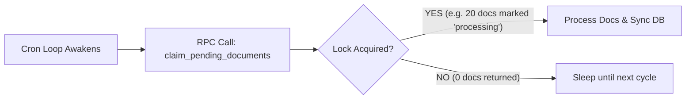

# EPIC-024: Concurrency Hardening (50-80 User Scale)

## 1. Problem & Value
> Target Audience: Stakeholders, Business Sponsors

### 1.1 The Problem
The current backend architecture contains critical concurrency bottlenecks preventing it from safely scaling to the target 50-80 concurrent users. 
1. Database queries inside FastAPI routes strictly block the event loop due to the synchronous `supabase-py` client.
2. Background tasks (Cron workers) pull entire payloads into memory un-paginated and inherently race each other when deployed horizontally across multiple Uvicorn instances.

### 1.2 The Solution
We will eliminate the event loop blocking by wrapping HTTP-based synchronous Supabase operations into ThreadPool workers natively supported by Starlette. For the background crons, we will introduce a zero-infrastructure distributed lock using a Postgres RPC with `UPDATE ... RETURNING ... SKIP LOCKED` batching, preventing duplicate LLM billing and race conditions.

### 1.3 Success Metrics (North Star)
- Zero duplicated API calls/processing runs during background sync tasks under horizontal scale.
- Route latency under load (< 250ms p95 response time with 80 concurrent users).
- Complete elimination of memory exhaustion via cron batch pagination.

---

## 2. Scope Boundaries
> Target Audience: AI Agents (Critical for preventing hallucinations)

### ✅ IN-SCOPE (Build This)
- [ ] Refactor all `execute()` calls in FastAPI routes to process inside `run_in_threadpool`.
- [ ] Create a Supabase DB migration for the `claim_pending_documents` RPC function.
- [ ] Update `wiki_ingest_cron.py` and `drive_sync_cron.py` to use `.rpc()` for fetching batched, exclusively locked documents.
- [ ] Implement `try/catch` handlers inside the crons to reset failed documents back to `pending` or `error` from the new `processing` state.

### ❌ OUT-OF-SCOPE (Do NOT Build This)
- Transitioning to a completely different async driver (e.g. `asyncpg`) or SQLAlchemy (keep it simple, stick to Supabase REST client).
- Implementing new infrastructure (e.g., Redis, Celery, or ARQ) for cron extraction.

---

## 3. Context

### 3.1 User Personas
- **Scalability Lead**: Ensure the application doesn't freeze and scales predictably on AWS/Coolify.
- **End User**: Expects immediate API responses and no dropped inputs when 79 other team members are highly active.

### 3.2 User Journey (Happy Path)


### 3.3 Constraints
| Type | Constraint |
|------|------------|
| **Performance** | Must be able to process 50 Uvicorn requests simultaneously without threading deadlocks. |
| **Complexity** | Zero new infrastructure dependencies. Must run on the existing Supabase server. |

---

## 4. Technical Context
> Target Audience: AI Agents - READ THIS before decomposing.

### 4.1 Affected Areas
| Area | Files/Modules | Change Type |
|------|---------------|-------------|
| DB | `backend/supabase/migrations/...` | New RPC migration |
| Routes | `backend/app/api/routes/*.py` | Modify wrapper implementation |
| Crons | `backend/app/services/*_cron.py` | Refactor to `.rpc()` |
| DB Core | `backend/app/core/db.py` | Add threadpool helper |

### 4.2 Dependencies
| Type | Dependency | Status |
|------|------------|--------|
| **Requires** | Vibe Code Review completion | Done |

### 4.3 Integration Points
| System | Purpose | Docs |
|--------|---------|------|
| Postgres RPC | Executes native Transaction `FOR UPDATE SKIP LOCKED` to manage queueing | [Supabase PostgREST RPC](https://supabase.com/docs/guides/database/functions) |

### 4.4 Data Changes
| Entity | Change | Fields |
|--------|--------|--------|
| `sync_status` | NEW ENUM VALUE | `processing` added to pending/synced/error |

---

## 5. Decomposition Guidance
> The AI agent will analyze this epic and research the codebase to create small, focused stories. Each story must deliver a tangible, verifiable result.

### Affected Areas (for codebase research)
- [ ] Database migration scripts syntax for Supabase CLI
- [ ] Python routes using `.execute()`
- [ ] The `while True:` loop inside `wiki_ingest_cron.py`

### Key Constraints for Story Sizing
- Route wrapping must be systematically verified, perhaps isolating `db.py` wrapper functions.
- The RPC migration must be independently deployed before modifying the crons.

### Suggested Sequencing Hints
1. **Database layer**: Create and verify the Postgres RPC and `processing` status.
2. **Cron layer**: Refactor the background loops to utilize the RPC lock.
3. **API layer**: Wrap the synchronous route executions in the Starlette thread pool handler.

---

## 6. Risks & Edge Cases
| Risk | Likelihood | Mitigation |
|------|------------|------------|
| Thread pool exhaustion from long-running DB queries | Low | Queries are simple REST DB interactions; scale threadpool limit via Env Var if needed. |
| Zombies (`processing` status documents locked forever) | Medium | Write a robust `finally` or `except` catch block returning orphaned docs to `pending`, and add a timeout query inside the RPC to reclaim old processing tasks. |

---

## 7. Acceptance Criteria (Epic-Level)

```gherkin
Feature: Concurrency Scaling to 80 Users

  Scenario: Multiple background workers do not overlap
    Given there are 20 documents marked "pending"
    When 4 background worker processes run simultaneously
    Then each document is processed exactly once
    And only 1 LLM request per document is recorded

  Scenario: FastAPI Event loop remains unblocked
    Given a Uvicorn server is running with 1 worker
    When 50 synchronous database queries hit multiple endpoints
    Then the async server loop accepts new HTTP requests without > 10ms hesitation
```

---

## 8. Open Questions
| Question | Options | Impact | Owner | Status |
|----------|---------|--------|-------|--------|
| Zombie Tasks | A: Timeout check in RPC. B: Clean-up cron | Blocks Story 02 | DevOps | Decided (Option A) |

---

## 9. Artifact Links
> Auto-populated as Epic is decomposed.

**Stories (Status Tracking):**
- [ ] STORY-024-01-database-queue-rpc -> Backlog
- [ ] STORY-024-02-background-worker-locks -> Backlog
- [ ] STORY-024-03-fastapi-thread-wrapper -> Backlog

**References:**
- Vibe Code Review: `security_and_scalability_audit.md`
